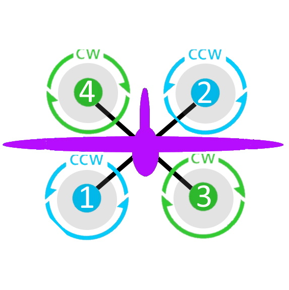
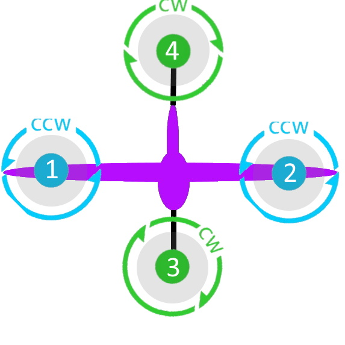

.. _common-future-wiki-changes:

==========================================
Future Wiki Changes (in Master branch now)
==========================================

PLANE
=====

On Terrain Following Page:
--------------------------

In Flight Modes Section change:

"Set :ref:`TERRAIN_FOLLOW<TERRAIN_FOLLOW>` to 1 to enable terrain following in those modes." to read "Setting the bitmask in :ref:`TERRAIN_FOLLOW<TERRAIN_FOLLOW>` determines which altitude controlled modes terrain following is active. For example, setting it to "10" enables following in FBWB and AUTO."

At the end of Flight Modes section:

Terrain Following in CRUISE and FBWB modes can be disabled with an RC switch assigned ``RCx_OPTION`` = 86. When enabling (<1200us) or disabling (>1800us) terrain following with the switch, the present altitude will be the target set point either above terrain, or home, respectively. The target altitude can be changed as normal with elevator whether the altitude reference being used is above home or above terrain.

On Dspoiler Page:
-----------------

Add at bottom of page:

Crow Mode Switch
================

If Differential Spoilers are used, setting an ``RCx_OPTIONS`` channel to "87" will allow the control of CROW aileron (outer spoilers) operation. 

- HIGH position: No change to CROW deflection amount or use of progressive crow.
- MIDDLE position: force progressive crow, assuming :ref:`DSPOILER_CROW_W1<DSPOILER_CROW_W1>` is non-zero, even if :ref:`DSPOILER_OPTS <DSPOILER_OPTS>` bit 2 is zero.
- LOW position: effectively sets :ref:`DSPOILER_CROW_W1<DSPOILER_CROW_W1>` to zero. Only inner spoilers move with FLAP channel, ie normal flaps.

This allows live changes to CROW operation on approaches so that speed braking and descent rates can be changed during the approach.

On Automatic Landing page:
--------------------------

- add note in Reverse-Thrust Landing section: 

.. note:: Airbrakes can also be automatically deployed during reverse thrust operation. See :ref:`Airbrakes<airbrakes-on-plane>`.

On Tilt Rotors and Tailsitters pages:
-------------------------------------

add note:

For landing in fixed wing, manual throttle controlled modes, there is an ``RCx_OPTION`` (89) that will force the tilt servos upright, force idle throttle, and optionally force the pitch to target :ref:`LAND_PITCH_CD<LAND_PITCH_CD>` for flaring to the normal fixed wing landing. This allows intentional or emergency fixed wing landings in MANUAL, ACRO, STABILIZE, and FBWA modes without the risk of a prop strike in configurations where this could occur otherwise.

On Tilt Rotors page:
--------------------

- add note and change table to:

.. raw:: html

   <table border="1" class="docutils">
   <tr><th>Tilt Control</th><th>SERVOn_FUNCTION</th></tr>
   <tr><td>Tilt Motors Rear</td><td>45</td></tr>
   <tr><td>Tilt Motor Rear Left</td><td>46</td></tr>
   <tr><td>Tilt Motor Rear Right</td><td>47</td></tr>
   <tr><td>Tilt Motor</td><td>41</td></tr>
   <tr><td>Tilt Motor Left</td><td>75</td></tr>
   <tr><td>Tilt Motor Right</td><td>76</td></tr>
   </table>

.. note:: For vectored yaw applications, the right and left tilt servos would be used for front and/or back.

On Tailsitters page, under Vectored Thrust:
-------------------------------------------

add note:

To allow vectored thrust QuadPlanes to land in the Fixed Wing (FW) stance in non-throttled controlled modes (in case of low battery level or emergency), an RC channel option, ``RCx_OPTION = 89``. This forces up the motor's tilts while still in FW non-throttled control modes (FBWA, MANUAL, STABILIZE, and ACRO) to avoid prop strikes upon ground contact when landing.

change note about Copter Tailsitters to read:

.. note:: in firmware versions previous to 4.1, CopterMotor Tailsitters did not use any yaw torque control. Roll (with respect to plane body) is only controlled by the flying surface (ailerons or elevons). Now QUAD PLUS and X frames have yaw control via motors, and frame types 16 and 17 are added that have no torque yaw control, as previous versions of PLUS and X did.

On Tailsitters page, under Tailsitter Configuration:
----------------------------------------------------

add frame types 16 and 17 to table of supported frame types for CopterMotor No Yaw Torque Tailsitters and add new diagrams with motor rotation matching Copter for yaw torque controlled plus (0) and X (1) frames.

add note:

.. note:: it is possible to have a CopterMotor Tailsitter using no fixed wing control surfaces, ie basically a quadcopter with a wing. For that configuration, all Copter motors would be set to be active in fixed wing modes via :ref:`Q_TAILSIT_MOTMX<Q_TAILSIT_MOTMX>` and :ref:`Q_OPTIONS<Q_OPTIONS>` bitmask would have bit 7 (Force QASSIST) set to have QASSIST active in all modes.

On Airspeed Calibration Page
----------------------------

Add section at end:

Miss-calibration Safeguards
===========================

In order to help prevent Airspeed sensor use when its been miss-calibrated either during ground static calibration during the power up sequence, or by accidental parameter changes to offset or ratio, three parameters are available. If the ground speed is consistently lower than the reported airspeed for a few seconds by :ref:`ARSPD_WIND_MAX<ARSPD_WIND_MAX>`, i.e. the apparent wind speed is greater than that amount, the sensor can be disabled to avoid erroneous reporting. It can be allowed to re-enable if the apparent wind falls back below that value. These actions are controlled by :ref:`ARSPD_OPTIONs<ARSPD_OPTIONs>`.

You can also send a warning to the Ground Control Station if the apparent wind exceeds :ref:`ARSPD_WIND_WARN<ARSPD_WIND_WARN>`. This can be used instead of, or together with the above.

On Quadplane Tips Page:
-----------------------

Under Tilt Rotor Servo Setup, add:

Note that setting :ref:`Q_OPTIONS<Q_OPTIONS>` bit 10 (Disarmed Yaw Tilt) allows the motors to tilt in response to rudder input while disarmed to facilitate adjustment of parameters.

On Flight Options Page:
 add to table

=====================================   ======================
:ref:`FLIGHT_OPTIONS<FLIGHT_OPTIONS>`   Function
=====================================   ======================
4                                       Climb to :ref:`ALT_HOLD_RTL<ALT_HOLD_RTL>` altitude before turning toward home in RTL
=====================================   ======================

