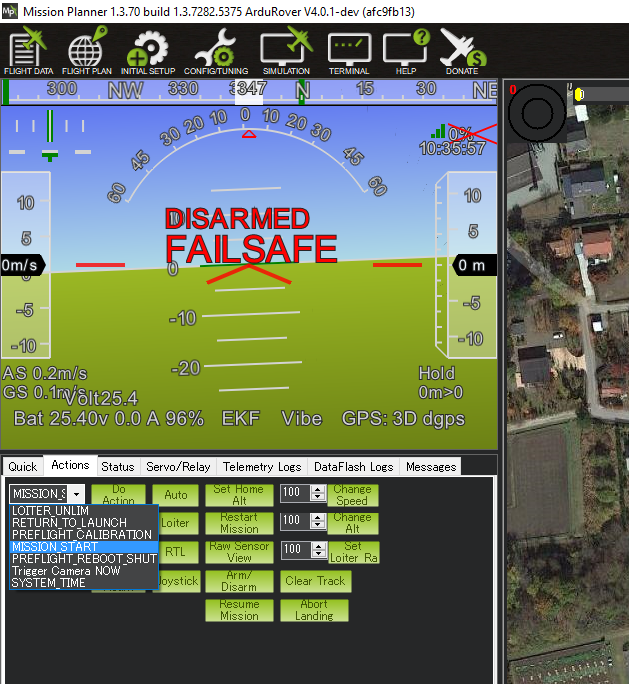

.. _common-gcs-only-operation:

===================================================
Operation Using Only a Ground Control Station (GCS)
===================================================

While it is generally recommended that a Radio Control system is employed as primary pilot control means for ArduPilot vehicles, it is not a requirement. It is possible to operate a vehicle using only a Ground Control Station (GCS), with or without joystick input. Setup varies vehicle to vehicle, and is detailed below.

Capability
==========

If a joystick is connected to the GCS, then almost the same control capabilities are available as with a radio control transmitter/receiver. Mode changes can be assigned to joystick buttons. If an RC transmitter is used as the joystick, then the same control precision can be obtained. Use of low resolution , cheaper "game" style joysticks will usually provide a less than enjoyable experience and use of high quality joystick or use of an RC transmitter as a joystick (OpenTX provides this capability) is highly recommended.

It is also possible to use only the GCS itself, if only autonomous missions or guided mode operation is desired.

Failsafes
=========

It is highly recommended that the GCS failsafe be setup for the vehicle, since GCS connectivity is being relied upon exclusively for vehicle control. See :ref:`apms-failsafe-function` , :ref:`Copter Failsafe <failsafe-landing-page>` , or :ref:`Rover Failsafes <rover-failsafes>`, as appropriate.

Of course, other failsafes can be setup and utilized as desired in addition to the GCS failsafe.

Configuration
=============

Plane and Rover
---------------

Both Plane and Rover only require two parameter changes to allow the arming of the vehicle when using only a GCS.

-  In Plane, :ref:`THR_FAILSAFE<THR_FAILSAFE>` must be set to zero, while in Rover, :ref:`FS_THR_ENABLE<FS_THR_ENABLE>` must be set to zero.
-  In both Plane and Rover, :ref:`ARMING_CHECK<ARMING_CHECK>` should not include bit 6 (RC check). A value of 65470 will include all other checks. It is not recommended that :ref:`ARMING_CHECK<ARMING_CHECK>` be set to 0 (ARM immediately), since important system checks would be bypassed.

The vehicle can then be armed after the GPS has obtained lock and internal initializations have completed, either by rudder arming (if enabled, see :ref:`ARMING_RUDDER<ARMING_RUDDER>` ) or arming command from the GCS. 

Copter
------

Copter has a few additional safety checks that must be accommodated in order to arm with no RC input.

-  :ref:`FS_THR_ENABLE<FS_THR_ENABLE>` must be set to zero
-  :ref:`ARMING_CHECK<ARMING_CHECK>` should not include bit 6 (RC check). A value of 65470 will include all other checks. It is not recommended that :ref:`ARMING_CHECK<ARMING_CHECK>` set for 0 (ARM immediately), since important system checks would be bypassed.
-  assuming that the :ref:`RCMAP_ROLL <RCMAP_ROLL>`, :ref:`RCMAP_PITCH <RCMAP_PITCH>`, :ref:`RCMAP_THROTTLE <RCMAP_THROTTLE>` and :ref:`RCMAP_YAW <RCMAP_YAW>` parameters are default, then the RC 1 thru 4 channels' maximum and minimum parameters must be changed slightly. This is because Copter checks to see that the RC calibration has been done. But since no RC is used in the system, this step will not have occurred. Therefore, to emulate that this has happened, the min and max values need to be changed from their defaults of 1100 and 1900, respectively. Values of 1101 and 1901, will do for the ``RCx_MIN`` and ``RCx_MAX`` for the roll,pitch, throttle, and yaw RC channels.

The vehicle can then be armed after the GPS has obtained lock and internal initializations have completed, either by joystick rudder arming (if enabled, see :ref:`ARMING_RUDDER<ARMING_RUDDER>` ) or arming command from the GCS. 

However, there is still one more safety check that needs to be cleared. Copter will auto-disarm after a few seconds if the throttle is not raised above idle. If a joystick is used, this is easily accomplished. However, if AUTO or GUIDED operation without a joystick is desired, then after arming, a MISSION START command must be issued in AUTO mode, as shown below for Mission Planner, or a TAKEOFF command be issued from the GCS (in Mission Planner, this is a mouse right button click option) within a few seconds of arming. QGC has a slider button that will arm and start the mission in one swipe.

