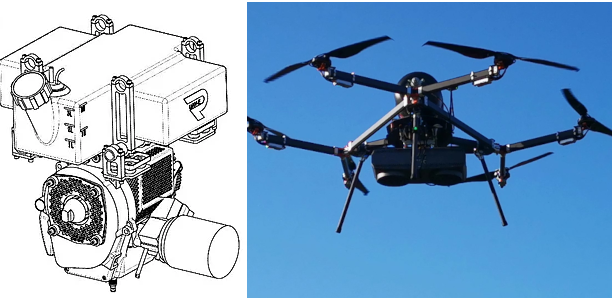

.. _common-generators:

==========
Generators
==========

ArduPilot supports generators for powering your vehicle.  Some generators can be controlled from ArduPilot, others are telemetry only.  Within ArduPilot the term generator is used to broadly group all devices that convert some form of fuel into electrical power.

The following are all currently supported within ArduPilot:

.. toctree::
    :maxdepth: 1

[site wiki="copter,plane,rover"]
    RichenPower generator <common-richenpower-generator>
    Intelligent Energy 650W/800W Hydrogen Fuel Cell <common-ie650-fuelcell>
    Intelligent Energy 2.4kW Hydrogen Fuel Cell <common-ie24-fuelcell>
[/site]

[copywiki destination="plane,copter,rover"]
