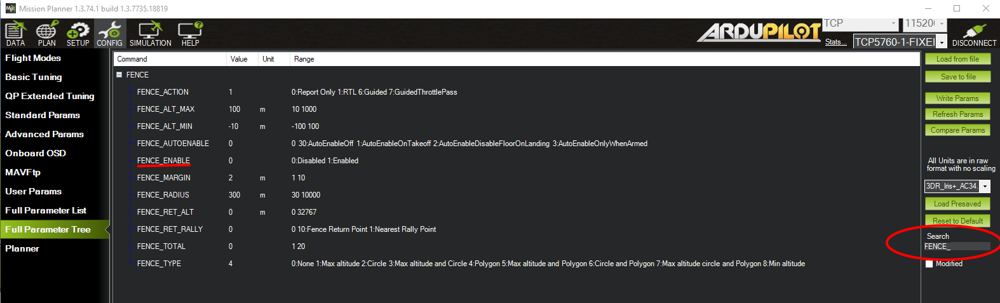

.. _common-geofencing-landing-page:

[site wiki="plane"]
==========
GeoFencing
==========
[/site]
[site wiki="copter,rover"]
======
Fences
======
[/site]

ArduPilot supports a home based Cylindrical ("TinCan") and Polygonal and/or Cylindrical, Inclusion and/or Exclusion regions. Inclusion and Exclusion Fences are defined easily in Mission Planner under the PLAN screen and loaded to the autopilot, using the FENCES item in the drop down box, just like Missions or Rally Points are planned.

Some vehicles can also have maximum and/or minimum altitude limits. Some flight modes will try to prevent exceeding these limits automatically, a fence breach will be declared in all modes if exceeded.

Upon Fence breach, selectable actions are taken.

General Setup
=============

-  Set :ref:`FENCE_ENABLE<FENCE_ENABLE>` = 1 to enable fences. This enables any fences that are setup, except the ALT_MIN fence, which must be enabled by using any fence enable means (GCS message, AUTOENABLE in plane, RC switch)
-  Set :ref:`FENCE_ACTION<FENCE_ACTION>` = to whatever you wish for a breach action. These will vary depending on vehicle type. See :ref:`fence_breach_actions` above.
-  Set :ref:`FENCE_OPTIONS<FENCE_OPTIONS>` to "1" to prevent mode changes after a fence breach until the vehicle returns within the fence boundary (Plane only, Copter/Rover do not allow mode changes while in breach)
-  Set :ref:`FENCE_ALT_MAX<FENCE_ALT_MAX>` = to the altitude limit you want (in meters). This is unavailable in Rover.
-  Set :ref:`FENCE_MARGIN<FENCE_MARGIN>` = to the distance from the fence horizontal boundary the vehicle must maintain in order to prevent a breach.
-  Set the :ref:`FENCE_ALT_MIN<FENCE_ALT_MIN>` as a minimum altitude breach boundary.
-  Set :ref:`FENCE_AUTOENABLE<FENCE_AUTOENABLE>` = (Plane Only)to allow automatic enabling of the fence (different than :ref:`FENCE_ENABLE<FENCE_ENABLE>`) under certain vehicle conditions, such as upon arming or takeoff. A value of 0 disables this feature. :ref:`FENCE_ENABLE<FENCE_ENABLE>` is ignored if this feature is enabled.
-  :ref:`FENCE_RET_RALLY<FENCE_RET_RALLY>` allows returning to the nearest RALLY point (See: :ref:`common-rally-points`), if loaded, instead of HOME.
-  Set :ref:`FENCE_TYPE<FENCE_TYPE>` = is a bitmap set to enable the various fence types: MIN or MAX altitude, simple CIRCLE tin can around HOME, or POLYGON fences. The POLYGON fences must also have been loaded via a fence list from a ground control station in order to be active. See below for detailed setup of :ref:`common-ac2_simple_geofence` and :ref:`common-polygon_fence`.

.. note:: Polygon fence type includes the circular fences specified in the Inclusion/Exclusion fence list. The simple home centered CIRCLE fence is a separate fence. Rover ignores altitudes, if set.

Defaults for :ref:`FENCE_TYPE<FENCE_TYPE>` are:

- Rover: CIRCLE and POLYGON
- Copter: ALT MAX, CIRCLE, and POLYGON
- Plane: POLYGON

Detailed Setup
--------------

.. toctree::
    :maxdepth: 1

    Cylindrical Fence Failsafe <common-ac2_simple_geofence>
    Inclusion/Exclusion Fence Failsafe <common-polygon_fence>

Types of Fences
===============

+---------------------------------------+--------------------+-----------+----------+---------+
|       TYPE OF FENCE                   | ``FENCE_TYPE`` bit |  PLANE    | COPTER   |  ROVER  |
+=======================================+====================+===========+==========+=========+
|Global Maximum Altitude                |    0               |           |          |         |
|   - FENCE_ALT_MAX defines max altitude|                    |    X      |    X     |         |
+---------------------------------------+--------------------+-----------+----------+---------+
|  Cylindrical ("TinCan")               |      1             |    X      |    X     |    X    |
|     - Circle Centered on Home         |                    |           |          |         |
|     - Parameters for radius, height   |                    |           |          |         |
+---------------------------------------+--------------------+-----------+----------+---------+
|  Inclusion/Exclusion Zones            |                    |           |          |         |
|     - Arbitrary Locations             |                    |           |          |         |
|     - Polygonal or Circular           |     2              |    X      |    X     |    X    |
|     - Inclusion or Exclusion          |                    |           |          |         |
|     - Defined by list, like missions  |                    |           |          |         |
|     - No height/altitude restriction  |                    |           |          |         |
+---------------------------------------+--------------------+-----------+----------+---------+
|Global Minimum Altitude                |   3                |           |          |         |
|   - FENCE_ALT_MIN defines min altitude|                    |   X       |          |         |
+---------------------------------------+--------------------+-----------+----------+---------+

.. note:: if :ref:`FENCE_TYPE<FENCE_TYPE>` =2 inclusion zones overlap, a fence breach will occur when crossing a boundary, even if within another inclusion zone, UNLESS :ref:`FENCE_OPTIONS<FENCE_OPTIONS>` bit 1 is set to make all inclusions zones a union set.

.. _fence_breach_actions:

Fence Breach Actions
====================
[site wiki="copter,rover"]
Rover Actions
-------------

Rover has no altitude actions, but if it reaches the Cylindrical fence boundary in either Steering or Acro modes, it will simply stop and not move beyond it. In other modes, it will execute the :ref:`FENCE_ACTION<FENCE_ACTION>`.

Copter Actions
--------------

Copter will stop increasing altitude at :ref:`FENCE_ALT_MAX<FENCE_ALT_MAX>` in Loiter, PosHold, and AltHold modes.

In Loiter mode, it will try to stop at the horizontal boundaries, but declare a breach if exceeds the boundary.

In other modes, it will execute the :ref:`FENCE_ACTION<FENCE_ACTION>` below if the altitude or boundary is reached.

+------------+--------------------+-------------------+
+FENCE_ACTION|  Copter            | Rover             +
+============+====================+===================+
+     0      |   Report Only                          +
+------------+--------------------+-------------------+
+     1      | RTL/LAND           | RTL/HOLD          +
+------------+--------------------+-------------------+
+     2      |LAND                | HOLD              +
+------------+--------------------+-------------------+
+     3      |  SmartRTL/RTL/LAND | SmartRTL/RTL/HOLD +
+------------+--------------------+-------------------+
+     4      | BRAKE/LAND         |SmartRTL/HOLD      +
+------------+--------------------+-------------------+
+     5      | SmartRTL or  LAND  | not applicable    +
+------------+--------------------+-------------------+

.. note:: RTL/HOLD,etc. means it will attempt RTL first, but if it can't switch to that mode (ie for RTL, GPS lock is lost), it will attempt to switch to the next,in this case HOLD.

If :ref:`common-object-avoidance-landing-page` is setup, RTL actions will attempt to avoid any fences as it returns.

At the moment the fence is breached a backup fence is erected 20m
further out (or up).  If the vehicle breaches this backup fence (for
example if the vehicle is not set up correctly or the operator takes
control but is unable to bring the copter back towards home), the vehicle
will execute the :ref:`FENCE_ACTION<FENCE_ACTION>` again (and another backup fence an additional 20m further out will be created if this is breached again).

If the vehicle eventually proceeds 100m outside the configured fence
distance, despite the backup fences, the vehicle will switch into LAND mode (HOLD for Rover).  The idea being that it's clearly impossible to get the vehicle home so best to just bring it down/stop it.  The pilot can still retake control of course with the flight mode
switches.  Like with the earlier fences, another fence is erected 20m
out which will again switch the vehicle to LAND (HOLD for Rover), if it continues away from
home.
[/site]
[site wiki="plane"]

If enabled, and  the fence boundaries or altitudes(:ref:`FENCE_ALT_MAX<FENCE_ALT_MAX>` and :ref:`FENCE_ALT_MIN<FENCE_ALT_MIN>`), if non-zero,  are exceeded, Plane will execute the :ref:`FENCE_ACTION<FENCE_ACTION>` below:

+------------+--------------------+
+FENCE_ACTION|  Plane             +
+============+====================+
+     0      |   Report Only      +
+------------+--------------------+
+     1      | RTL                +
+------------+--------------------+
+     6      | Guided to return   +
+            | point              +
+------------+--------------------+
+     7      |  Guided to return  +
+            |  point with pilot  +
+            |  throttle control  +
+------------+--------------------+

The return (and loiter) point, unless :ref:`FENCE_RET_RALLY<FENCE_RET_RALLY>` is enabled, is the geometric center of the breached fence boundary. If :ref:`FENCE_ACTION<FENCE_ACTION>` is set to a guided return mode (6 or 7), the altitude at which it returns is determined by :ref:`FENCE_RET_ALT<FENCE_RET_ALT>` or if  :ref:`FENCE_RET_ALT<FENCE_RET_ALT>` is zero, midway between the altitude limits, if non-zero. If both altitude limits are zero, then it will return at current altitude.

The return point can also be replaced by the nearest rally point (See: :ref:`common-rally-points`) as a destination, if :ref:`FENCE_RET_RALLY<FENCE_RET_RALLY>` is enabled.

.. note:: while executing any action that requires a mode change (ie. all except Report Only), any additional fence breaches are recorded but ignored. For example, RTL that has an AutoLand will breach a MIN_ALT fence, if enabled, but take no action and finish the landing.

Modes changes cannot be executed after the fence breach unless the :ref:`FENCE_OPTIONS<FENCE_OPTIONS>` bit 0 is set to "0". By default it is set to "1" to prevent mode changes. When set, the vehicle must return to within the fence boundary in order to change modes. If mode changes are allowed, you can also return to the mode that was active upon breach by using an RC auxiliary switch set to option "96" (Re-read mode switch).
[/site]

Enabling the Fence with an RC Channel Auxiliary Switch
======================================================

It is not necessary to set-up a switch to enable or disable the fence
but if you wish to control the fence with a switch follow these
steps:

An ``RCx_OPTION`` can be set via the Config/Tuning > Full Parameter List screen, for example using RC channel 7:

-  Set :ref:`RC7_OPTION<RC7_OPTION>` = 11 (Fence Enable)
-  setting the switch high (i.e. PWM > 1800) will enable the fence, low
   (under 1800) will disable the fence.

Automatic Altitude Breach Avoidance
===================================

For landing modes (NAV_LAND,QLAND,LAND,etc.) in Copter and Plane, the :ref:`FENCE_ALT_MIN<FENCE_ALT_MIN>` limit is automatically disabled.

[wiki site="copter"]

For Polygonal fences, Copter will stop increasing altitude at :ref:`FENCE_ALT_MAX<FENCE_ALT_MAX>` in Loiter, PosHold, and AltHold modes.
[/site]
[wiki site="plane"]

When in Mode FBWB or CRUISE, Plane will attempt to limit altitude target changes by the pilot (ie using Pitch stick for climb/descent rate demand inputs) to avoid breaching a maximum or minimum altitude fence.
[/site]

.. note:: altitude control imperfections can still result in a breach unless the :ref:`FENCE_MARGIN<FENCE_MARGIN>` param is loose enough to accommodate these imperfections.

Enabling Fences in Mission Planner
==================================

To enable Fences, go to the Mission Planner full parameter list (CONFIG->Full Parameter Tree), search for items with ``FENCE_``:

..  youtube:: yhNrtTERnJk
    :width: 100%

[wiki site="copter"]

Copter GeoFence Tab
-------------------

Copter and Traditional Heli, when connected to Mission Planner, present a CONFIG tab called GeoFence which provides another way to access these parameters in those vehicles.

.. image:: ../../../images/Fence_MPSetup.png
    :target: ../_images/Fence_MPSetup.png

[/site]

Use for R/C Training
====================

One of the main uses of geo-fencing is to teach yourself (or someone
else) to fly radio controlled vehicles. When you have a properly
configured geo-fence it is very hard to crash, and you can try
manoeuvres that would normally be too likely to end in a crash, trusting
the autopilot to 'bounce' the vehicle off the geo-fence before the flight ends
in disaster.

Geo-fencing can be combined with any flight mode. So for a raw
beginner, you would combine it with one of the stabilised flight modes
. Once the pilot has gained some confidence you could combine it with ACRO mode in Copter or MANUAL mode in Plane, which gives direct control of the vehicle and allows for the most interesting aerobatic manoeuvres. 

[wiki site="plane"]

Stick-mixing on fence breach
============================

ArduPilot enables 'stick mixing' by default when in auto modes. This means
that you can change the path of a loiter, for example, by using your
transmitter sticks.

When you are using geo-fencing, stick mixing will be disabled on fence
breach until your plane is back inside the fenced region. This is to
ensure that the bad control inputs that caused you to breach the fence
don't prevent it from recovering to the return point.

As soon as you are back inside the fence stick mixing will be
re-enabled, allowing you to control the GUIDED mode that the plane will
be in. If by using stick mixing you manage to take the plane outside the
fence again then stick mixing will again be disabled until you are back
inside the fence.

[/site]

MAVLink support
===============

ArduPilot will report the fence status via the MAVLink GCS protocol. The
key status packet is called FENCE_STATUS, and is defined in
"ardupilotmega.xml". A typical FENCE_STATUS packet looks like this:

::

    2011-12-20 16:36:35.60: FENCE_STATUS breach_status : 1, breach_count : 15, breach_type : 1, breach_time : 1706506

The breach_status field is 0 if inside the fence, and 1 if outside. The
breach_count is how many fence breaches you have had on this flight.
The breach_type is the type of the last breach (see the FENCE_BREACH 
enum in ardupilotmega.xml). The breach_time is the time in milliseconds
of the breach since APM was booted.

The MAV_SYS_STATUS_GEOFENCE bit of the MAV_SYS_STATUS_SENSOR
portion of the SYS_STATUS message indicates whether or not the
geo-fence is breached.  As of this writing only the MAVProxy GCS
recognizes this status bit and reports the status of the geo-fence.  In
the future the Mission Planner, APM Planner, and other GCS applications
should get support for announcing geo-fence status during the flight.

The MAV_CMD_DO_FENCE_ENABLE MAVLink command message allows a GCS to
enable or disable a fence interactively.  As of this writing only
MAVProxy supports this message using the "fence enable" or "fence
disable" commands.  In the future Mission Planner, APM Planner, and
other GCS applications may get support for interactively enabling and
disabling the geo-fence without needing to use a manual transmitter.