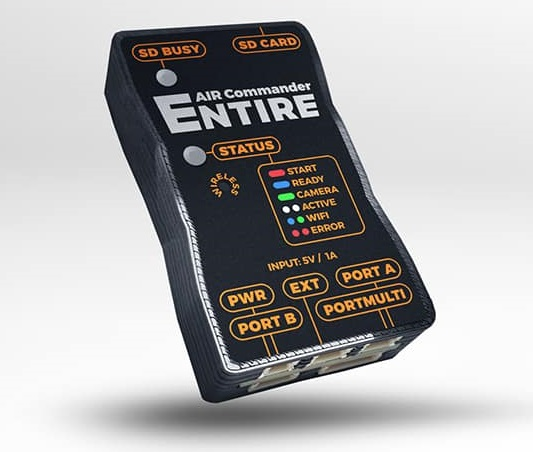

.. _common-geotagging-airpixel-entire:

==============================
Airpixel Entire for Geotagging
==============================

`The Entire <http://photogrammetry.airpixel.cz/>`_ is a standalone device for GeoTagging of images in-camera SD card.  GPS data data is read from the autopilot's serial port (aka MAVLink bus) and is then saved directly into the photos using EXIF. The Entire can also trigger the camera shutter via MAVLink commands.

- Photos are tagged (via EXIF) with the lat, lon and altitude within the camera
- GPS position filtering and interpolation for higher accuracy
- Supports taking pictures by distance flown or at intervals
- Optionally uses configurable GPS position offset (X,Y,Z) to improve accuracy
- High accuracy of EXIF saving - 1mm in distance
- Tagging available for JPG and RAW
- hot-shoe sync connector for reduced errors
- GeoTagging is available at the *maximum speed of the camera* (even lower than 1s)
- WiFi configuration and simple firmware updates

More info at `photogrammetry.airpixel.cz <http://photogrammetry.airpixel.cz/>`_

[copywiki destination="copter,plane,rover"]

