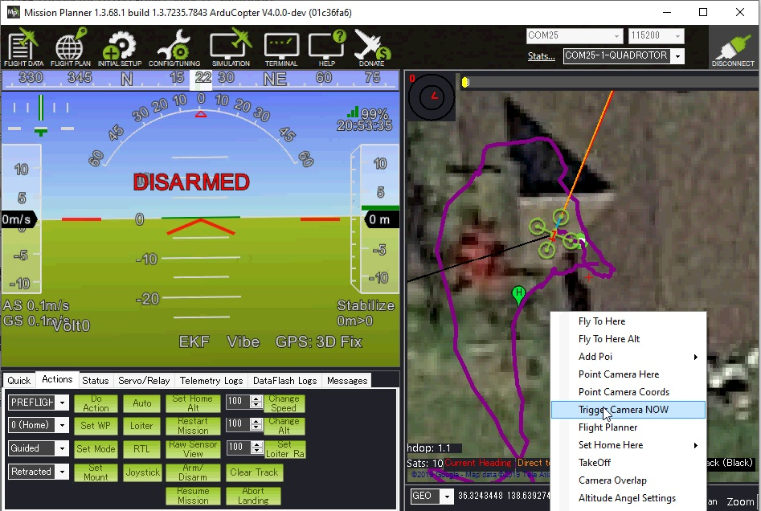
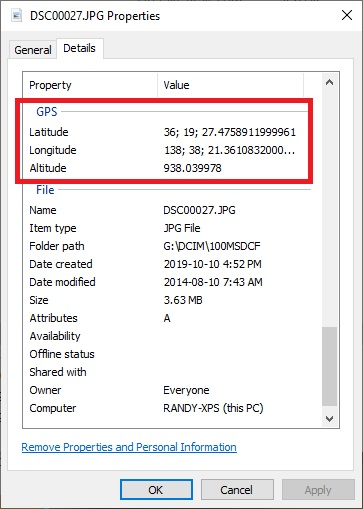

.. _common-geotagging-drotagx:

=======================
DROTAG x for Geotagging
=======================

.. image:: ../../../images/geotagging-drotagx.jpg
    :target: https://www.airborneprojects.com/product/drotag-onboard-image-tagging-computer/
    :width: 450px

`DROTAGx <https://www.airborneprojects.com/product/drotag-onboard-image-tagging-computer/>`__ makes geo-tagging easy by recording the vehicle's position directly into the images on the camera.

-   Images are geotagged with the vehicle's Latitude, Longitude and Altitude (above sea level) at the moment the photo was taken.  These value can be viewed with any EXIF viewer
-   Two text files are also created which include the image name, lat, lon, alt above home, altitude above sea level, roll, pitch and yaw
-   Captures picture every 1.6 seconds
-   Includes a Hotshoe which connects between the autopilot and your camera's flash to improve the accuracy of the geo-tagging

More details can be found in the official DrotagX manual (`web <https://www.airborneprojects.com/doc/drotagx/>`__, `pdf <https://www.airborneprojects.com/docs/drotagx_manual.pdf>`__) including pre-flight checklists, detailed explanations for diagnosis and other tips.

Setup, Configuration
--------------------

- Connect the Drotag's 6-pin JST connector to one of the autopilot's serial ports
- Connect the micro USB connector to the Sony camera's "MultiPort"
- Set the following parameters in ArduPilot (assuming the Drotag is connect to Serial port 1) and then reboot the autopilot

  - :ref:`SERIAL1_BAUD<SERIAL1_BAUD>` : 115
  - :ref:`SERIAL1_PROTOCOL<SERIAL1_PROTOCOL>` : 1

- Turn on the camera
- Power the autopilot and Drotag
- If all goes well the following will happen:

  - Drotag's red LED should blink twice quickly about once per second
  - The camera should switch to "mass storage" for about 30 seconds (or less) and then return to regular shooting mode
  - If a Mavlink Inspector is used (available in MissionPlanner and QGC) a "Component 2" should appear and send heartbeats once every 3 seconds

Testing
-------

Test the Drotag is working correctly by doing the following

- Connect with Mission Planner and right-mouse-button-clicking on the map and select, "Trigger Camera Now".  The camera should emit a click as it takes a picture.  Normally a green circle will also appear on the map.
- Arm the vehicle, trigger another picture, then disarm the vehicle.  The camera should momentarily switch to "Mass Storage" mode as Drotag geotags the images and writes the text files

Retrieving Geotagged Images
---------------------------

Drotag writes the location information directly into the .jpg images files using EXIF and also into two accompanying files on the camera's SD card

- Connect the camera's USB port to your PC or remove the SD card and download to your PC
- The location can be viewed with any EXIF viewer including Window's file property viewer

- The PIX4D_xxxx.txt includes the image's lat, lon, alt, roll, pitch and yaw information as shown below

   ::

        DSC00027.JPG,36.3242995,138.6392682,938.0399780,0.3200000,0.1200000,-24.9599991

- The tagging_xxxx.log file has the following information

   ::

        {
            filename: "DSC00027.JPG",
            time: 1571822099701000,
            latitude: 363242995,
            longitude: 1386392682,
            alt_msl: 938.039978,
            alt_rel: -0.310000,
            roll: 0.320000,
            pitch: -0.120000,
            yaw: 24.959999,
        }

[copywiki destination="copter,plane,rover"]

