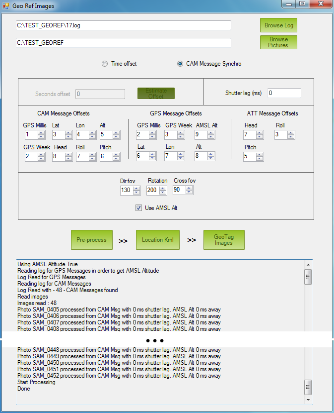
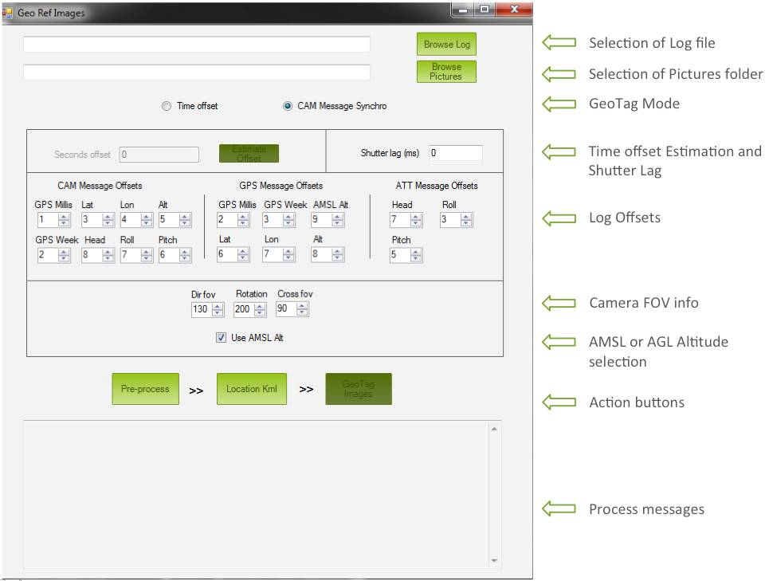

.. _common-geotagging-images-with-mission-planner:

======================================
Geotagging Images with Mission Planner
======================================

This article shows how to Geo-tag images, using *Mission Planner* to
inject data from telemetry logs into their EXIF tags.

Overview
========

Geo-tagging images makes it easier to photo-merge the many pictures
taken during a :ref:`camera mission <common-camera-control-and-auto-missions-in-mission-planner>`,
and is important for applications including photogrammetry, orthophoto
generation, 3D terrain modeling etc.

*Mission Planner* provides two methods for geotagging your photos from a
mission log:

#. **CAM messages from dataflash log**

   ArduPilot can trigger a camera during pre-programmed missions or by
   RC activation using the ``DO_DIGICAM_CONTROL`` or
   ``DO_SET_CAM_TRIGG_DIST`` commands. Corresponding CAM messages are
   stored in the dataflash log, and can be used by Mission Planner to
   add accurate geotag information to images.
#. **Time offset (image timestamp to log timestamp)**

   This method uses the time difference between the camera internal
   clock and system clock to determine where in the log each image was
   taken and get the GPS information. Typically users must tune the
   offset value in order to find a sensible result.

   .. tip::

      This method is less accurate. It is used when there is no
         connection between camera and autopilot.

.. note::

   Even if your camera has a built-in GPS you *may* find this
   approach provide more accurate information than the built-in GPS.

Geotagging images
=================

Common pre-steps
----------------

-  Open Mission Planner and press **Ctrl+F**. This will open a hidden
   screen like the one shown below.

   .. figure:: ../../../images/geotag_temp_form-v2.png
      :target: ../_images/geotag_temp_form-v2.png

      Mission Planner: Temp Screen (Ctrl +F)

-  Click the button **Geo ref images**. It will give you access to the
   *Geo Tagging* tool

   .. figure:: ../../../images/geotag_overview-v2.png
      :target: ../_images/geotag_overview-v2.png

      Mission Planner: Geo Ref Images Screen

-  Click the button **Browse Log** and select the log (**.tlog** or
   **.log)** of the flight related to the shooting session.
-  Click the button **Browse Directory** and select the folder where
   your aerial pictures were downloaded from your camera.

   Notice that the camera picture folder can contain other files apart
   from the pictures. However in terms of pictures, it must contain just
   the ones belonging to the flight.

The next steps depend on whether you're using CAM Messages or a time
offset.

CAM messages
------------

In order to process CAM messages, the mission file had to be defined to
use remote camera trigger by means of any of the available mission
commands (CAM_TRIGG_DISTANCE, DO_DIGICAM_CONTROL, etc).

-  Select the **CAM Message** method if it is not selected in the
   *Geotag Mode* section.
-  Enter Shutter Lag value (in milliseconds) if you know it. If not
   leave it with 0
-  Check that Log offsets are correct according to your log version
   (usually these are OK)
-  Enter FOV information if needed
-  Select **Use AMSL Alt** checkbox if you want absolute altitude.
   Otherwise, uncheck
-  Click **Pre-process**

If pre-processing works correctly, you will see ``Done`` displayed at
the end of the *Process Messages Area*.

.. note::

   The most common problem in this processing mode is having a
   discrepancy between the number of CAM messages in log and the number of
   pictures in the folder. If the tool finds that they are different, it
   will output an error message and abort.

The final step is to "sanity check" the proposed picture location using
the **Location Kml** button (See :ref:`Common Post-steps <common-geotagging-images-with-mission-planner_common_post-steps>` below).

Time offset
-----------

.. tip::

   If you haven't flown yet, one useful trick is to synchronize camera
   and system time.

- Select the **Time Offset** method if it is not selected in the
  *Geotag Mode* section.
- Click on **Estimate Offset** button

  The tool will calculate (as explained in previous section) the time
  difference between the first picture and the first GPS time in the
  log.
- Copy the calculated offset printed in the *Process Messages Area* and
  paste it into the field *Seconds offset*

  Take a look at the following picture:

  .. image:: ../../../images/geotag_offset_calculation.jpg
      :target: ../_images/geotag_offset_calculation.jpg

- Click **Pre-process**

If pre-processing works correctly, you will see ``Done`` displayed at
the end of the *Process Messages Area*.

.. note::

   The most common problem when using this method is the use of an
   inaccurate time offset. Remember that the estimated time offset is just
   a starting point!

   The Geotag tool will output a warning if pictures are discovered that
   are not found in the autopilot log - see picture below:

   .. figure:: ../../../images/geotag_offset_problem.png
      :target: ../_images/geotag_offset_problem.png

      Mission Planner: Images not found in log at specified offset

The final step is to "sanity check" the proposed picture location using
the **Location Kml** button (See :ref:`Common Post-steps <common-geotagging-images-with-mission-planner_common_post-steps>` below). If the proposed locations are
not correct, add or subtract some seconds to the *Offset Time* and
repeat.

.. _common-geotagging-images-with-mission-planner_common_post-steps:

Common post-steps
-----------------

The remaining steps are to check that proposed picture locations are
acceptable and write location information to the picture's EXIF data:

- Click on the **Location Kml** button. Google Earth will open and show
  the proposed picture locations (as shown below):

  .. image:: ../../../images/geotag_google_earth_review.jpg
      :target: ../_images/geotag_google_earth_review.jpg
    
- Check that they are OK. If you used *CAM Message* mode, there
  shouldn't be any problem (iIf there is, just order pictures
  alphabetically and check that the first picture in the list is also
  the oldest one). If you used *Time Offset*, just try adding or
  subtracting seconds to time offset.
- If everything is OK, click on **GeoTag Images** button and wait to
  see the processing message ``Geo tagging FINISHED``.

Geotagged files can be found in *geotagged* folder inside the original
pictures folder

Interface overview
==================

The *Mission Planner Geo Ref Images* screen is shown below:

Files selection
---------------

This is where the user has to select the log location and camera
pictures folder

Geotag mode
-----------

As explained above, there are two options. CAM Messages and Time offset.

Time offset estimation and shutter lag
--------------------------------------

This section is only relevant if *Time Offset* mode has been selected.

The time offset needs to be estimated by comparing the first picture
time and the first GPS time in the log. Once the user clicks the
**Estimate Offset** button, the tool will calculate time offset and
print the result in the *Process Messages* section at the bottom of the
window:

::

    Offset Estimation = 1st_Picture_Time - 1st_GPS_Time_Logged

Notes:

-  If CAM Message is selected, the Shutter Lag option is available. Note
   that GPS positions are stored at 5Hz by default (if using 3DR GPS) so
   they are recorded every 200ms.
-  If Shutter Lag is less than 100ms, then GPS position is taken from
   current CAM Message.
-  If Shutter Lag is bigger than 100ms, the GPS position is taken from
   200ms ahead in log.

Item offsets in log
-------------------

This section allows the user to tell the tool where specific information
can be found in the log. There are three messages whose offsets need to
be defined

-  CAM
-  GPS
-  ATT

.. tip::

   Item offsets are preset to the values for the last stable APM
   release.

**Example of how to find out item offset in a message line within a
log**

Lets take a look at the GPS Line Format definition at the beginning of a
log:

::

    FMT, 130, 45, GPS, BIHBcLLeeEefI, Status,TimeMS,Week,NSats,HDop,La6t,Lng,RelAlt,Alt,Spd,GCrs,VZ,T

The field with the number **1** is the one after the
``Units-definition-word``.

In our case, the ``Units-definition-word`` is ``BIHBcLLeeEefI``. So the
field with number **1** is **Status**

From this we should have:

::

    TimeMS = 2
    Week = 3
    Lat = 6
    ...

FOV and altitude reference
--------------------------

This is where the user can define the Field of View (FOV) and
orientation information. This information is incorporated into the
result files but it is not used or stored in the picture EXIF data.

The **AMSL Alt** checkbox allows to select either AGL Altitude (Above
Ground Level) or AMSL Altitude (Above Mean Sea Level).

Action buttons
--------------

-  **Pre-process** - When this button is clicked, Geotag tool will try
   to extract and calculate pictures positions
-  **Location Kml** - When this button is clicked, Geotag tool will open
   Google Earth and show pictures position on a map so the user can
   check their correct positioning.
-  **GeoTag Images** - If everything was correct in previous steps and
   pictures are well positioned in the map, this button will write the
   position information in the EXIF data of every picture

Process messages
----------------

This is the place where the tool will output information

Additional information
======================

This section contains links to additional information/information for
working with specific cameras:

-  `Geotag GoPro Images with a Pixhawk Log File <http://tuffwing.com/support/geotag_gopro_images_with_pixhawk_log.html>`__
   (tuffwing.com)

Alternative Commercial Hardware Solutions
=========================================

DROTAGx - In-Camera Card Photo Tagging - Airborne Projects
----------------------------------------------------------

With the appropriate mission from Mission Planner(or similar),
`DROTAGx <https://www.airborneprojects.com/product/drotag-onboard-image-tagging-computer/>`_ (airborneprojects.com) enables APM compatible Flight Controllers (like Pixhawk)
to *Trigger and Geo-Tag* your Digital Camera pictures in
the air. It works through one of the available TELEMETRY ports and
through a microUSB cable to the camera.

You will have your taken pictures automatically Geo-Tagged by DROTAGx in the
microSD card inside your camera at the time you land, with no need for any
post-processing.

DROTAGx enables non DRONE experts to get professional survey level results,
with it's easy to use and included accessories:

-   Photo tagging directly on the camera card itself.
-   Have a plain text log file with geographical data in the camera card itself.
    Includes Yaw, Roll, and Pitch of the Drone.
-   1 Picture every 1.6 seconds.
-   Guaranteed correct tagging even if the camera misses several pictures in a row!
-   Hotshoe for camera flash feedback included for cameras with external flash.
    With the hotshoe installed take pictures as fast as your camera allows for,
    and microsecond accurate shutter lag.
-   Also tags RAW photos.
-   Customer support.

Airborne Project's also provides a comprehensive
`DROTAGx manual <https://www.airborneprojects.com/docs/drotagx_manual.pdf>`_ (airborneprojects.com)
with before flight checklists, detailed explanations for diagnosis and
other tips.

DROTAGx is used by several national governmental organizations including Land
Management Organizations around the world. Many professional surveying
companies also choose the DROTAG for their tagging needs.

.. image:: https://www.airborneprojects.com/wp-content/uploads/2016/06/drotag_1.jpg
    :target: https://www.airborneprojects.com/product/drotag-onboard-image-tagging-computer/
    :width: 100%

Acknowledgements
================

This tutorial was created to show you how does it work. Original work
from Sandro Benigno and Guto Santaella updated by Jesus Alvarez.

[copywiki destination="copter,plane,rover,planner"]

