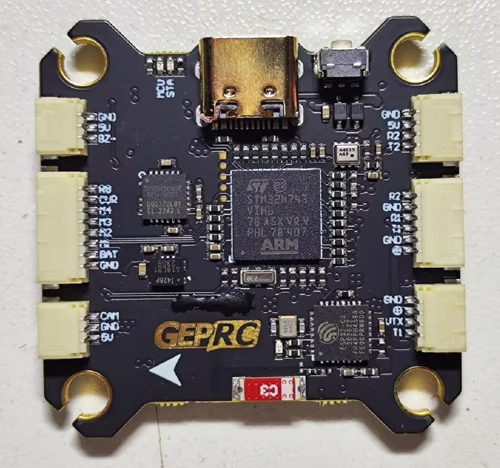
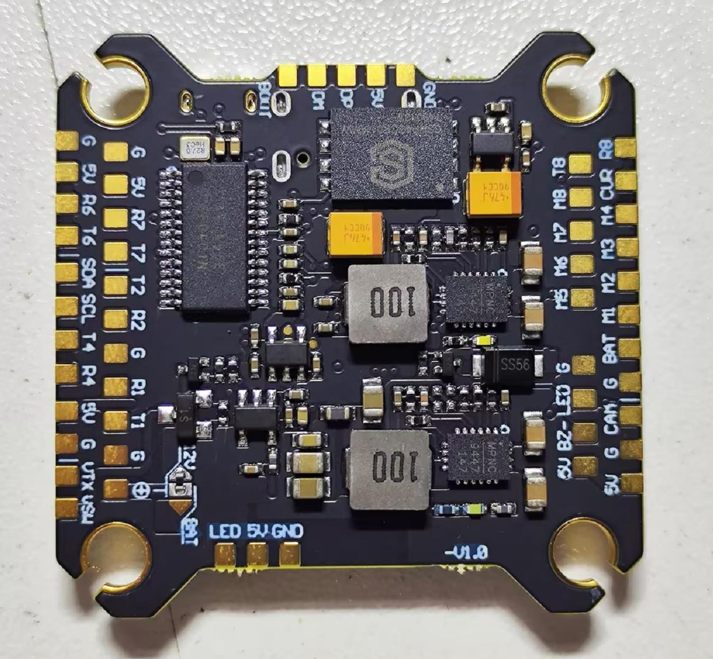

.. _common-geprc-taker-h743-bt:
[copywiki destination="plane,rover,copter,blimp,sub"]

=====================================
GEPRC TAKER H743 BT Flight Controller
=====================================

The TAKER H743 BT is a flight controller produced by `GEPRC <https://geprc.com/>`_.

Features
========

* STM32H743 microcontroller
* MPU6000+ICM42688 dual IMU
* SPL06-001 barometer
* microSD based 512MB flash logging
* AT7456E OSD
* 7 UARTs
* 8 PWM outputs

Pinout
======

UART Mapping
============
The UARTs are marked RXn and TXn in the above pinouts. The RXn pin is the receive pin for UARTn. The Txn pin is the transmit pin for UARTn.
Default protocols are given below:

* SERIAL0 -> USB
* SERIAL1 -> UART1 (DisplayPort, DMA-enabled)
* SERIAL2 -> UART2 (RCIN, DMA-enabled)
* SERIAL3 -> UART3 (connected to internal BT module, not currently usable by ArduPilot)
* SERIAL4 -> UART4 (GPS)
* SERIAL6 -> UART6 (User)
* SERIAL7 -> UART7 (User)
* SERIAL8 -> UART8 (ESC Telemetry)

Any UART may be re-tasked by changing its protocol parameter.

RC Input
========
RC input is configured on the RX2 (UART2_RX) pin. It supports all RC protocols except PPM. See :ref:`Radio Control Systems <common-rc-systems>` for details for a specific RC system. :ref:`SERIAL2_PROTOCOL<SERIAL2_PROTOCOL>` is set to “23”, by default, to enable this.

- SBUS/DSM/SRXL connects to the RX2 pin.
- FPort requires connection to TX2 and :ref:`SERIAL2_OPTIONS<SERIAL2_OPTIONS>` be set to “7”.
- CRSF also requires a TX2 connection, in addition to R2, and automatically provides telemetry. Set :ref:`SERIAL2_OPTIONS<SERIAL2_OPTIONS>`
- SRXL2 requires a connecton to TX2 and automatically provides telemetry. Set :ref:`SERIAL2_OPTIONS<SERIAL2_OPTIONS>` to “4”. =3.

FrSky Telemetry
===============
FrSky Telemetry is supported using the Tx pin of any UART excluding SERIAL3(UART3). To enable support for FrSky S.PORT (the example shows SERIAL6), you need to set the following parameters.

* :ref:`SERIAL6_PROTOCOL<SERIAL6_PROTOCOL>` = 10
* :ref:`SERIAL6_OPTIONS<SERIAL6_OPTIONS>` = 7

OSD Support
===========
The TAKER H743 BT supports analog OSD using its internal OSD chip and simultaneously HD goggle DisplayPort OSDs via the HD VTX connector.

VTX Support
===========
The SH1.0-6P connector supports a standard DJI HD VTX connection. Pin 1 of the connector is 12v (or VBAT selected by solder pad selection) so be careful not to connect to devices expecting 5v.

PWM Output
==========
The TAKER H743 BT supports up to 9 PWM/DShot outputs. The pads for motor output M1 to M4 are on the esc connector, M5-M8 are solder pads, plus M9 is defaulted for serial LED strip or can be used as another PWM output.

The PWM is in 4 groups:

* PWM 1-4 in group1
* PWM 5-6 in group2
* PWM 7-8 in group3
* PWM 9 in group4

Channels within the same group need to use the same output rate. If
any channel in a group uses DShot then all channels in the group need
to use DShot. Channels 1-8 support Bi-Directional DShot.

Battery Monitoring
==================
The board has a internal voltage sensor and connections on the ESC connector for an external current sensor input.
The voltage sensor can handle up to 6S.
LiPo batteries.

The default battery parameters are:

* :ref:`BATT_MONITOR<BATT_MONITOR>` = 4
* :ref:`BATT_VOLT_PIN<BATT_VOLT_PIN__AP_BattMonitor_Analog>` = 13
* :ref:`BATT_VOLT_MULT<BATT_VOLT_MULT__AP_BattMonitor_Analog>` = 11.1
* :ref:`BATT_CURR_PIN<BATT_CURR_PIN__AP_BattMonitor_Analog>` = 12
* :ref:`BATT_AMP_PERVLT<BATT_AMP_PERVLT__AP_BattMonitor_Analog>` = 28.5

Compass
=======
The TAKER H743 BT does not have a builtin compass, but you can attach an external compass using I2C on the SDA and SCL pads.

Loading Firmware
================
Initial firmware load can be done with DFU by plugging in USB with the
bootloader button pressed. Then you should load the "with_bl.hex"
firmware, using your favourite DFU loading tool.

Once the initial firmware is loaded you can update the firmware using
any ArduPilot ground station software. Updates should be done with the
\*.apj firmware files.
