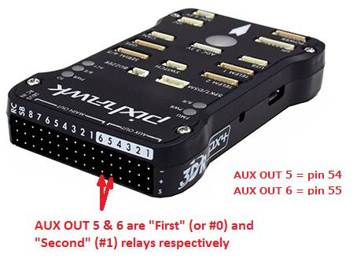
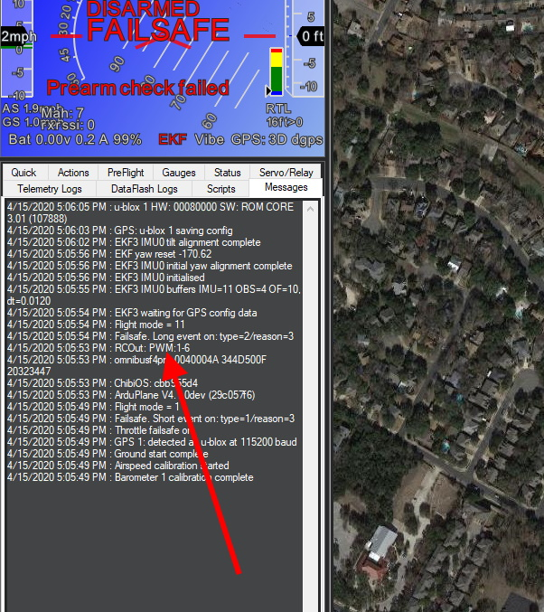

.. _common-gpios:

=====
GPIOs
=====

General Purpose Input/Outputs (GPIOs) are used in ArduPilot for control of :ref:`relays<common-relay>` , actuators, LEDs, :ref:`camera triggers<common-camera-shutter-with-servo>` , :ref:`Start Button<startstop-switch>` etc. These are provided by re-configuring the PWM outputs. The parameter :ref:`BRD_PWM_COUNT<BRD_PWM_COUNT>` determines how many of the PWM outputs are used for controlling motors/servos, and how many can be re-purposed and used as GPIO-style outputs.

If a autopilot has **X** outputs, then the number of available outputs that can be assigned via the ``SERVOx_FUNCTION`` parameter to be a relay, LED, etc. output is ( **X** - :ref:`BRD_PWM_COUNT<BRD_PWM_COUNT>` ). These GPIO outputs begin at the highest output number and proceed downward. So, for example, if the total outputs is 6 and :ref:`BRD_PWM_COUNT<BRD_PWM_COUNT>` = 4, then output 5/6 can be used for GPIO type functions.

The exception is autopilots using an IOMCU co-processor. These autopilots normally have 8 MAIN outputs, and several AUX outputs. Only the AUX outputs can be re-purposed as GPIOs, and the :ref:`BRD_PWM_COUNT<BRD_PWM_COUNT>` parameter only applies to this group of outputs.

For example, the Pixhawk has 8 MAIN outputs for motors/servos, and 6 AUX outputs. The default value for :ref:`BRD_PWM_COUNT<BRD_PWM_COUNT>` for this controller is 4, so AUX OUTPUT 5 & 6 can be used. More can be enabled for use as GPIO type output functions by decreasing :ref:`BRD_PWM_COUNT<BRD_PWM_COUNT>`.

Everytime the autopilot initializes, it sends a log message to the ground control station, showing which outputs are PWM/Oneshot/or DShot. The remaining higher numbered outputs are assigned as GPIOs.

GPIO "PIN" NUMBER
=================

Some GPIO-based functions require that the GPIO "pin number" to be entered into an associated parameter.This pin number is assigned in the autopilot's hardware definition file. Usually, the first GPIO capable output is assigned pin 50, the second 51, etc. So in the above case of the Pixhawk, AUX OUT 6 is pin 55.