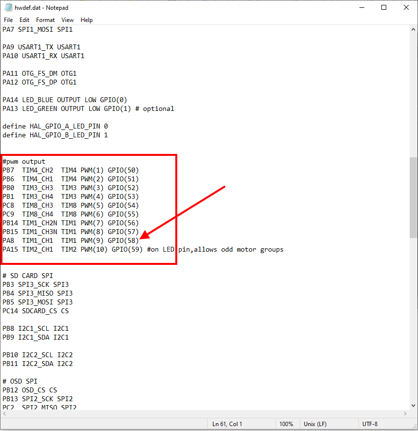

.. _common-gpios:

=====
GPIOs
=====

.. note:: in firmware versions 4.2 and later, the method for setting a PWM/SERVO/MOTOR outputs to be a GPIO function is changed. Instead of ``BRD_PWM_COUNT`` being used, the individual ``SERVOx_FUNCTION`` parameter is merely set to "-1". If set to "0", it remains a PWM output, unassigned to a function, and outputs that output's trim value when board safety is not active. If the servo function is being "mirrored" to a remote device, as in the case of a DroneCAN or KDECAN ESC, then in order to change the autopilot board's corresponding output pin to be a GPIO, but allow the ``SERVOx_FUNCTION`` to still be assigned to the remote device, the :ref:`SERVO_GPIO_MASK<SERVO_GPIO_MASK>` parameter can be used to assign the board pin to be a GPIO without affecting the ``SERVOx_FUNCTION`` assignment for the remote device.

.. warning:: When upgrading to 4.2 or later from pre 4.2 firmware, be aware that previously defined GPIOs MAY have to be re-designated using the SERVOx_FUNCTION or, alternatively, the :ref:`SERVO_GPIO_MASK<SERVO_GPIO_MASK>` parameter and that after upgrade any GPIO dependent release mechanisms (parachute, sprayers, etc.) may actuate until this re-definition is done.

General Purpose Input/Outputs (GPIOs) are used in ArduPilot for control of :ref:`relays<common-relay>` , actuators, LEDs, :ref:`camera triggers<common-camera-shutter-with-servo>` , :ref:`Start Button<startstop-switch>` etc. These are provided by re-configuring the PWM outputs. The parameter ``BRD_PWM_COUNT`` determines how many of the PWM outputs are used for controlling motors/servos, and how many can be re-purposed and used as GPIO-style outputs.

If a autopilot has **X** outputs, then the number of available outputs that can be assigned via the ``SERVOx_FUNCTION`` parameter to be a relay, LED, etc. output is ( **X** - ``BRD_PWM_COUNT`` ). These GPIO outputs begin at the highest output number and proceed downward. So, for example, if the total outputs is 6 and ``BRD_PWM_COUNT`` = 4, then output 5/6 can be used for GPIO type functions.

The exception is autopilots using an IOMCU co-processor. These autopilots normally have 8 MAIN outputs, and several AUX outputs. Only the AUX outputs can be re-purposed as GPIOs, and the ``BRD_PWM_COUNT`` parameter only applies to this group of outputs.

For example, the Pixhawk has 8 MAIN outputs for motors/servos, and 6 AUX outputs. The default value for ``BRD_PWM_COUNT`` for this controller is 4, so AUX OUTPUT 5 & 6 can be used. More can be enabled for use as GPIO type output functions by decreasing ``BRD_PWM_COUNT``.

.. image:: ../../../images/Relay_Pixhawk.jpg

.. note:: Changing ``BRD_PWM_COUNT`` requires a reboot of the autopilot for it to take effect.

Everytime the autopilot initializes, it sends a log message to the ground control station, showing which outputs are PWM/Oneshot/or DShot. The remaining higher numbered outputs are assigned as GPIOs.

GPIO "PIN" NUMBER
=================

Some GPIO-based functions require that the GPIO "pin number" to be entered into an associated parameter.This pin number is assigned in the autopilot's hardware definition file. Usually, the first GPIO capable output is assigned pin 50, the second 51, etc. So in the above case of the Pixhawk, AUX OUT 6 is pin 55.

You can verify an output's GPIO pin number assignment easily. First, find its hwdef.dat file `here <https://github.com/ArduPilot/ardupilot/tree/master/libraries/AP_HAL_ChibiOS/hwdef>`__ and determine the GPIO pin number listed beside its output number, as shown below:

In the above case, you could set the ``BRD_PWM_COUNT`` down to 8, freeing PWM9 and PWM10 (which correspond to the AUX1 and AUX2) and use their GPIO numbers for GPIO functions. (this also forces all higher numbered outputs, AUX3-6, to be GPIOs)

.. note:: Usually, changing any feature or function's GPIO pin assignment will require a reboot for it to take effect.

