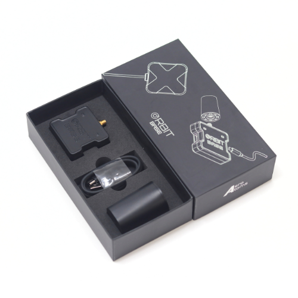
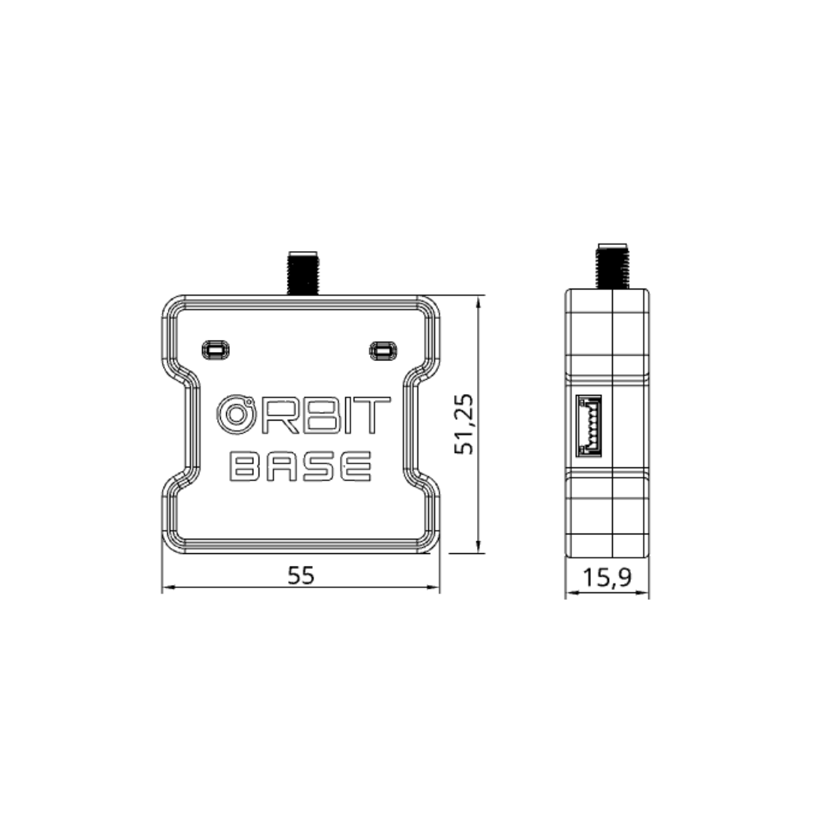

.. _common-gps-aeroatoms-orbit-base:

====================
AeroAtoms Orbit Base
====================

Overview
========

The **AeroAtoms Orbit Base** is a high-precision RTK base station designed for
ArduPilot-compatible systems. It integrates the u-blox ZED-F9P-15B GNSS receiver
and provides RTCM 3.3 correction data for centimeter-level RTK positioning.

Orbit Base supports GPS, Galileo, BeiDou, NavIC, and GLONASS constellations and
is intended for surveying, mapping, precision agriculture, and UAV RTK
applications.

Key Capabilities
================

* u-blox ZED-F9P-15B GNSS receiver
* Multi-band GNSS reception
* GPS, Galileo, BeiDou, NavIC and GLONASS
* RTCM 3.3 correction output
* USB Type-C interface
* RTK update rate up to 20 Hz

Specifications
==============

.. list-table::
   :widths: 35 65
   :header-rows: 0

   * - GNSS Receiver
     - u-blox ZED-F9P-15B
   * - Intended Application
     - RTK Base Station
   * - GNSS Systems
     - GPS, Galileo, BeiDou, NavIC, GLONASS
   * - GNSS Bands
     - L1C/A, L5, L1OF, E1B/C, E5a, B1I, B2a
   * - Position Accuracy
     - 0.01 m
   * - RTK Support
     - RTCM 3.3 Base Station
   * - Navigation Rate
     - Up to 20 Hz
   * - Communication
     - USB, UART
   * - Primary Connector
     - USB Type-C
   * - Antenna Connector
     - SMA
   * - Supply Voltage
     - 5 V (USB-C)
   * - Status Indicators
     - Power LED, GPS Lock LED

Dimensions
==========

The mechanical dimensions of the AeroAtoms Orbit Base are shown below.

Documentation
=============

Complete documentation for the AeroAtoms Orbit Base is available on the
AeroAtoms documentation portal.

Official documentation:

* `Orbit Base Documentation <https://docs.aeroatoms.com/orbit-base/overview/>`_

Links
=====

* `Documentation <https://docs.aeroatoms.com>`_
* `Store <https://shop.aeroatoms.com>`_
* `AeroAtoms Website <https://aeroatoms.com>`_