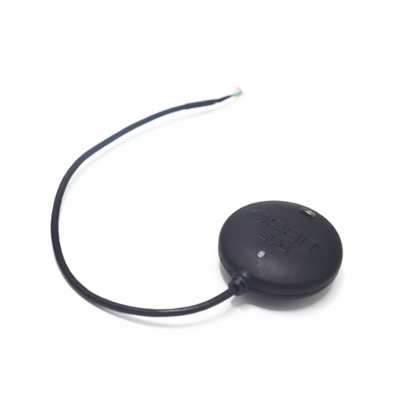
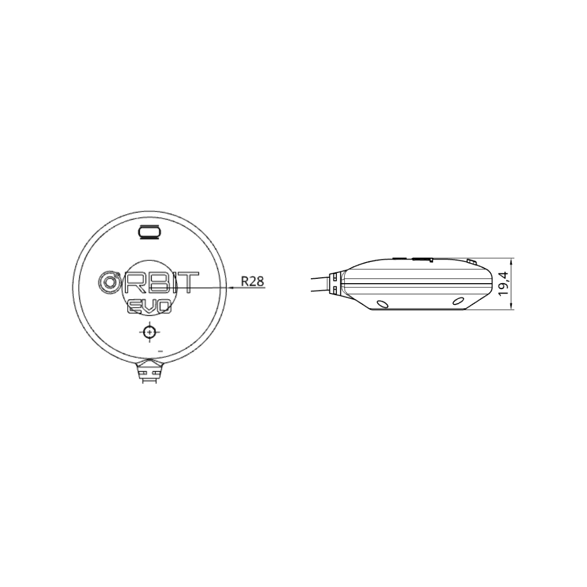

.. _common-gps-aeroatoms-orbit-evo:

=====================================
AeroAtoms Orbit EVO (UART / DroneCAN)
=====================================

Overview
========

The **AeroAtoms Orbit EVO** is a professional GNSS navigation module designed
for ArduPilot-compatible vehicles. It integrates the u-blox NEO-M9N GNSS
receiver, IST8310 magnetometer, safety switch, and buzzer into a compact
navigation solution for multirotors, fixed-wing aircraft, VTOLs, and ground
vehicles.

Orbit EVO supports concurrent reception of GPS, Galileo, BeiDou, and GLONASS
constellations while utilizing an integrated LNA and SAW filter for improved
signal reception and interference rejection. The module is available in both
UART and DroneCAN variants.

Key Capabilities
================

* u-blox NEO-M9N multi-constellation GNSS receiver
* Concurrent reception of GPS, Galileo, BeiDou and GLONASS
* Integrated IST8310 magnetometer
* Integrated safety switch
* Integrated buzzer
* LNA + SAW filter for enhanced signal reception
* Available in UART and DroneCAN variants
* Navigation update rate up to 10 Hz

Specifications
==============

.. list-table::
   :widths: 35 65
   :header-rows: 0

   * - GNSS Receiver
     - u-blox NEO-M9N
   * - Intended Application
     - Professional Unmanned Systems Navigation
   * - GNSS Systems
     - GPS, Galileo, BeiDou, GLONASS
   * - GNSS Bands
     - L1C/A, L1OF, E1B/C, B1I
   * - RTK Support
     - No (Standard Positioning)
   * - Horizontal Accuracy
     - 1.5 m CEP (without SBAS)
   * - Signal Enhancement
     - LNA + SAW Filter
   * - Magnetometer
     - IST8310
   * - Communication
     - UART or DroneCAN
   * - Navigation Rate
     - Up to 10 Hz
   * - Supply Voltage
     - 5 V
   * - Current Consumption
     - <80 mA
   * - Safety Switch
     - Integrated
   * - Buzzer
     - Integrated
   * - Dimensions
     - Ø56 × 19.4 mm
   * - Weight
     - 35.2 g

Dimensions
==========

The mechanical dimensions of the AeroAtoms Orbit EVO are shown below.

Documentation
=============

Complete documentation for the AeroAtoms Orbit EVO is available on the AeroAtoms
documentation portal.

The documentation includes:

* Product Overview
* Specifications
* Mechanical Dimensions
* User Guide
* Firmware Updates

Official documentation:

* `Orbit EVO Documentation <https://docs.aeroatoms.com/orbit-evo/overview/>`_

Links
=====

* `Documentation <https://docs.aeroatoms.com>`_
* `Store <https://shop.aeroatoms.com>`_
* `AeroAtoms Website <https://aeroatoms.com>`_