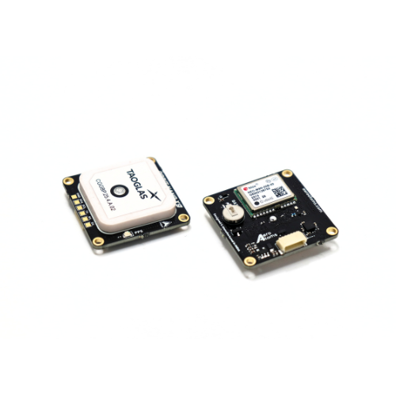
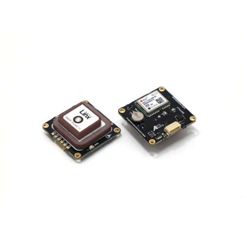
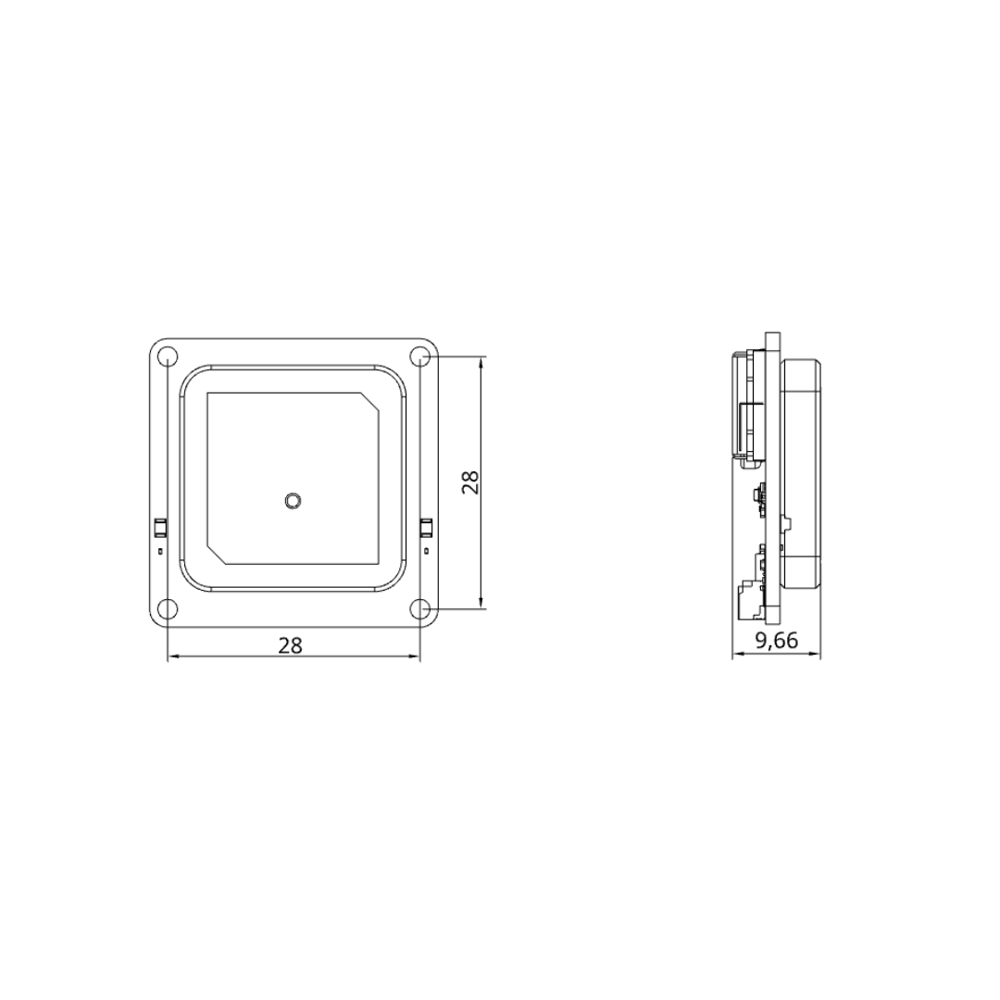
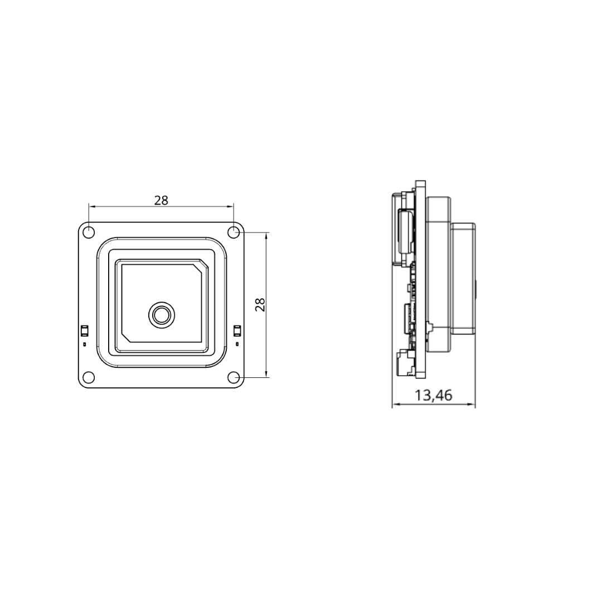

.. _common-gps-aeroatoms-orbit-nano-x:

=============================
AeroAtoms Orbit Nano X9 / X10
=============================

Overview
========

The **AeroAtoms Orbit Nano X** family consists of ultra-compact GNSS navigation
modules designed for ArduPilot-compatible vehicles. Both Orbit Nano X9 and
Orbit Nano X10 integrate an IST8310 magnetometer in a compact 28 × 28 mm form
factor, providing reliable positioning for multirotors, fixed-wing aircraft,
VTOLs, and ground vehicles.

Both modules utilize an integrated **LNA + SAW filter** for improved signal
reception and interference rejection while communicating through a standard
UART interface.

Orbit Nano X10 extends Orbit Nano X9 by incorporating the u-blox **NEO-F10N**
dual-band GNSS receiver with **L1/L5** reception and **NavIC** support,
providing improved positioning accuracy and enhanced multipath mitigation.

Key Capabilities
================

* Ultra-compact 28 × 28 mm form factor
* Integrated IST8310 magnetometer
* Integrated LNA + SAW filter
* UART communication interface
* Navigation update rate up to 10 Hz
* Designed for ArduPilot-compatible vehicles

Comparison
==========

.. list-table::
   :widths: 35 25 25
   :header-rows: 1

   * - Feature
     - Orbit Nano X9
     - Orbit Nano X10

   * - GNSS Receiver
     - u-blox NEO-M9N
     - u-blox NEO-F10N

   * - Intended Application
     - Entry-Level Unmanned Systems Navigation
     - Dual-Band Unmanned Systems Navigation

   * - GNSS Systems
     - GPS, Galileo, BeiDou, GLONASS
     - GPS, Galileo, BeiDou, QZSS, NavIC

   * - GNSS Bands
     - L1C/A, L1OF, E1B/C, B1I
     - L1C/A, L5, E1B/C, E5a, B1C, B2a

   * - Dual-Band Support
     - No
     - Yes (L1/L5)

   * - NavIC Support
     - No
     - Yes

   * - RTK Support
     - No
     - No

   * - Horizontal Accuracy
     - 1.5 m CEP (without SBAS)
     - 1.0 m CEP (with SBAS), 1.5 m CEP (without SBAS)

   * - Signal Enhancement
     - Integrated LNA + SAW Filter
     - Integrated LNA + SAW Filter

   * - Magnetometer
     - IST8310
     - IST8310

   * - Communication
     - UART
     - UART

   * - Navigation Rate
     - Up to 10 Hz
     - Up to 10 Hz

   * - Baud Rate
     - Configurable (Default: 38400)
     - Configurable (Default: 38400)

   * - Supply Voltage
     - 5 V
     - 5 V

   * - Current Consumption
     - <50 mA
     - <60 mA

   * - Dimensions
     - 28 × 28 × 9.6 mm
     - 28 × 28 × 13.46 mm

   * - Weight
     - 20.2 g
     - 23.2 g

Dimensions
==========

**Orbit Nano X9**

**Orbit Nano X10**

Documentation
=============

Complete documentation for the AeroAtoms Orbit Nano X family is available on
the AeroAtoms documentation portal.

Official documentation:

* `Orbit Nano X9 <https://docs.aeroatoms.com/orbit-nano-x9/overview/>`_
* `Orbit Nano X10 <https://docs.aeroatoms.com/orbit-nano-x10/overview/>`_

Links
=====

* `Documentation <https://docs.aeroatoms.com>`_
* `Store <https://shop.aeroatoms.com>`_
* `AeroAtoms Website <https://aeroatoms.com>`_