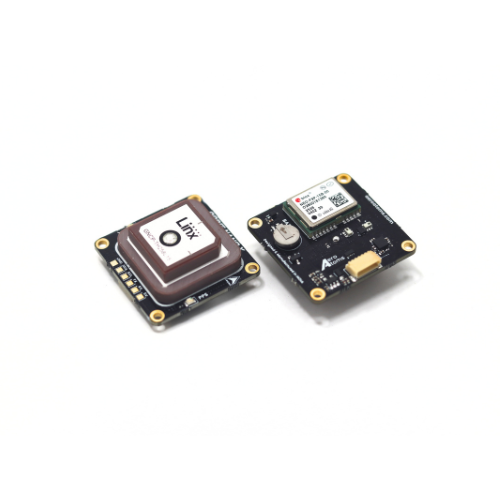
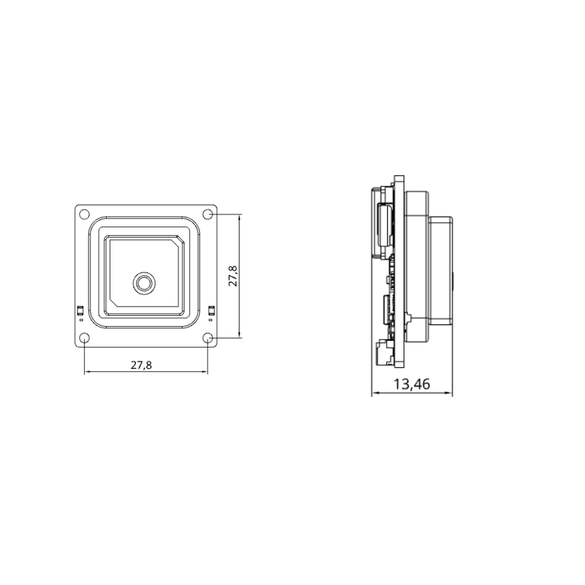

.. _common-gps-aeroatoms-orbit-nano:

==========================================
AeroAtoms Orbit Nano RTK (UART / DroneCAN)
==========================================

Overview
========

The **AeroAtoms Orbit Nano** is an ultra-compact RTK GNSS navigation module
designed for ArduPilot-compatible vehicles. It integrates the u-blox NEO-F9P
multi-band GNSS receiver and IST8310 magnetometer, delivering centimeter-level
RTK positioning for multirotors, fixed-wing aircraft, VTOLs, and ground
vehicles.

Orbit Nano supports concurrent reception of GPS, Galileo, BeiDou, NavIC,
GLONASS, and QZSS constellations with L1/L5 dual-band operation. Integrated
LNA and SAW filtering provide improved signal reception and interference
rejection.

The module is available in both **UART** and **DroneCAN** variants.

Key Capabilities
================

* Ultra-compact 28 × 28 mm form factor
* u-blox NEO-F9P multi-band RTK GNSS receiver
* Concurrent reception of GPS, Galileo, BeiDou, NavIC, GLONASS and QZSS
* L1/L5 dual-band GNSS reception
* Centimeter-level RTK positioning
* Integrated IST8310 magnetometer
* Integrated LNA + SAW filter
* Available in UART and DroneCAN variants
* Navigation update rate up to 10 Hz

Specifications
==============

.. list-table::
   :widths: 35 65
   :header-rows: 0

   * - GNSS Receiver
     - u-blox NEO-F9P-15B
   * - Intended Application
     - RTK Precision Unmanned Systems Navigation
   * - GNSS Systems
     - GPS, Galileo, BeiDou, NavIC, GLONASS, QZSS
   * - GNSS Bands
     - L1C/A, L5, L1OF, E1B/C, E5a, B1C, B2a
   * - RTK Support
     - Yes (Centimeter-level Accuracy)
   * - RTK Horizontal Accuracy
     - 0.01 m + 1 ppm CEP
   * - Horizontal Accuracy
     - 1.5 m CEP (without RTK)
   * - Signal Enhancement
     - LNA + SAW Filter
   * - Magnetometer
     - IST8310
   * - Communication
     - UART or DroneCAN
   * - Navigation Rate
     - Up to 10 Hz
   * - Supply Voltage
     - 5 V
   * - Current Consumption
     - <100 mA
   * - Dimensions
     - 28 × 28 × 13.4 mm
   * - Weight
     - 23.2 g

Dimensions
==========

The mechanical dimensions of the AeroAtoms Orbit Nano are shown below.

Documentation
=============

Complete documentation for the AeroAtoms Orbit Nano is available on the
AeroAtoms documentation portal.

The documentation includes:

* Product Overview
* Specifications
* Mechanical Dimensions
* User Guide
* RTK Rover Configuration
* Firmware Updates

Official documentation:

* `Orbit Nano Documentation <https://docs.aeroatoms.com/orbit-nano/overview/>`_

Links
=====

* `Documentation <https://docs.aeroatoms.com>`_
* `Store <https://shop.aeroatoms.com>`_
* `AeroAtoms Website <https://aeroatoms.com>`_