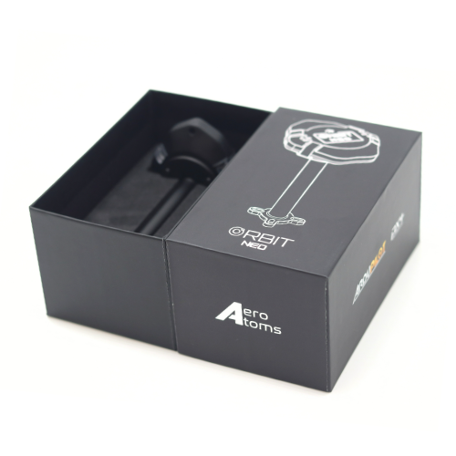
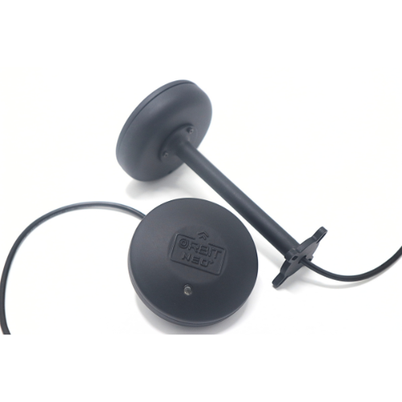
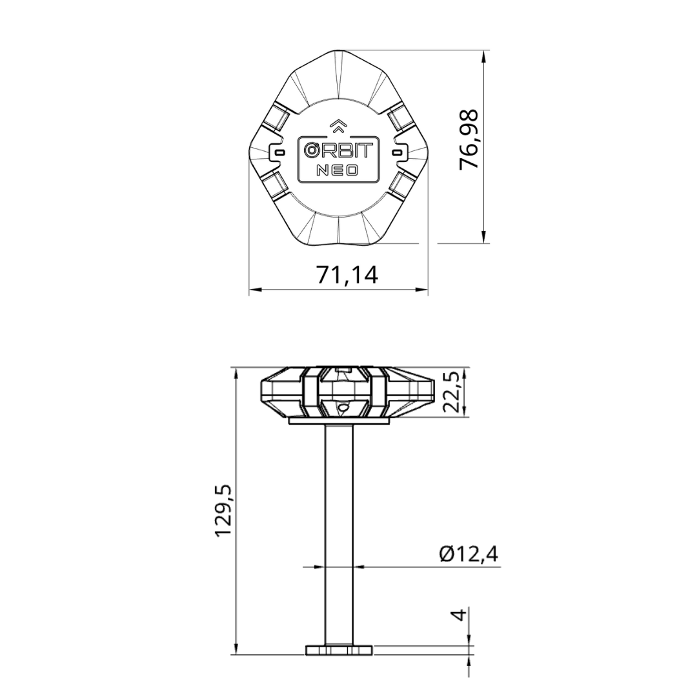
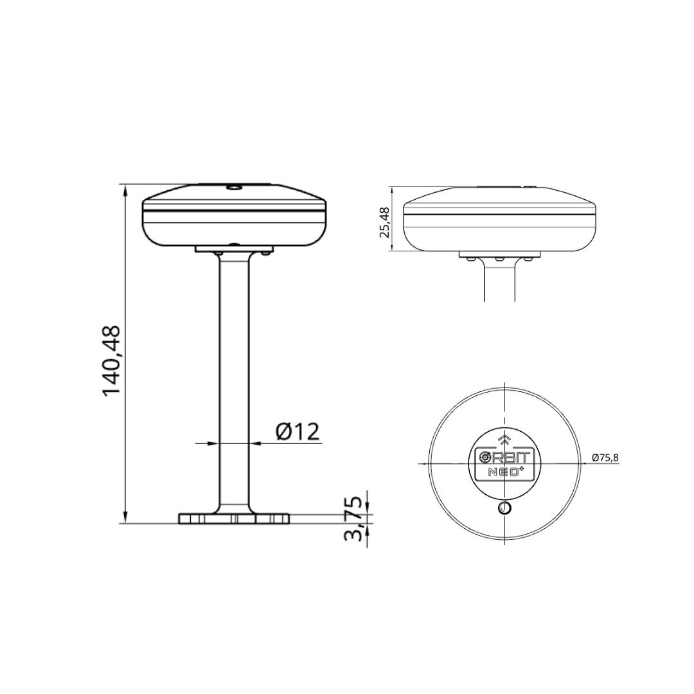

.. _common-gps-aeroatoms-orbit-neo:

==================================
AeroAtoms Orbit Neo / Neo Plus RTK
==================================

Overview
========

The **AeroAtoms Orbit Neo** family consists of high-precision DroneCAN GNSS
modules designed for ArduPilot-compatible vehicles. Both Orbit Neo and Orbit
Neo Plus integrate the u-blox ZED-F9P multi-band GNSS receiver with onboard
magnetometer and barometer, providing centimeter-level RTK positioning for
multirotors, fixed-wing aircraft, VTOLs, and ground vehicles.

Orbit Neo Plus extends the Orbit Neo platform by adding **Moving Baseline**
support for dual-antenna heading, an **STM32H743** microcontroller, integrated
**LNA + SAW filtering**, **EMI shielding**, and an upgraded barometer,
providing improved heading estimation and GNSS performance in demanding RF
environments.

Key Capabilities
================

* u-blox ZED-F9P multi-band RTK GNSS receiver
* Centimeter-level RTK positioning
* DroneCAN communication
* Concurrent reception of GPS, Galileo, BeiDou, NavIC and GLONASS
* Integrated IST8310 magnetometer
* Integrated barometer
* Navigation update rate up to 10 Hz

Comparison
==========

.. list-table::
   :widths: 35 25 25
   :header-rows: 1

   * - Feature
     - Orbit Neo
     - Orbit Neo Plus

   * - GNSS Receiver
     - u-blox ZED-F9P-15B
     - u-blox ZED-F9P-15B

   * - MCU
     - STM32G474
     - STM32H743

   * - RTK Support
     - Yes
     - Yes

   * - Moving Baseline
     - No
     - Yes

   * - GNSS Systems
     - GPS, Galileo, BeiDou, NavIC, GLONASS
     - GPS, Galileo, BeiDou, NavIC, GLONASS

   * - GNSS Bands
     - L1C/A, L5, L1OF, E1B/C, E5a, B1I, B2a
     - L1C/A, L5, L1OF, E1B/C, E5a, B1I, B2a

   * - LNA + SAW Filter
     - No
     - Yes

   * - EMI Shielding
     - No
     - Yes

   * - Magnetometer
     - IST8310
     - IST8310

   * - Barometer
     - ICP-20100
     - DPS368XTSA1

   * - Communication
     - DroneCAN
     - DroneCAN

   * - Navigation Rate
     - Up to 10 Hz
     - Up to 10 Hz

   * - CAN Baud Rate
     - Up to 8 Mbit/s
     - Up to 8 Mbit/s

   * - Supply Voltage
     - 5 V
     - 5 V

   * - Current Consumption
     - 180 mA
     - 150 mA

Dimensions
==========

**Orbit Neo**

**Orbit Neo Plus**

Documentation
=============

Complete documentation for the AeroAtoms Orbit Neo family is available on the
AeroAtoms documentation portal.

Official documentation:

* `Orbit Neo <https://docs.aeroatoms.com/orbit-neo/overview/>`_
* `Orbit Neo Plus <https://docs.aeroatoms.com/orbit-neo-plus/overview/>`_

Links
=====

* `Documentation <https://docs.aeroatoms.com>`_
* `Store <https://shop.aeroatoms.com>`_
* `AeroAtoms Website <https://aeroatoms.com>`_