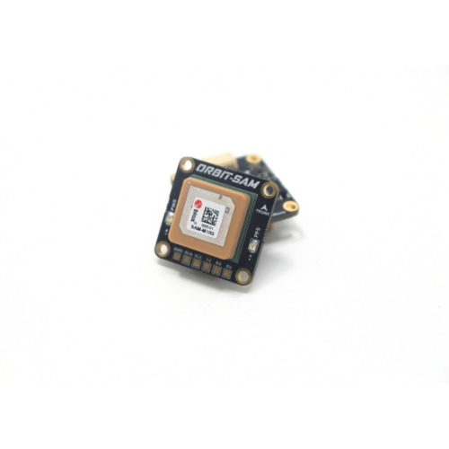
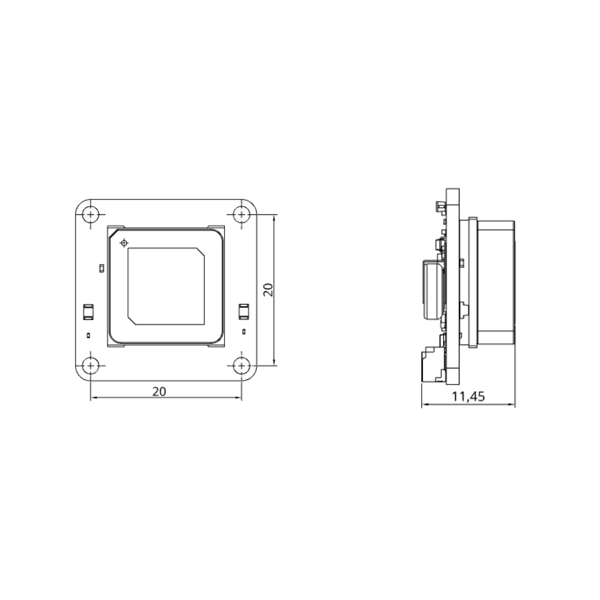

.. _common-gps-aeroatoms-orbit-sam:

===================
AeroAtoms Orbit SAM
===================

Overview
========

The **AeroAtoms Orbit SAM** is an ultra-compact GNSS module designed for
ArduPilot-compatible vehicles. It integrates the u-blox SAM-M10Q GNSS receiver
with an onboard IST8310 magnetometer, providing reliable positioning and heading
information for multirotors, fixed-wing aircraft, VTOLs, and ground vehicles.

Orbit SAM supports concurrent reception of GPS, Galileo, BeiDou, and GLONASS
constellations while maintaining very low power consumption, making it suitable
for compact and battery-powered unmanned systems.

Key Capabilities
================

* Ultra-compact 20 × 20 mm form factor
* u-blox SAM-M10Q multi-constellation GNSS receiver
* Concurrent reception of GPS, Galileo, BeiDou and GLONASS
* Integrated IST8310 magnetometer
* UART communication interface
* Navigation update rate up to 5 Hz
* Low power consumption (<40 mA)

Specifications
==============

.. list-table::
   :widths: 35 65
   :header-rows: 0

   * - GNSS Receiver
     - u-blox SAM-M10Q
   * - Intended Application
     - Unmanned Systems Navigation
   * - GNSS Systems
     - GPS, Galileo, BeiDou, GLONASS
   * - GNSS Bands
     - L1C/A, L1OF, E1B/C, B1I
   * - RTK Support
     - No (Standard Positioning)
   * - Horizontal Accuracy
     - 1.5 m CEP (without SBAS)
   * - Magnetometer
     - IST8310
   * - Communication
     - UART
   * - Navigation Rate
     - Up to 5 Hz
   * - Baud Rate
     - Configurable (Default: 38400)
   * - Supply Voltage
     - 5 V
   * - Current Consumption
     - <40 mA
   * - Dimensions
     - 20 × 20 × 11.45 mm
   * - Weight
     - 9.1 g

Dimensions
==========

Documentation
=============

Complete documentation for the AeroAtoms Orbit SAM is available on the AeroAtoms
documentation portal.

The documentation includes:

* Product Overview
* Specifications
* Mechanical Dimensions
* User Guide
* Firmware Updates

Official documentation:

* `Orbit SAM Documentation <https://docs.aeroatoms.com/orbit-sam/overview/>`_

Links
=====

* `Documentation <https://docs.aeroatoms.com>`_
* `Store <https://shop.aeroatoms.com>`_
* `AeroAtoms Website <https://aeroatoms.com>`_