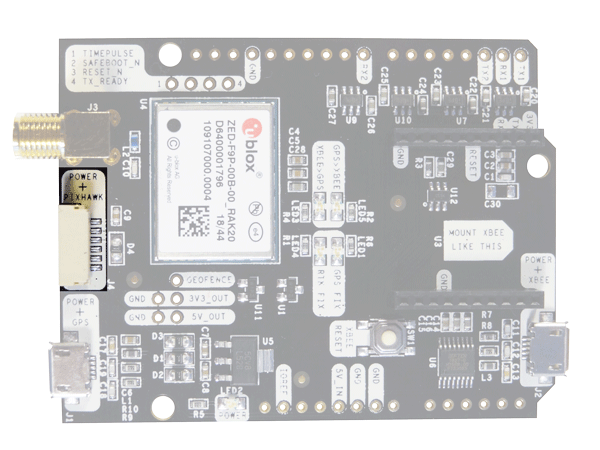

.. _common-gps-ardusimple:

==========
ArduSimple
==========

ArduSimple provides a number of UBlox F9P based GNSS receivers that support RTK and GPS-for-Yaw. Using RTK allows ArduPilot with centimeter level accuracy which is much more accurate than a normal GPS.

The simpleRTK2B system has two receiver modules which plug together and the simpleRTK3b is a single integrated unit.

Where to Buy
============

- `ArduSimple website <https://www.ardusimple.com/>`_

Pin Map
=======

The system is connected to the autopilot via one of its UARTs.

The JST-GH connector is following the Pixhawk standard:

   -  1: 5V_IN
   -  2: ZED-F9P UART1 RX (3.3V level)
   -  3: ZED-F9P UART1 TX (3.3V level)
   -  4,5: Not connected
   -  6: GND

Please note that the board only includes GPS and doesn’t include compass.

Wiring and Connections
======================

All ArduSimple GNSS models come with a JST GH 6-pin connector/cable that is compatible with the Pixhawk family and many other autopilots.

.. note:: The cables/connectors may be modified to connect to other autopilot boards, using the Pin Map information provided above.

Configuration
=============

For normal GPS only operation, ArduPilot's GPS parameter defaults will work for any serial port configured for ``SERIALx_PROTOCOL`` = 5.

For GPS-for-Yaw, please refer to :ref:`GPS-for-Yaw <common-gps-for-yaw>`, but ArduSimple provides detailed setup guides for each system on their website:

`simpleRTK2B instructions <https://www.ardusimple.com/ardupilot-simplertk2bheading-configuration/>`__

`simpleRTK3B instructions <https://www.ardusimple.com/ardupilot-simplertk3b-heading-configuration/>`__

.. note:: ArduPilot does not currently configure UBlox F9P GPS constellations. User must assure that the GPS is properly configured for his region and application. See :ref:`common-gps-ublox-firmware-update`

