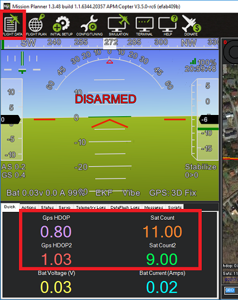

.. _common-gps-blending:

===========================
GPS Blending (aka Dual GPS)
===========================

Copter 3.5 (and higher), Plane 3.8.0 (and higher) and recent versions of Rover all support GPS Blending.
Using two GPSs reduces the chance of glitches affecting the vehicle.

.. image:: ../../../images/pixhawk_with_dual_gps.jpg
    :target: ../_images/pixhawk_with_dual_gps.jpg

.. note::

   Two GPSs should not be used on Copter-3.4.5 (and older) firmwares because of the risk of sudden vehicle movements when the primary GPS changes.

Only GPSs that report position and speed accuracy can be used for blending.  All UBlox GPSs provide this extra information while GPSs using the NMEA protocol generally do not.

Normally blending should be done with two GPSs from the same manufacturer because the scaling of the accuracy numbers varies and will lead to favouring one GPS over the other.

Setup through the Ground Station
================================

- :ref:`SERIAL4_PROTOCOL <SERIAL4_PROTOCOL>` = 5 / "GPS".  Alternatively telemetry port 1 or 2 can be used by setting :ref:`SERIAL1_PROTOCOL <SERIAL1_PROTOCOL>` or :ref:`SERIAL2_PROTOCOL <SERIAL2_PROTOCOL>` to 5.
- :ref:`GPS_TYPE2 <GPS_TYPE2>` = 1 / "AUTO" or the specific number corresponding to the type of GPS
- :ref:`GPS_AUTO_SWITCH <GPS_AUTO_SWITCH>` = 2 / "Blend".  Alternatively set to 1 / "UseBest" to only use the better GPS.  The better GPS is decided based on the GPS's self reported accuracy.

After rebooting the board, the status, hdop and satellite count of both GPSs should be visible.

Dataflash logging
=================

The first GPS's data appears in the GPS and GPA messages.
The second GPS's data appears in the GPS2 and GPA2 messages.
The blended GPS data appears in the GPSB and GPAB messages.

If using the Mission Planner, opening a dataflash log and clicking on "Show Map" will show both GPSs, the blended position and the EKF's final estimate (shown as "POS")

.. image:: ../../../images/gps-blending-mp-show-map.png
	:target: ../_images/gps-blending-mp-show-map.png

Video
=====

Video of a heavily loaded IRIS using Blended GPS, optical flow and a lidar range finder

..  youtube:: ieUD6FlxM-I
    :width: 100%