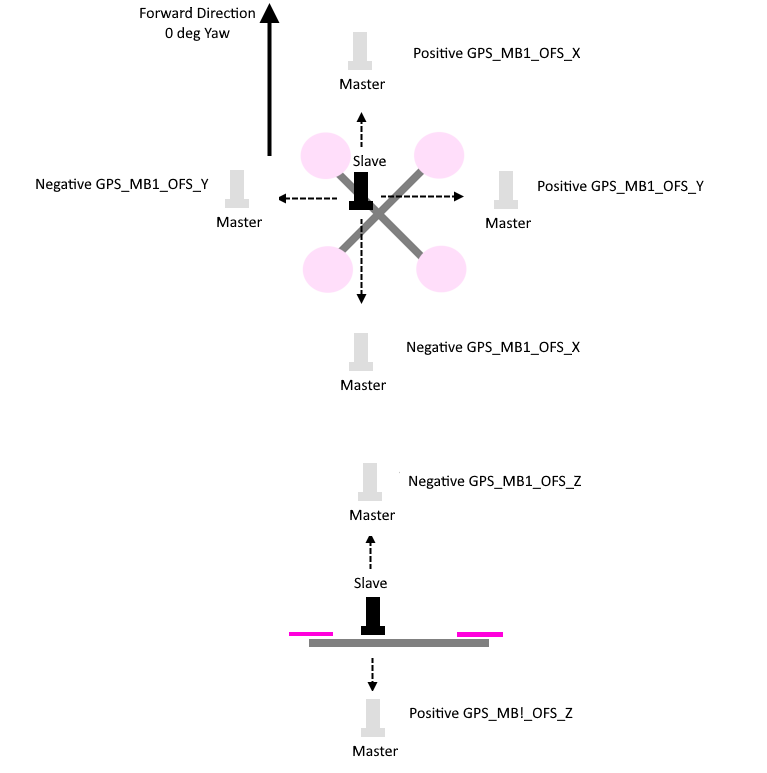

.. _common-gps-for-yaw:

=================================
GPS for Yaw (aka Moving Baseline)
=================================

New RTK GPS modules, such as a pair of Ublox F9's, devices based on the Unicore UM-982 or some dual-antenna devices can be used to estimate yaw,
in addition to providing position information.
This removes the need for a compass which may suffer from magnetic interference from the ground or the vehicle's motors and ESCs.
This works even if the GPSs do not have an RTK fix (RTCM data from a fixed RTK station or NTRIP server).

GPSes from ArduPilot Partners that are known to work are shown on the :ref:`common-positioning-landing-page`

.. note::

 **Ublox F9P modules must run firmware version 1.3.2 or higher and constellations configured**. See :ref:`common-gps-ublox-firmware-update`.

Hardware Setup
==============

GPS Yaw estimation relies on the detection of signal delays from each satellite as they reach two separated antennas. The GPS system may consist of dual or a single module, but two antennas are required in each case.

- The antennas must be separated by at least 30cm on the vehicle.
- For dual unit systems, the 1st GPS and 2nd GPS should be connected to the serial/telem ports on the
  autopilot or via DroneCAN.  The following parameter instructions assume Serial3 and Serial4 are used for serial connecting GPSes but any serial port(s) should work as long as the first port using protocol 5 is connected to one of the GPS.
- Dual unit Serial GPS modules must be connected to ArduPilot via their (not the autopilots's) UART1 connectors, DroneCAN modules via CAN , or interconnected per their manufacturer instructions.

Configuration
=============

.. note:: should be possible to mix and match a Serial GPS and a DroneCAN GPS, but this configuration has not been tested as yet.

Common Parameter Setup
----------------------

- :ref:`AHRS_EKF_TYPE <AHRS_EKF_TYPE>` = 3 (to use EKF3)
- :ref:`EK2_ENABLE <EK2_ENABLE>` = 0 (to disable EKF2)
- :ref:`EK3_ENABLE <EK3_ENABLE>` = 1 (to enable EKF3)
- :ref:`EK3_MAG_CAL <EK3_MAG_CAL>` is not used for this feature so it can be left at its default value ("0" for Plane, "3" for Copter, "2" for Rover)
- :ref:`EK3_SRC1_YAW <EK3_SRC1_YAW>` = 2 ("GPS") or 3 ("GPS with Compass Fallback") if a compass(es) is also in the system

.. note:: Do not use :ref:`GPS_AUTO_SWITCH<GPS_AUTO_SWITCH>` = 2 (Blend) when using Moving Baseline configurations.

Dual Serial F9P GPS
-------------------

- :ref:`SERIAL3_PROTOCOL<SERIAL3_PROTOCOL>` = 5 ("GPS") assuming the 1st GPS is connected to SERIAL3.
- :ref:`SERIAL4_PROTOCOL <SERIAL4_PROTOCOL>` = 5 ("GPS") assuming the 2nd GPS is connected to serial port 4
- :ref:`GPS1_TYPE <GPS1_TYPE>` = 17 ("UBlox moving baseline base") 
- :ref:`GPS2_TYPE <GPS2_TYPE>` = 18 ("UBlox moving baseline rover")
- :ref:`GPS_AUTO_CONFIG<GPS_AUTO_CONFIG>` = 1 (AutoConfig Serial)
- :ref:`GPS_AUTO_SWITCH <GPS_AUTO_SWITCH>` = 1
- Set the :ref:`GPS1_POS_X <GPS1_POS_X>`/Y/Z and :ref:`GPS2_POS_X <GPS2_POS_X>`/Y/Z parameters for the GPSs (see :ref:`Sensor Position Offset are here <common-sensor-offset-compensation>`). You must establish the relative positions of each GPS location on the vehicle with respect the vehicle's motion.

Dual DroneCAN F9P GPS
---------------------

If DroneCAN GPS are used, then configure the CAN/DroneCAN ports as explained in :ref:`common-uavcan-setup-advanced` and instead of setting up the SERIAL port protocols above, make sure that no SERIAL ports are setup with GPS protocol ("5"). Also be sure that the two DroneCAN GPS are on the same physical CAN bus from the autopilot. This usually requires that a CAN bus splitter be used. Then set these parameters:

- :ref:`GPS1_TYPE <GPS1_TYPE>` = 22 ("DroneCAN moving baseline base")
- :ref:`GPS2_TYPE <GPS2_TYPE>` = 23 ("DroneCAN moving baseline rover")
- :ref:`GPS_AUTO_CONFIG<GPS_AUTO_CONFIG>` = 2 (AutoConfig DroneCAN)
- :ref:`GPS_AUTO_SWITCH <GPS_AUTO_SWITCH>` = 1
- Set the :ref:`GPS1_POS_X <GPS1_POS_X>`/Y/Z and :ref:`GPS2_POS_X <GPS2_POS_X>`/Y/Z parameters for the GPS antennas (see :ref:`Sensor Position Offset are here <common-sensor-offset-compensation>`). You must establish the relative positions of each GPS location on the vehicle with respect the vehicle's motion.
- :ref:`GPS1_CAN_OVRIDE<GPS1_CAN_OVRIDE>` (Base NODEID) and :ref:`GPS2_CAN_OVRIDE<GPS2_CAN_OVRIDE>` (Rover NODEID) determine which physical DroneCAN GPS is used for GPS1 and GPS2. These are automatically populated at boot from the detected addresses, which are also shown in :ref:`GPS1_CAN_NODEID<GPS1_CAN_NODEID>` and :ref:`GPS2_CAN_NODEID<GPS2_CAN_NODEID>`, but can be overriden, if needed. You will need to determine which physical CAN GPS is assigned as GPS1 and GPS2 in order to setup the position offsets (see :ref:`Sensor Position Offset are here <common-sensor-offset-compensation>`)

The above dual unit configurations assumes that you want the RTCMv3 data between
the two GPS modules to go via the autopilot board.

.. note:: You may instead install a cross-over UART cable between the two UART2 connectors on the two GPS modules (Assuming they are serial rather than DroneCAN). If you do that then you can set :ref:`GPS_DRV_OPTIONS <GPS_DRV_OPTIONS>` = 1 which tells the u-blox GPS driver to configure the two GPS modules to send RTCMv2 data over UART2. On DroneCAN modules, a second CAN port is provided to allow this direct connection for RTCMv2 data. In that case, set :ref:`GPS_DRV_OPTIONS <GPS_DRV_OPTIONS>` = 8.

Single Unit Systems
-------------------

These have a single module with dual antennas.

.. note:: ArduPilot allows for up to two GPSes. The following parameter examples are for setting up the first GPS instance.

NMEA
~~~~

- :ref:`SERIAL3_PROTOCOL<SERIAL3_PROTOCOL>` = 5 ("GPS") assuming the GPS is connected to SERIAL3 (be sure any lower numbered port does not use this protocol unless a GPS is attached).
- :ref:`GPS1_TYPE<GPS1_TYPE>` = 5 (NMEA)

Some of these systems require that the "Master" antenna and "Slave" antenna (see manufacturer's documentation for which is antenna is designated the "Master") be mounted on the vehicle front to back in line with the 0 degree yaw of the vehicle and at the same vertical level and be at least 30cm apart. Otherwise , the antenna offset distances in the x/y/z directions must be entered detailed in the :ref:`Master-Slave Antenna Offsets<antenna-offsets>` section below.

.. note:: these units can be used with only its "Master" antenna connected, if desired, but no yaw information should be used.

Unicore UM982
-------------

- :ref:`SERIAL3_PROTOCOL<SERIAL3_PROTOCOL>` = 5 ("GPS") assuming the GPS is connected to SERIAL3 (be sure any lower numbered port does not use this protocol unless a GPS is attached).
- :ref:`GPS1_TYPE<GPS1_TYPE>` = 25 (UnicoreMovingBaseline)

.. note:: thes units can be used with only its "Master" antenna connected, if desired, but no yaw information should be used. In this case set :ref:`GPS1_TYPE<GPS1_TYPE>` = 24 (UnicoreMaster)

For Unicore UM982 based GPSes, the "Master" and "Slave" antennas must be mounted at least 30cm apart on the vehicle. The offset distances in the x/y/z directions must be entered detailed in the :ref:`Master-Slave Antenna Offsets<antenna-offsets>` section below.

DroneCAN
--------

- setup the autopilot's CAN port parameters for DroneCAN: :ref:`common-uavcan-setup-advanced`
- :ref:`GPS1_TYPE<GPS1_TYPE>` = 9 (DroneCAN GPS)

The antenna offset distances in the x/y/z directions must be entered detailed in the :ref:`Master-Slave Antenna Offsets<antenna-offsets>` section below.

.. _antenna-offsets:

Master-Slave Antenna Offsets
============================

Dual unit or single unit/dual antenna systems (except Blicube NEMA GRTK) need the relative positions for the "Master" and "Slave" antennas specified:

- :ref:`GPS1_MB_TYPE<GPS1_MB_TYPE>` = 1 (GPS1 Moving Baseline master antenna offsets relative to slave antenna, also enables the next parameters to be shown)
- :ref:`GPS1_MB_OFS_X<GPS1_MB_OFS_X>`: offset in meters from the "Slave" to "Master" antenna in the X axis (in direction of 0 deg yaw, positive offsets are if "Master" is in front of the "Slave".
- :ref:`GPS1_MB_OFS_Y<GPS1_MB_OFS_Y>`: offset in meters from the "Slave" to "Master" antenna in the Y axis (in direction 90 deg (right) of 0 deg yaw, positive offsets are if "Master" to the right of the "Slave".
- :ref:`GPS1_MB_OFS_Z<GPS1_MB_OFS_Z>`: offset in meters from the "Slave" to "Master" antenna in the Z axis (in direction up and down, positive offsets are if "Master" below the "Slave".

This figure and photo illustrates these parameters and their settings:

.. image:: ../../../images/X-500V2_MovingBaseline.png
    :target: ../_images/X-500V2_MovingBaseline

Holybro X500V2 Mounting Example

RTK Correction
==============

ArduPilot will automatically foward RTCM correction data it receives over MAVLink from a GCS or telemetry radio (from a fixed baseline RTK base station) to these GPSes. See :ref:`common-rtk-correction`.

Master Antenna Offset from Vehicle CG
=====================================

For ultimate positioning precision in the centimeter ranges, the offset of the "Master" antenna from the vehicle's CG can optionally be entered to compensate for attitude effects on GPS accuracy. The offsets from the CG are entered into:

- :ref:`GPS1_POS_X<GPS1_POS_X>`: offset in meters from the Center of Gravity to "Master" antenna in the X axis (in direction of 0 deg yaw, positive offsets are if "Master" is in front of the Center of Gravity.
- :ref:`GPS1_POS_Y<GPS1_POS_Y>`: offset in meters from the Center of Gravity to "Master" antenna in the Y axis (in direction 90 deg (right) of 0 deg yaw, positive offsets are if "Master" to the right of the Center of Gravity.
- :ref:`GPS2_POS_Z<GPS1_POS_Z>`: offset in meters from the Center of Gravity to "Master" antenna in the Z axis (in direction up and down, positive offsets are if "Master" below the Center of Gravity.

This figure and photo illustrates these parameters and their settings:

.. image:: ../../../images/magoffsets.png
    :target: ../_images/magoffsets.png

Testing
=======

In a location with good GPS reception point the vehicle at a landmark
some distance away and then check the heading on the ground station
matches.  Rotate the vehicle and ensure the heading on the ground
station updates correctly.

If the heading is reversed, then the GPS_POS_xxx parameters have probably been set incorrectly.

Note that it can take some time for the two GPS modules to get a
sufficiently good fix for yaw to work. The ArduPilot GPS driver
validates that the fix is good enough in several ways:

 - that the rover GPS module is in fix type 6 (fixed RTK)
 - that the reported distance between the two modules matches the
   distance given by the GPS position parameters within 20%
 - that the reported heights of the two GPS modules match the attitude
   of the vehicles is within 20% of the distance between the two GPS
   modules

Video Demo
----------

.. youtube:: NjaIKyrInpg

Using Moving Baseline Yaw to Reject Magnetic Disturbances
---------------------------------------------------------

.. youtube:: MmnfHUYLTeQ

