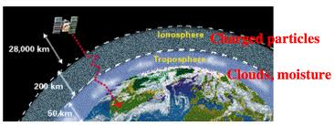

.. _common-gps-how-it-works:

==================
GPS - How it Works
==================

GPS system is a Global Navigation Satellite System (GNSS).

Most civil GPS receivers are using pseudorange data (C/A code) available
on GPS L1 channel (1575.42 MHz) and optionally they can receive SBAS
DGPS corrections giving meter precision.

.. image:: ../../../images/gps_satellite_constellation.jpg
    :target: ../_images/gps_satellite_constellation.jpg

Advanced and expensive civil GPS receivers can use the previous method
plus carrier phase smoothing, carrier phase corrections (RTK) as well as
L2 channel P(Y) code semi-codeless tracking (1227.60 MHz) for realtime
local ionospheric corrections giving centimeter or even millimeter
precision.

.. image:: ../../../images/ag_GPS_Segments_low_res.jpg
    :target: ../_images/ag_GPS_Segments_low_res.jpg

Some even more advanced GNSS receivers can combine DGPS and RTK
corrections and can receive other GNSS satellite constellations (GLONASS
and GALILEO) and other channels (L2C, L5...) at the same time to enhance
precision and fix reliability.

Military GPS receivers are able to decode the P(Y) code available on L1
and L2 channels giving ten times more precision in realtime compared to
a pseudorange basic solution.

GPS multipathing
================

Multipathing is causing GPS position errors that are difficult to detect
and compensate for. Multiple GNSS receivers are better suited to filter
out multipathing thanks to a higher number of visible satellites at the
same time.

.. image:: ../../../images/multi_path-full.jpg
    :target: ../_images/multi_path-full.jpg

.. image:: ../../../images/Gps-multipath-efect.jpg
    :target: ../_images/Gps-multipath-efect.jpg

GPS disturbed signal propagation
================================

Ionospheric perturbations and magnetic storms (solar activity) can cause
signal delays. This can be partially compensated using SBAS and L1 / L2
decoding.

.. image:: ../../../images/atmospheric_effects.gif
    :target: ../_images/atmospheric_effects.gif

Decoding L1 and L2 channels at the same time do allow realtime
ionospheric corrections through a differential technique. Unlike SBAS
broadcasted ionospheric corrections, this method gives a better match to
local ionospheric conditions.

New channels (L2C, L5) for civil use will enhance signal acquisition and
position precision as soon as new satellites constellations will be
complete ( 2015 - 2020 ).

GPS performance data for different scenarios
============================================

Those values can be thought as a basis to understand GPS limitations.

As a general rule only clear sky view is safe enough for Auto missions !

GPS 3D precision :

-  Free Horizon (clear sky view): 2.5 m
-  Extreme Multipath (Backyards or between buildings flights): 26 m
-  Indoor: 55 m

GPS Availability :

-  Free Horizon (clear sky view) : 99%
-  Extreme Multipath (Backyards or between buildings flights) : 83 %
-  Indoor : 14 %

DGPS corrections
================

DGPS corrections are using pseudorange data only. SBAS is a form of DGPS
correction freely available from one or more geostationary satellites.

Each region of the world has a localized SBAS system : WAAS for America,
EGNOS for Europe, MSAS for Japan.

DGPS corrections give meter precision (free services) or decimeter
precision (paying services)

RTK corrections
===============

RTK corrections are using carrier phase informations and needs costly
advanced GPS as well as a RTK base station or a Network of RTK base
stations broadcasting corrections over a modem or Internet through the
RTCM protocol.

.. image:: ../../../images/RTK.jpg
    :target: ../_images/RTK.jpg

RTK is easier to use with slow motion or static applications (like
surveying or farming) and give centimeter or millimeter precision.
