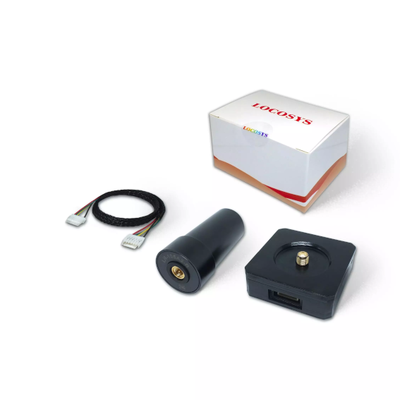
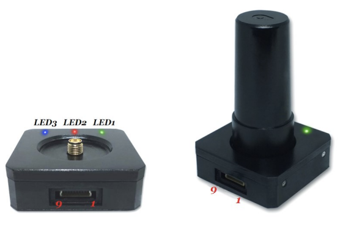

.. _common-gps-locosys:

=============================
LOCOSYS HAWK R1 & R2 RTK GNSS
=============================

HAWK R1 and R2 (with compass) is a L1+L5 dual-frequency RTK centimeter-level GNSS receiver designed 
for UAV applications. 
The receiver is capable of concurrently tracking global civil navigation systems, including GPS, 
GLONASS, GALILEO, BEIDOU and QZSS. It acquires both L1 and L5 signals at a time while providing the 
centimeter-level RTK positioning accuracy.

.. note:: HAWK R1 and R2 GNSS requires L1 and L5 RTCM GNSS correction data for a stable RTK fix

Key Features
============

- Concurrent reception of L1 and L5 band signals
- Centimeter-level RTK high position accuracy
- Support GPS, GLONASS, BEIDOU, GALILEO, QZSS
- Capable of SBAS (WAAS, EGNOS, MSAS, GAGAN)
- Support 135-channel GNSS
- Fast TTFF at low signal level
- Free hybrid ephemeris prediction to achieve faster cold start
- Default 5Hz, up to 10 Hz update rate, SBAS support 5Hz only
- Build-in super capacitor to reserve system data for rapid satellite acquisition
- Three LED indicator for Power, Pulse per Second and Data transmit
- HAWK R2 integrated with IST8310 compass via I2C bus
- JST-GH cable (Dronecode standard) for direct connection to i.e. Cube Autopilot

Frequency
=========
   -  GPS/QZSS: L1 C/A, L5C
   -  GLONASS: L1OF
   -  BEIDOU: B1I, B2a
   -  GALILEO: E1, E5a

Interfaces
==========
   -  1 UART 230400 bps, 8 data bits, no parity, 1 stop bit 
   -  1 I2C
   -  1 Antenna interface (SMA)
   
Protocols
=========
   -  UBX binary UBX-NAV-PVT, UBX-NAV-DOP, UBX-NAV-TIMEGPS 
   -  RTCM version 3.x
   
Supply voltage
==============
   -  3.3V - 5V

Size and weight
===============
   -  Size:   46.5\*46.5\*16 mm without antenna
   -  Weight: 26g, 40g with antenna

LED
===

+---------+---------------+---------------------------------------------------+
| Pin No  | Name          | Description                                       |
+=========+===============+===================================================+
| LED 1   | TX LED        | Green, GNSS data transmit indicator               |
+---------+---------------+---------------------------------------------------+
| LED 2   | Power LED     | Red, Power indicator                              |
+---------+---------------+---------------------------------------------------+
| LED 3   | PPS_LED       | Blue, Pulse per Second indicator                  |
+---------+---------------+---------------------------------------------------+

Pinout GNSS connector 
=====================

+---------+---------------+---------------------------------------------------+
| Pin No  | Name          | Description                                       |
+=========+===============+===================================================+
| 1       | VCC           | DC supply voltage 3.3V ~ 5.0V input               |
+---------+---------------+---------------------------------------------------+
| 2       | GNSS_RX       | Receive Data Input                                |
+---------+---------------+---------------------------------------------------+
| 3       | GNSS_TX       | Transmit Data Output                              |
+---------+---------------+---------------------------------------------------+
| 4       | GNSS_PPS      | GNSS pulse per second, 100ms pulse width, 1.8V DC |
+---------+---------------+---------------------------------------------------+
| 5       | NC            | NC                                                |
+---------+---------------+---------------------------------------------------+
| 6       | NC            | NC                                                |
+---------+---------------+---------------------------------------------------+
| 7       | I2C_CLK       | Magnetometer I2C serial clock                     |
+---------+---------------+---------------------------------------------------+
| 8       | I2C_DAT       | Magnetometer I2C serial data                      |
+---------+---------------+---------------------------------------------------+
| 9       | GND           | Ground                                            |
+---------+---------------+---------------------------------------------------+

Pinout JST-GH cable connector (standard pinout) 
===============================================

+---------+---------------+---------------------------------------------------+
| Pin No  | Name          | Description                                       |
+=========+===============+===================================================+
| 1       | VCC           | DC supply voltage 3.3V ~ 5.0V input               |
+---------+---------------+---------------------------------------------------+
| 2       | GNSS_RX       | Receive Data Input                                |
+---------+---------------+---------------------------------------------------+
| 3       | GNSS_TX       | Transmit Data Output                              |
+---------+---------------+---------------------------------------------------+
| 4       | I2C_CLK       | Magnetometer I2C serial clock                     |
+---------+---------------+---------------------------------------------------+
| 5       | I2C_DAT       | Magnetometer I2C serial data                      |
+---------+---------------+---------------------------------------------------+
| 6       | GND           | Ground                                            |
+---------+---------------+---------------------------------------------------+

Where to buy
============

You can buy it from `LOCOSYS <https://www.locosystech.com/en/index.html>`__.
	

More information
================

`HAWK R1 <https://www.locosystech.com/en/product/hawk-r1.html>`__

`HAWK R2 <https://www.locosystech.com/en/product/hawk-r2.html>`__

`Datasheet <https://www.locosystech.com/Templates/att/HAWK%20R1%2CR2%20datasheet_v0.2.pdf?lng=en>`__
