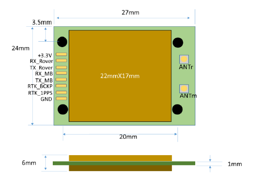

.. _common-gps-navisys-g920:

==============================
Navisys GE-920 Dual-Antenna RTK
==============================

.. image:: ../../../images/navisys/navisys_ge920.png
    :target: ../../../images/navisys/navisys_ge920.png
    :width: 433px

The Navisys GE-920 is a dual-antenna GNSS module based on the u-blox ZED-F9 RTK engine. It operates simultaneously as an RTK moving base and RTK rover to provide centimeter-level positioning and precise heading without relying on vehicle movement.

Key Features
------------

* **Dual Antenna & Heading:** Integrated u-blox ZED-F9 RTK engine supporting dual I-PEX antenna connectors (Rover & Moving Base) for accurate orientation.
* **Multi-Constellation Dual-Band:** Concurrent L1/L2 reception for GPS, GLONASS, Galileo, BeiDou, QZSS, and SBAS.
* **Centimeter-Level Accuracy:** RTK positioning (0.01 m CEP + 1 ppm) and heading accuracy (<0.4°).
* **Communication Interface:** Dual UART/TTL interfaces (Rover UART and Moving Base UART) at 460800 bps.
* **Compact Form Factor:** 27 x 24 x 6 mm SMD module.

Pinout & Connection Guide
-------------------------

===  ==========  ======================================================  ======
Pin  Name        Function                                                Type
===  ==========  ======================================================  ======
1    +3.3V       3.3V Power Supply (3.3V ± 0.3V)                         Input
2    RX_Rover    UART Receive for Rover                                  Input
3    TX_Rover    UART Transmit for Rover (Outputs RELPOSNED by default)  Output
4    RX_MB       UART Receive for Moving Base                            Input
5    TX_MB       UART Transmit for Moving Base                           Output
6    RTK_BCKP    Backup Power (V_BAT: 3V)                                Input
7    RTK_1PPS    Time Pulse Signal (1PPS)                                Output
8    GND         Ground                                                  Input
===  ==========  ======================================================  ======

.. note::
   Antenna connections: **ANTm** is for Moving Base and **ANTr** is for Rover. Heading is defined as the direction vector from ANTm to ANTr.

ArduPilot Configuration
-----------------------

To use the GE-920 for GPS positioning and Dual-Antenna Yaw/Heading in ArduPilot, set the following parameters:

GPS Driver Settings
~~~~~~~~~~~~~~~~~~~

* :ref:`GPS_TYPE<GPS_TYPE>` = 2 (u-blox)
* :ref:`GPS_TYPE2<GPS_TYPE2>` = 2 (u-blox)
* :ref:`GPS_AUTO_CONFIG<GPS_AUTO_CONFIG>` = 1
* :ref:`GPS_AUTO_SWITCH<GPS_AUTO_SWITCH>` = 1

Dual Antenna Yaw Settings
~~~~~~~~~~~~~~~~~~~~~~~~~

* :ref:`EK3_SRC1_YAW<EK3_SRC1_YAW>` = 2 (GPS) or 3 (GPS with Compass fallback)
* :ref:`GPS_POS1_X<GPS_POS1_X>`, :ref:`GPS_POS1_Y<GPS_POS1_Y>`, :ref:`GPS_POS1_Z<GPS_POS1_Z>`: Set offset relative to CG for ANTm (Moving Base).
* :ref:`GPS_POS2_X<GPS_POS2_X>`, :ref:`GPS_POS2_Y<GPS_POS2_Y>`, :ref:`GPS_POS2_Z<GPS_POS2_Z>`: Set offset relative to CG for ANTr (Rover).

Where to Buy
------------

* For more details, visit the `Navisys Official Website <https://www.navisys.com.tw/>`_.