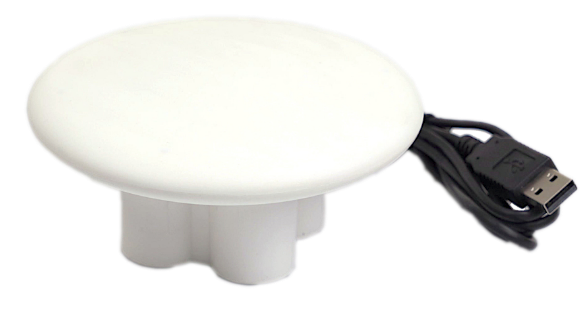
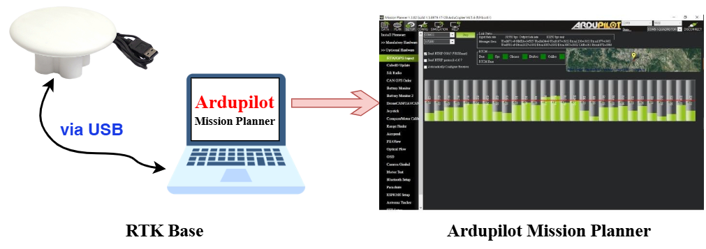
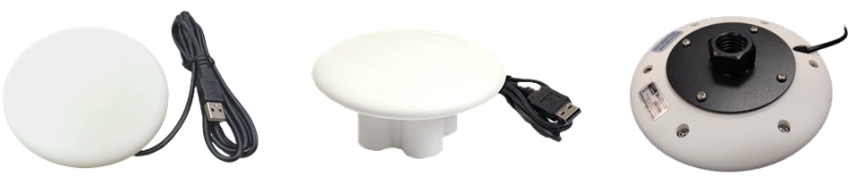

.. _common-gps-navisys-gr901u:

=============================
Navisys GR-901U RTK base
=============================

Navisys GR-901U is an advanced RTK base station. Equipped with u-blox ZED-F9P engine,
it features L1/L2 dual-band, centimeter-level accuracy and supports multiple satellite systems,
including GPS, GLONASS, BeiDou, Galileo, and QZSS.

Navisys GR-901U is fully compatible with Ardupilot and provide high precision GPS data for 
UAV/drone applications. Simply plug Navisys GR-901U into a computer, it’s serving as an RTK Base
in Ardupilot Mission Planner！

Key Features
============

- Based on ZED-F9P high precision engine
- Centimeter-level accuracy
- L1/L2 Dual-band 
- Multi-satellite systems GPS/GLONASS/BEIDOU/Galileo/QZSS
- SBAS (WAAS, EGNOS, MSAS, GAGAN) support
- Up to 8/ 10/ 15/ 20 Hz update rate for quad/ tri/dual/ single-GNSS constellations
- Spoofing detection / monitoring
- Jamming / interference indicator
- Ardupilot/PX4-compliant

Frequency
=========
- GPS/SBAS/QZSS: (MHz) 
  L1 C/A (1575.42)
  L2C (1227.60) 
- GLONASS: (MHz) 
  L1OF (1602+k*0.5625, k= -7,…,5,6)
  L2OF (1246+k*0.4375, k= -7,…,5,6) 
- Galileo: (MHz) 
  E1-B/C (1575.42) 
  E5b (1207.140) 
- BeiDou: (MHz)
  B1I (1561.098) 
  B2I (1207.140)

Protocols
==========
- NMEA 0183 up to v 4.11, ASCII GGA, GLL, GSA, GSV, RMC, VTG 
- UBX: u-blox proprietary, binary 
- RTCM 3.3: binary

   
Supply voltage
==============
-  5.0 VDC

Size
====
- Φ116*24.6 (mm) for disk without pedestal 
- Φ116*56.8 (mm) for disk with pedestal
- 5/8”-11 Pole Adapter for disk

Where to buy
============

You can buy it from `Navisys <https://www.navisys.com.tw/>`__.
	

More information
================

`GR-901 <https://www.navisys.com.tw/productdetail?name=GR901&class=RTK>`__

`GR-903 <https://www.navisys.com.tw/productdetail?name=GR903&class=RTK>`__

`GR-9028 <https://www.navisys.com.tw/productdetail?name=GR9028&class=RTK>`__
