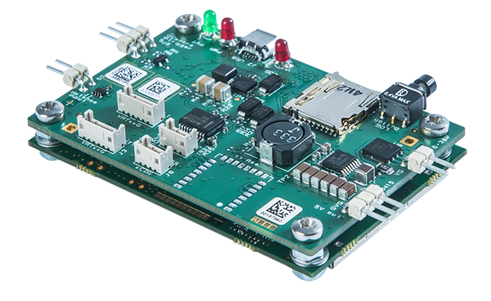

.. _common-gps-septentrio:

=================================================
Septentrio AsteRx-m UAS and AsteRx-m2 UAS RTK GPS
=================================================

The Septentrio `AsteRx-m UAS <http://www.septentrio.com/products/gnss-receivers/rover-base-receivers/oem-receiver-boards/asterx-m-uas/>`__ and `AsteRx-m2 UAS <http://www.septentrio.com/products/gnss-receivers/rover-base-receivers/oem-receiver-boards/asterx-m2-uas/>`__ RTK GPS are relatively expensive but also highly accurate RTK GPS.

.. note::

     This GPS is supported in Copter-3.4 (and higher), Plane 3.7.0 (and higher) and Rover 3.0.1 (and higher).
     Mission Planner GCS is the only GCS to support this feature currently.

Setup instructions
==================

To setup this using GPS1 input (serial3) configure these parameters:

- GPS_INJECT_TO,0
- GPS_RATE_MS,100
- GPS_TYPE,10
- :ref:`SERIAL3_BAUD<SERIAL3_BAUD>` ,115
- :ref:`SERIAL3_PROTOCOL<SERIAL3_PROTOCOL>` ,5

To setup this using GPS2 input (serial4) configure these parameters:

- GPS_INJECT_TO,1
- GPS_RATE_MS2,100
- GPS_TYPE2,10
- :ref:`SERIAL4_BAUD<SERIAL4_BAUD>` ,115
- :ref:`SERIAL4_PROTOCOL<SERIAL4_PROTOCOL>` ,5

If you want to inject RTCM corrections to both GPS1 and GPS2 then use:
- GPS_INJECT_TO,127

Note:
Baud rate is auto-negotiated by the ArduPilot firmware, and might get set to something different than the 115200 baud.

Video including setup instructions
==================================
..  youtube:: HWJnG3tu9iM
    :width: 100%
