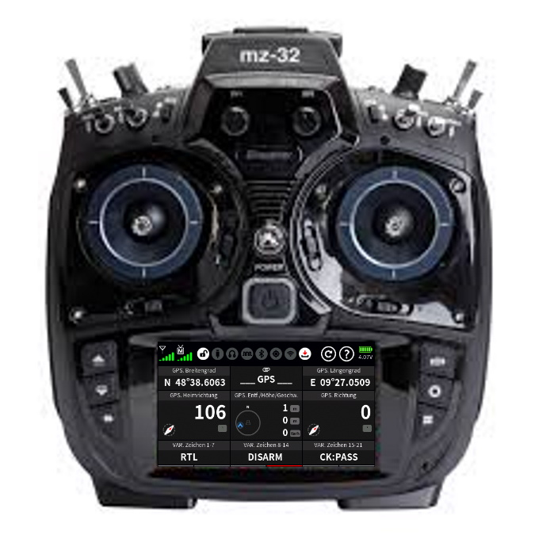

.. _common-graupner-rc:
[copywiki destination="plane,copter,rover,blimp"]
===================
Graupner RC Systems
===================

`Graupner home page <https://www.graupner.de/>`__

Graupner RC Systems utilize the SUMD receiver protocol which is auto-detected and supported by ArduPilot. Some systems include :ref:`HOTT telemetry <common-hott-telemetry>` 

