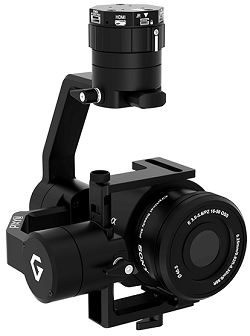
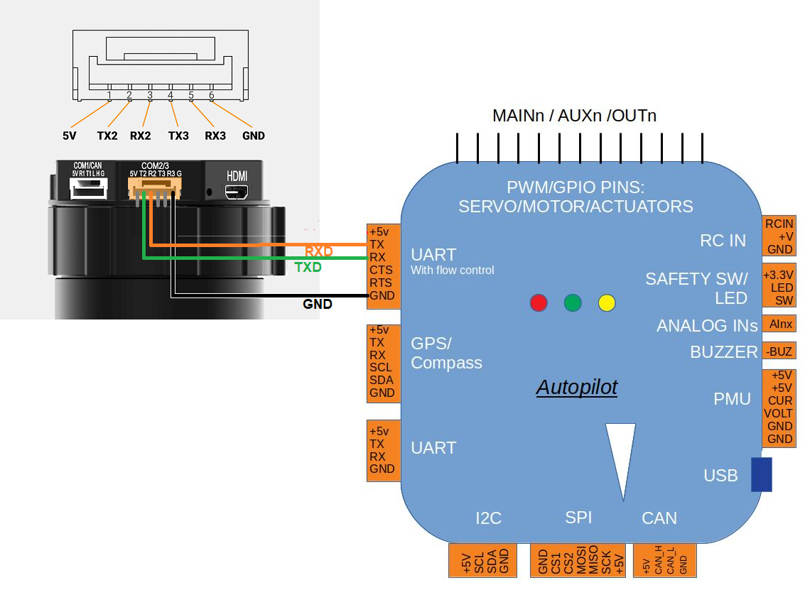

.. _common-gremsy-pixyu-gimbal:

===========================
Gremsy Pixy U 3-Axis Gimbal
===========================

The Gremsy Pixy U is a 3-axis gimbal that can communicate with the flight controller using the MAVLink protocol, weighs 465g, and is compatible with a range of cameras for real-time video or mapping purposes.  More specifications can be found `here on the Gremsy website <https://gremsy.com/pixy-u-spec/>`__.  The user manual is `here <https://gremsy.com/pixy-u-manual/>`__.

Where to Buy
============

The Pixy U can be purchased from the `Gremsy store <https://store.gremsy.com/product/pixy-u/>`__

Connecting to the Autopilot
===========================

We recommend connecting the Gimbals's COM2 port to one of the autopilot's Serial/Telemetry ports like Telem2 as shown above.

Connect with a ground station and set the following parameters:

- :ref:`MNT_TYPE <MNT_TYPE>` to "4" for "SToRM32 MavLink"
- :ref:`SERIAL2_BAUD <SERIAL2_BAUD>` to "115" for 115200 bps.  "SERIAL2" can be replaced with another serial port (i.e. SERIAL1) depending upon the physical connection
- :ref:`SERIAL2_PROTOCOL <SERIAL2_PROTOCOL>` to 2 for "MAVLink2"
- :ref:`SR2_EXTRA1 <SR2_EXTRA1>` to 10
- :ref:`SR2_POSITION <SR2_POSITION>` to 10

The gimbal's maximum angles can be set using these parameters:

- :ref:`MNT_ANGMIN_ROL <MNT_ANGMIN_ROL>` to -3000 to allow leaning left up to 30deg
- :ref:`MNT_ANGMAX_ROL <MNT_ANGMAX_ROL>` to 3000 to allow leaning right up to 30deg
- :ref:`MNT_ANGMIN_TIL <MNT_ANGMIN_TIL>` to -9000 to allow pointing 90deg down
- :ref:`MNT_ANGMAX_TIL <MNT_ANGMAX_TIL>` to 3000 to allow pointing 30deg up
- :ref:`MNT_ANGMIN_PAN <MNT_ANGMIN_PAN>` to -18000 to allow turning around to the left
- :ref:`MNT_ANGMAX_PAN <MNT_ANGMAX_PAN>` to 18000 to allow turning around to the right

To control the gimbal's lean angles from a transmitter set:

- :ref:`MNT_RC_IN_TILT <MNT_RC_IN_TILT>` to 6 to control the gimbal's tilt (aka pitch angle) with the transmitter's Ch6 tuning knob
- :ref:`MNT_RC_IN_ROLL <MNT_RC_IN_ROLL>` to some input channel number to control the gimbal's roll angle
- :ref:`MNT_RC_IN_PAN <MNT_RC_IN_PAN>` to some input channel number to control the gimbals' heading

Gremsy's instructions can be found below:

- `How to setup Gremsy gimbal with Pixhawk Cube <https://support.gremsy.com/support/solutions/articles/36000189926-how-to-setup-gremsy-gimbal-with-pixhawk-cube>`__
- `Control Gremsy Gimbal with Herelink & Cube <https://support.gremsy.com/support/solutions/articles/36000222529-control-gremsy-gimbal-with-herelink-cube-pilot>`__

Configuring the Gimbal
----------------------

The gimbal should work without any additional configuration but to improve performance you may need to adjust the gimbal's gains to match the camera's weight

- Download, install and run the `gTune setup application <https://github.com/Gremsy/gTuneDesktop/releases>`__
- Connect the gimbal to your Desktop PC using a USB cable
- Push the "CONNECTION" button on the left side of the window, then select the COM port and press "Connect"
- Select the "CONTROLS" tab and ensure "SYNC" is selected so the gimbal communicates with the autopilot using MAVLink
- Select the "STIFFNESS" tab and adjust the Tilt, Roll and Pan gains so that the gimbal holds the camera in position without shaking

Testing Controlling the Gimbal from RC
--------------------------------------

- Disconnect the USB cable connecting your PC to the gimbal
- Powerup the vehicle and gimbal
- Move the transmitter's channel 6 tuning knob to its minimum position, the camera should point straight down
- Move the ch6 knob to maximum and the gimbal should point upwards

.. note::

   The RC's channel 6 input can be checked from Mission Planner's Radio calibration page

Testing ROI
-----------

The ROI feature points the vehicle and/or camera to point at a target.  This can be tested by doing the following:

- Ensure the vehicle has GPS lock
- If using the Mission Planner, go to the Flight Data screen and right-mouse-button-click on a point about 50m ahead of the vehicle (the orange and red lines show the vehicle's current heading), select **Point Camera Here** and input an altitude of -50 (meters).  The camera should point forward and then tilt down at about 45 degrees

.. image:: ../../../images/Tarot_BenchTestROI.jpg
    :target: ../_images/Tarot_BenchTestROI.jpg

Pilot control of the gimbal can be restored by setting up an :ref:`auxiliary function switch <common-auxiliary-functions>` to "Retract Mount" (i.e. RCx_OPTION = 27) and then move the switch to the lower position
