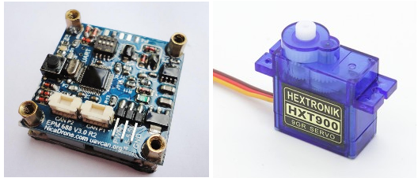

.. _common-gripper-landingpage:

=======================
Grippers (for delivery)
=======================

Copter supports a number of different grippers which can be useful for delivery applications and bottle drops.

Follow the links below (or in sidebar) for configuration information based upon your set-up.

.. toctree::
    :maxdepth: 1
    
    Electro Permanent Magnet v3 (EPMv3) <common-electro-permanent-magnet-V3>
    Electro Permanent Magnet v1 (EPM688) <common-electro-permanent-magnet-gripper>
    Servo Gripper  <common-gripper-servo>

.. tip::
    Grippers can be configured to release in a failsafe situation using :ref:`FS_OPTIONS<FS_OPTIONS>` (ArduCopter only)

Common Gripper Parameters
=========================

- :ref:`GRIP_ENABLE<GRIP_ENABLE>`: Enables use of gripper and shows following parameters.
- :ref:`GRIP_TYPE<GRIP_TYPE>`: Type of gripper - 0:None(disables without hiddening parameters), 1:Servo, 2:EMP
- :ref:`GRIP_AUTOCLOSE<GRIP_AUTOCLOSE>`: Time in secs (0 disables) to re-grip payload after releasing. Used for payload replacement after delivery.
- :ref:`GRIP_GRAB<GRIP_GRAB>`: PWM in uS to grab payload
- :ref:`GRIP_NEUTRAL<GRIP_NEUTRAL>`: PWM in uS to neither grab nor release payload
- :ref:`GRIP_RELEASE<GRIP_RELEASE>`: PWM in uS to release payload
- :ref:`GRIP_REGRAB<GRIP_REGRAB>`: (EMP only) Time interval in seconds (0 disables) to regrab payload to assure EM hold has not decayed.
- :ref:`GRIP_CAN_ID<GRIP_CAN_ID>`: (EMP only) Refer to https://docs.zubax.com/opengrab_epm_v3#UAVCAN_interface

The autopilot output channel which is attached to the gripper is selected by setting its ``SERVOx_FUNCTION`` = "28"(Gripper).

The gripper is controlled by using the MAVLink Command :ref:`MAV_CMD_DO_GRIPPER <mav_cmd_do_gripper>` or, configuring and RC channel switch to ``RCx_OPTION`` = "19(Gripper). 