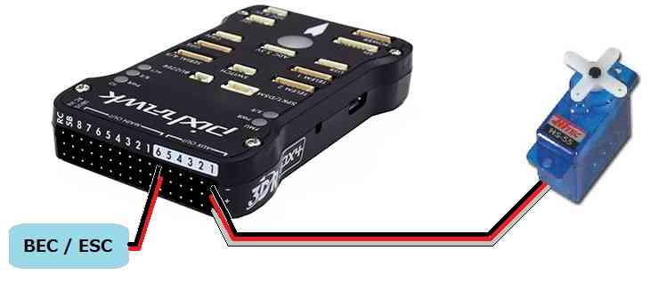
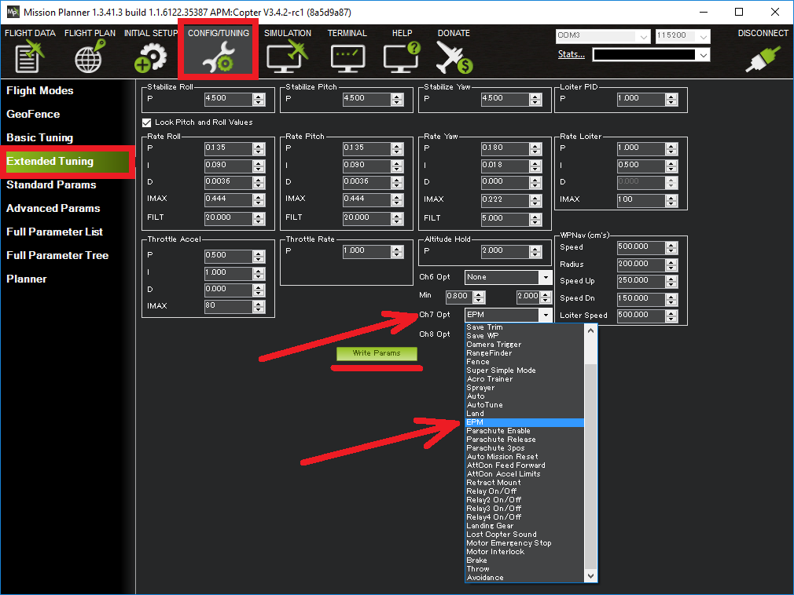
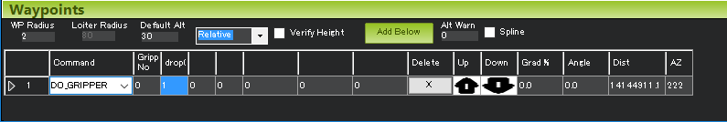

.. _common-gripper-servo:

=============
Servo Gripper
=============

This article explains how to connect a servo to a autopilot and configure it for use as a gripper which is useful for delivery or bottle drop applications.
The servo can be controlled directly by the pilot via a switch on the transmitter or as part of a mission.  You may wish to refer to the :ref:`general servo wiki page <common-servo>` for other ways servos can be controlled.

.. note::

   This servo gripper is included in Copter-3.5 (and higher).  If using an earlier version, a similar result can be accomplished by :ref:`controlling the servo as a camera shutter <common-servo>`

..  youtube:: HiOw6OvJcik
    :width: 100%

Connecting the servo to a Pixhawk
=================================

-  If using Copter, connect the servo to AUX OUT 1, 2, 3 or 4.  MAIN OUT 1 ~ 8 should be avoided because these update at 400hz.  If using Plane or Rover where all pins update at 50hz, any unused MAIN OUT or AUX OUT 1 ~ 4 may be used.
-  AUX OUT 5 and 6 cannot be used by default because they are setup as :ref:`Relays <common-relay>`.  These pins can changed to Servo outputs by setting the :ref:`BRD_PWM_COUNT <BRD_PWM_COUNT>` parameter to 6 and setting :ref:`RELAY_PIN <RELAY_PIN>` and :ref:`RELAY_PIN2 <RELAY_PIN2>` to -1.
-  The Pixhawk autopilot cannot provide power to the servos so an external BEC or ESC that can provide 5V should be used.

Configuration
=============
- set which RC output is used by setting SERVOx_FUNCTION (or RCX_FUNCTION) to 28 (i.e. if using AUX OUT 1 on a Pixhawk, set :ref:`SERVO9_FUNCTION <SERVO9_FUNCTION>` to 28).
- :ref:`GRIP_ENABLE <GRIP_ENABLE>` to 1 to enable the gripper feature and then refetch parameters from the ground station in order to make other gripper parameters visible.
- :ref:`GRIP_TYPE <GRIP_TYPE>` to 1 to enable the servo gripper and reboot the autopilot
- :ref:`GRIP_GRAB <GRIP_GRAB>` to the pwm value (i.e. 1000 ~ 2000) for the gripper's closed position
- :ref:`GRIP_RELEASE <GRIP_RELEASE>` to the pwm value for the gripper's open position
- :ref:`GRIP_NEUTRAL <GRIP_NEUTRAL>` to the pwm value for the gripper's neutral position (often the same as its closed position)

Controlling Gripper from the transmitter
========================================

The transmitter's auxiliary switch can control the gripper.

If using a firmware version prior to 4.0. CH7_OPT or CH8_OPT can be used to control the gripper by setting it to 19. If using the mission planner, select Config/Tuning > Extended Tuning and set the Ch7 Opt or Ch8 Opt drop-down to "EPM" or "Gripper".

- In firmware versions 4.0 later, use an RC channel for control by setting is ``RCx_OPTION`` parameter to 19.

Controlling Gripper during a mission
====================================

The gripper position can be controlled during a mission in AUTO mode using the :ref:`DO_GRIPPER <common-mavlink-mission-command-messages-mav_cmd>` command.  Set the "drop/grab" column to 0 to close the gripper, 1 to open the gripper.

Controlling Gripper from the ground station
===========================================

The gripper can be opened or closed in real-time from the ground station if the ground station sends a `COMMAND_LONG <https://mavlink.io/en/messages/common.html#COMMAND_LONG>`__ with the command field set to DO_GRIPPER (i.e. 211) but there are no ground stations (as far as we know) that support doing this.
