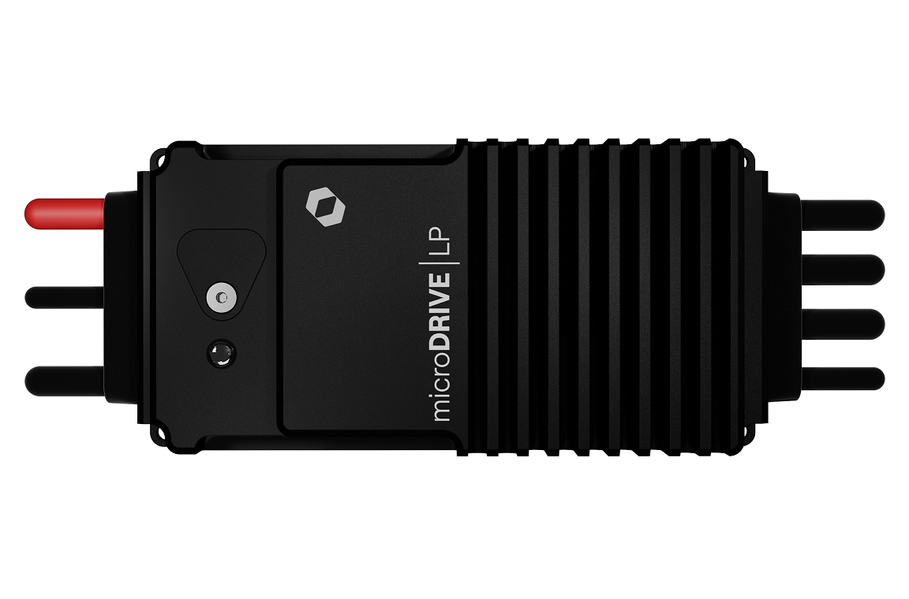

.. _common-hargrave-dronecan-escs:

===================================
Hargrave Technologies DroneCAN ESCs
===================================

Hargrave Technologies is an Australian power electronics engineering company specialising in the professional design and manufacturing of NDAA-compliant electronic speed controllers (ESCs).

Hargrave's ESCs are designed for space and weight-limited applications and optimised for power density while maintaining optimum thermal performance. `The full range can be found here <https://www.hargravetechnologies.com/>`__.

The ESCs support DroneCAN natively, providing an interface for control, telemetry, parameter configuration and firmware updates. The following guide describes how to get set up and outlines the main features of the DroneCAN interface.

Ardupilot Setup
--------------------
Follow the instructions for DroneCAN setup found at :ref:`DroneCAN ESCs <common-uavcan-escs>` - specifically, the parameters required for the autopilot to activate the DroneCAN driver on the desired physical port.

Getting Started
---------------
By default, the ESCs will accept a CAN Bus communications input. The ESCs can be configured over USB or CAN Bus. `A USB configuration tool for settings, onboard log view and firmware updates can be found here <https://configurator.hargravetechnologies.com>`__.

.. note::

    To enable CAN, the `CAN Bus Enabled <https://docs.hargravetechnologies.com/communication-settings>`__ setting should be set as required. The settings names are abbreviated for CAN transmissions.

When running DroneCAN, it's recommended to set the DroneCAN Node ID as required by the system, noting there should be no duplicates. By default, Hargrave ESCs will seek a Node ID automatically (the flight controller will negotiate and provide one through dynamic node allocation). However, this can result in changing IDs over time. The following ESC settings will change this behaviour:

- ``Force DroneCAN Node ID (FORCE_NODEID)``:  Toggles the method that the ESC uses to get an ID.
- ``Preferred DroneCAN Node ID (DRONECAN_NODEID)``:  Set the desired Node ID. The ESC will use this ID when the Force Node ID parameter is enabled.

Further settings that should be considered (more documentation can be found `here <https://docs.hargravetechnologies.com/can-bus-settings>`__):

- ``DroneCAN ESC Index (DRONECAN_INDEX)``:  Configures which motor output the ESC will use from the flight controller. The channels are 0 indexed, so Motor 1 on the flight controller is ``ESC Index`` = 0.
- ``Require Armed Status DroneCAN (CAN_ARM_CHK_EN)``:  By default, the ESC will only drive the motor while the Autopilot broadcasts that it is in an Armed state. Toggle this setting to change the behaviour.
- ``CAN Terminator Enable (CAN_TERM_EN)``:  The onboard software-selectable CAN termination resistor can be enabled by toggling this setting. Follow the connection tips below to select which ESC to enable this on, as it should only be enabled on a single unit per bus.

Connecting the ESCs
-------------------
Each ESC should be connected in a daisy chain configuration, where one end of the chain is the flight controller, and the other is an ESC. 

.. note::

    Ensure the flight controller is appropriately terminated. For example, models such as the Pixhawk Cube have CAN termination resistors installed by default.  

The CAN H, CAN L and GND should be connected to the flight controller ports in the same order.

.. note::

    The ESCs have a software-selectable CAN termination resistor for ease of integration, which should be enabled on the ESC that is physically furthest along the daisy chain (in reference to the flight controller).

The following diagram shows the wiring of the CAN lines communicating from the flight controller, and terminating on the final ESC (which should have the terminator activated):

Logging and Reporting
---------------------

The ESCs support telemetry reporting directly to the autopilot, for viewing and logging purposes. Ardupilot log viewing tools can be used to view this data. The ESCs support two different telemetry messages which can be individually configured as required, transmitting the following data:

ESC Primary Status
==================
- Error Count:  Current active errors on the ESC. 0 indicates no errors.
- Voltage:  The bus voltage currently measured.
- Current:  The bus current currently measured.
- Temperature:  The bridge temperature currently measured.
- RPM:  The RPM of the motor, scaled with the ``Motor Pole Pair`` parameter on the ESC. 
- Requested Power:  The percentage power currently requested by the autopilot.

ESC Extended Status
===================
- Input Percent:  The percentage duty cycle currently requested by the autopilot.
- Output Percent:  The percentage duty cycle currently output to the motor. If not equal to input percent, this indicates limiting is occuring within the ESC.
- Motor Temperature:  The temperature of the connected motor (requires NTC or PTC sensor connected to the ESC).
- Motor Angle:  The currently measured angle of the motor, if sensor input is enabled. (requires external motor position sensing).
- Status Flags:  The current general status of the ESC, non-error specific. 

Both status messages are individually transmitted, and the rate can be adjusted separately as required. The rate of transmission should be minimised such that the CAN bus is not overloaded. 

Parameters
----------

The ESCs support parameter/setting configuration over DroneCAN. The ESC will reboot to apply the updates to the parameters. By default, not all settings are shown. To show all available parameters on the ESC, enable the ``Advanced Settings`` parameter (the ESC will require a reboot to apply and allow fetching of all parameters). Once set, this setting will persist until changed again.

.. note::

    If CAN is disabled, USB access is required to configure the ESC from serial signalling mode back into CAN.

The ESC will reject attempts to fetch or save parameters while the motor is running (or the ESC is in the motor driving state). To perform further updates, either disarm the motors (assuming the ``Require Armed Status DroneCAN`` parameter is enabled) or disable the ESC throttle packet output from the flight controller. Rebooting the ESC will also allow for parameter changes.

The ``Erase All`` function within DroneCAN will reset the configuration to the default state, and automatically trigger a reboot to apply the settings.

Firmware Updates
----------------

The ESCs support firmware updating over DroneCAN. Once the firmware update process has started, the ESC will report file read and update status through the DroneCAN debug messages. The ESCs automatically check the file for compatibility before the update starts.

Once the firmware is successfully downloaded, the unit will automatically verify and perform the firmware installation, followed by a reboot.

.. note::

    The ESCs have a built in recovery in the event the update process is interrupted or fails to complete. If an issue occurs, reboot the unit and restart the update attempt. The previous firmware version is retained in the event of interruption.

The firmware can be updated through the DroneCAN GUI or other DroneCAN-supported interfaces (such as Mission Planner). The image below highlights some key DroneCAN GUI features; double-click on a node to open the node properties panel:

After a firmware update is complete and the unit reboots, confirm the reported firmware version matches expectations.

Further Information
-------------------

Hargrave Technologies prides itself on industry-leading support. If you have further questions or need assistance, reach out to the team `here <https://www.hargravetechnologies.com/contact>`__. All support topics are channelled directly to the engineering team.