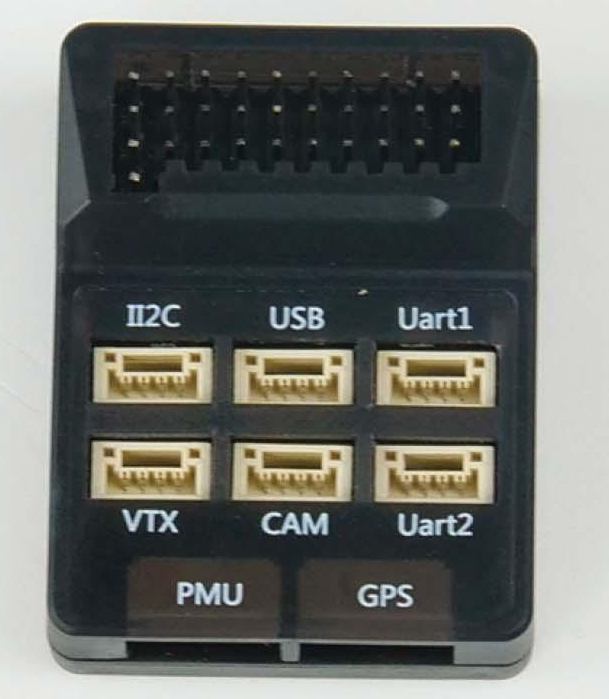
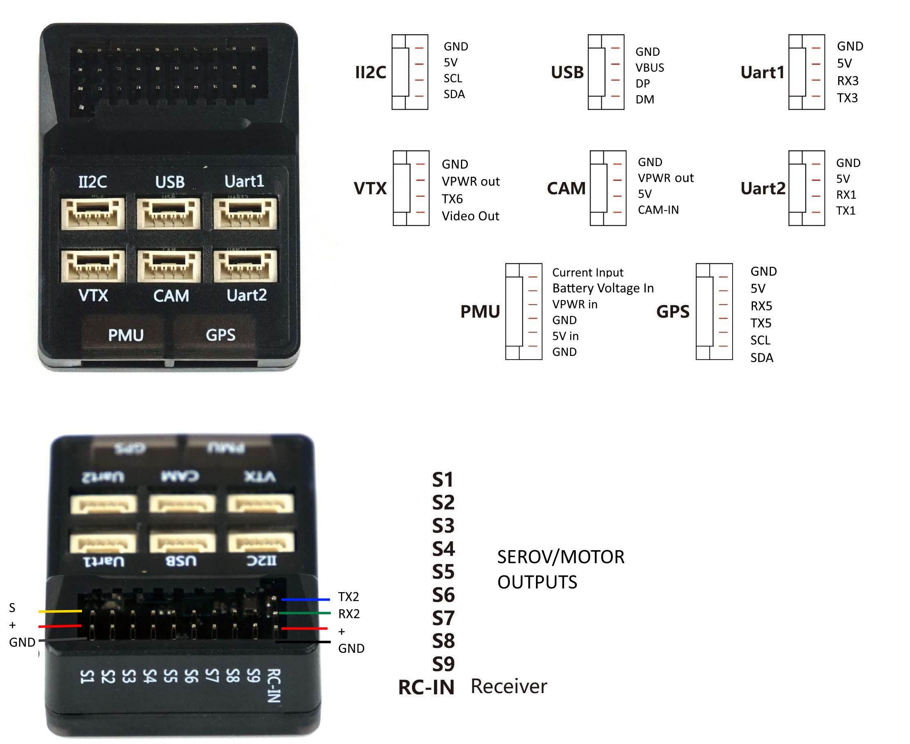

.. _common-heewingf405:

==================
HEEWINGF405/F405V2
==================

The HEEWING F405 is a flight controller produced by HEEWING that is incorporated into their Ranger-T1 VTOL RTF airframe.

the above image and some content courtesy of `HEEWING <http://heewing.com/>`__

.. note::

	Due to flash memory limitations, this board does not include all ArduPilot features.
        See :ref:`Firmware Limitations <common-limited_firmware>` for details.

Specifications
==============

-  **Processor**

   -  STM32F405RGT6 ARM (168MHz)
   -  AT7456E OSD

-  **Sensors**

   -  ICM-42688P IMU (accel, gyro)
   -  SPL-06 barometer
   -  Voltage & current sensor input

-  **Power**

   -  2S - 6S Lipo PMU unit providing:
   -  88A Current monitor
   -  9V/3A BEC for powering Video Transmitter
   -  5V, 5A BEC for internal,servos, and peripherals

-  **Interfaces**

   -  9x PWM outputs DShot capable
   -  1x RC input/ can be used as full UART with :ref:`BRD_ALT_CONFIG<BRD_ALT_CONFIG>` = 1
   -  4x UARTs/serial for GPS and other peripherals
   -  I2C port for external compass, airspeed, etc.
   -  USB-C port on remote dongle

.. note:: the original version has no logging capability. The V2 version has an internal flash (i.e no SD Card) for logging, etc.

-  **Size and Dimensions**

   - 44.3mm x 34.3mm x 13.7mm
   - ??g

Where to Buy
============

`HEEWING <https://www.heewing.com/>`__

User Manual
===========

`User Manual <https://cdn.shopifycdn.net/s/files/1/0553/6573/0348/files/fx-405.pdf>`__

Pinouts
=======

.. note:: servo/motor power rail supplied from 5V PMU input. Disconnect any ESC BEC's power lead

Default UART order
==================

The UARTs are marked Rn and Tn in the above pinouts. The Rn pin is the
receive pin for UARTn. The Tn pin is the transmit pin for UARTn.

 
- SERIAL0 -> USB
- SERIAL1 -> UART3 (marked UART1 on casing, DMA-enabled)
- SERIAL2 -> UART1 (marked UART2 on casing, DMA-enabled)
- SERIAL3 -> UART5 (GPS)
- SERIAL4 -> UART4 (not pinned out)
- SERIAL5 -> UART6 (TX only on VTX connector)
- SERIAL6 -> UART2 (RCIN RX-only or RX/TX with :ref:`BRD_ALT_CONFIG <BRD_ALT_CONFIG>` = 1, DMA-enabled)

Serial protocols shown are defaults, but can be adjusted to personal preferences.

Servo/Motor Outputs
===================

The HEEWING F405 supports up to 9 PWM outputs. M1-M2, M5-M6 and M9 support bi-directional dshot. All outputs support dshot although M3-4 are not recommended for this purpose as they share resources with I2C.

The PWM is in 4 groups:

- PWM 1 and 2 in group1
- PWM 3 and 4 in group2
- PWM 5 and 6 in group3
- PWM 7-9 in group4

Channels within the same group need to use the same output rate. If any channel in a group uses DShot then all channels in the group need to use DShot.

RC Input
========

The RCIN pin, is passed by an inverter to RX2 (UART2 RX), which by default is mapped to a timer input instead of the UART, and can be used for all ArduPilot supported receiver protocols, except CRSF/ELRS and SRXL2 which require a true UART connection. However, FPort, when connected in this manner, can provide RC without telemetry. 

To allow CRSF and embedded telemetry available in Fport, CRSF, and SRXL2 receivers, the RX2 pin can also be configured to be used as true UART2 RX pin for use with bi-directional systems by setting the :ref:`BRD_ALT_CONFIG<BRD_ALT_CONFIG>` to “1” so it becomes the SERIAL2 port's RX input pin.

With this option, :ref:`SERIAL6_PROTOCOL<SERIAL2_PROTOCOL>` must be set to "23", and:

- PPM/SBUS is not supported.

- FPort requires connection to TX2 and RX2 via a bi-directional inverter. See :ref:`common-FPort-receivers`.

- CRSF also requires a TX2 connection, in addition to RX2, and automatically provides telemetry.

- SRXL2 requires a connection to TX2 and automatically provides telemetry.  Set :ref:`SERIAL6_OPTIONS<SERIAL2_OPTIONS>` to "4".

.. note:: UART2 is configured by default for serial receivers. You can also have more than one receiver in the system at a time (usually used for long range hand-offs to a remote TX). See :ref:`common-multiple-rx` for details.

Any UART can be used for RC system connections in ArduPilot also, and is compatible with all protocols except PPM (SBUS requires external inversion on other UARTs). See :ref:`common-rc-systems` for details.

OSD Support
===========

The HEEWINGF405 supports using its internal OSD using OSD_TYPE 1 (MAX7456 driver). External OSD support such as DJI or DisplayPort is supported using any free UART. See :ref:`common-msp-osd-overview-4.2` for more info.

Battery Monitor Configuration
=============================
These settings are set as defaults when the firmware is loaded for use with its accompanying PMU. However, if they are ever lost, you can manually set the parameters:

Enable Battery monitor.

:ref:`BATT_MONITOR<BATT_MONITOR>` =4

Then reboot.

:ref:`BATT_VOLT_PIN<BATT_VOLT_PIN>` 10

:ref:`BATT_CURR_PIN<BATT_CURR_PIN>` 11

:ref:`BATT_VOLT_MULT<BATT_VOLT_MULT>` 7.71

:ref:`BATT_AMP_PERVLT<BATT_AMP_PERVLT>` 26.7

Connecting a GPS/Compass module
===============================

This board does not include a GPS or compass so an :ref:`external GPS/compass <common-positioning-landing-page>` should be connected in order for autonomous modes to function.

Firmware
========
First Versions
--------------
The first version of the board does not come a correct Ardupilot bootloader (it may at some future point) so it cannot be upgraded with new versions of Ardupilot firmware. ANd cecause it has not boot pin exposed, DFU loading is not possible. 

Instead a `"transitional" firmware <https://firmware.ardupilot.org/Tools/TransitionalFirmware/HeeWingF405/>`__  can be used and loaded like normal ArduPilot firmware (this is rev 4.3.7 Plane firmware) as a custom firmware file in Mission Planner.

This firmware contains the correct bootloader and it can be installed using the Mission Planner: SETUP->Install firmware "Bootloader Update" button after this firmware is loaded. From then on you can load any ArduPilot future firmware versions you desire, normally.

Firmware for this board can be found `here <https://firmware.ardupilot.org>`_ in  sub-folders labeled
"HEEWING-F405".

V2 Version
----------

The upcoming V2 version with internal flash logging should ship with a correct bootloader with ArduPilot firmware installed. Updating firmware can be done normally with Mission Planner or other GCS.

Firmware for this board can be found `here <https://firmware.ardupilot.org>`_ in  sub-folders labeled
"HEEWING-F405v2".

[copywiki destination="plane,copter,rover,blimp"]

