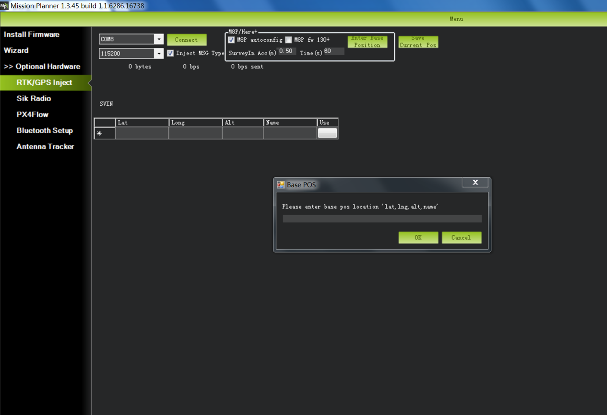

.. _common-here-plus-gps:

=============
Here+ RTK GPS
=============

This article provides a brief overview of how to setup a Here+ RTK GPS receiver which is based on the Ublox M8N.
Like other RTK GPSs, the Here+ can provide much more accurate position estimates than regular GPSs but normally requires the use of a 2nd GPS connected to the ground station.
These instructions focus on the setup using Mission Planner on Windows but in the future other ground stations (i.e. QGroundControl) will also support this GPS.

.. note::

     Here+ RTK GPS is supported in Copter-3.5 (and higher), Plane 3.8.0 (and higher)

Where to buy
============

See a list of `Proficnc resellers here <http://www.proficnc.com/stores>`__ or you can purchase directly from `Proficnc.com <http://www.proficnc.com/gps/77-gps-module.html>`__.

Connecting the vehicle and base station GPSs
============================================

The Here+ GPS kit comes with a larger round GPS (also knows as the "Rover") that should be mounted on the vehicle so that the round button is on the top and the faint arrow is pointing forwards.
This GPS is connected to the flight controller using the supplied 8-pin clickmate connector (if using a Pixhawk2) or an optional 4pin+6pin DF13 connector (if using Pixhawk1).

A smaller GPS (also known as the "base station") labelled "here+" is also included along with it's external antenna.  This GPS is connected to the ground station PC using the supplied USB cable.

Below is a diagram showing how to connect the Here+ to a Pixhawk1.

.. image:: ../../../images/here-plus-pixhawk.png
	:target: ../_images/here-plus-pixhawk.png

Installing the Drivers
======================

Windows 10 users (and perhaps others) will need to download and install the `u-blox GNSS VCP Device Driver for Windows <https://www.u-blox.com/sites/default/files/ubloxGnss_vcpDeviceDriver_windows_3264_v3.01.exe>`__.
If this link is broken you may find a newer version is available under the "Driver" section of `this ublox page <https://www.u-blox.com/en/product-resources?f[0]=property_file_product_filter%3A2779>`__.

If installed correctly, when plugged in, the GPS should appear in the Device Manager as "u-blox Virtual COM Port".

.. image:: ../../../images/here-plus-gps-windows-device.png
	:target: ../_images/here-plus-gps-windows-device.png

Enabling RTK GPS through Mission Planner
========================================

- Connect the "here+" base station to the ground station PC
- Connect to the vehicle's flight controller (i.e. Pixhawk, Pixhawk2, etc) using Mission Planner
- Open the Initial Setup >> Optional Hardware >> RTK GPS Inject screen
- Place the vehicle and base stations so that their GPS antennas have a clear view of the sky (i.e. this will not work indoors!).
- For first time setup in a new location, click the Enter Base Position button, make sure the dialogue box shows empty location information, as shown below:

	
- In the SurveyIn Acc input box, key in the absolute accuracy of base station you wish to achieve, in the unit of meters (for example, 0.50 means 50cm accuracy). In the Time(s) input box, key in a reference time in seconds. Depending on your desired accuracy, the base station may take more than your input time to achieve the desired accuracy. 

	
- Select the COM port for the base station and press Connect (the baud rate drop-down normally does not need to be set because it is automatically detected)
- "M8P autoconfig" should be checked
.. image:: ../../../images/here-plus-gps-mission-planner.png
	:target: ../_images/here-plus-gps-mission-planner.png
	
- The satellite information will be visualized as green bars as shown in the screen shot below.

A line of text will indicate the current status of the surveying:
SurveyIn indicates whether the survey has achieved the desired accuracy of base station, it will show ‘true’ when the survey has been completed.

InProgress shows whether the survey is still ongoing. A completed survey of the current base position is indicated by the status messages SurveyIn Valid: True, and InProgress: false.

Duration: the duration of the survey in seconds

Obs: number of observations used for the survey

Acc: current accuracy in meters

- When the survey is completed as indicated by the SurveyIn: True message, you may click the ‘Save current pos’ button and enter a name for the saved position.
- The RTK messages from base station is sent to vehicle by Mavlink message. In the main HUD of Mission Planer, the GPS status should display RTK Fix or RTK Float

	
- The information of the saved position will be displayed in the table as shown in the screen shot below. 

	
- The saved position can be used the next time you set up the base station in the exact same location. However, if you change to another location for surveying, please ensure you clear the position information in the dialogue box that pops up when you click ‘Enter Base Position’. Otherwise, the previously saved point will be taken every time you connect to the base module.

