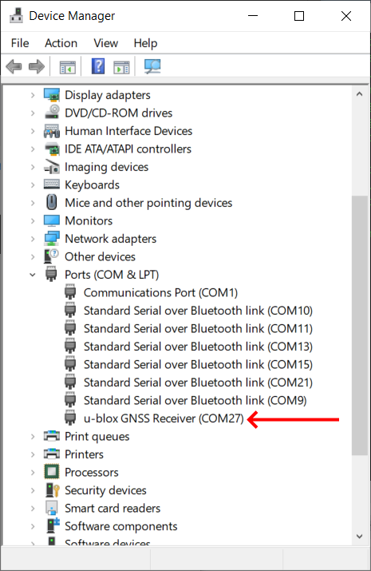

.. _common-here-plus-gps:

=============
Here+ RTK GPS
=============

This article provides a brief overview of how to setup a Here+ RTK GPS receiver which is based on the Ublox M8N.
Like other RTK GPSs, the Here+ can provide much more accurate position estimates than regular GPSs but normally requires the use of a 2nd GPS connected to the ground station.
These instructions focus on the setup using Mission Planner on Windows but in the future other ground stations (i.e. QGroundControl) will also support this GPS.

.. image:: ../../../images/here-plus-gps.png
	:target: ../_images/here-plus-gps.png

.. note::

     Here+ RTK GPS is supported in Copter-3.5 (and higher), Plane 3.8.0 (and higher)

Where to buy
============

See a list of `Proficnc resellers here <http://www.proficnc.com/stores>`__ or you can purchase directly from `Proficnc.com <http://www.proficnc.com/gps/77-gps-module.html>`__.

Connecting the vehicle and base station GPSs
============================================

The Here+ GPS kit comes with a larger round GPS (also knows as the "Rover") that should be mounted on the vehicle so that the round button is on the top and the faint arrow is pointing forwards.
This GPS is connected to the flight controller using the supplied 8-pin clickmate connector (if using a Pixhawk2) or an optional 4pin+6pin DF13 connector (if using Pixhawk1).

A smaller GPS (also known as the "base station") labelled "here+" is also included along with it's external antenna.  This GPS is connected to the ground station PC using the supplied USB cable.

Below is a diagram showing how to connect the Here+ to a Pixhawk1.

Installing the Drivers
======================

Windows 10 users (and perhaps others) will need to download and install the `u-blox GNSS Standard Driver for Windows, v1.2.0.8 <https://www.u-blox.com/sites/default/files/products/tools/UBX-GNSS-CDC-ACM-windows_Driver_%28UBX-drv-v1.2.0.8%29.exe.zip>`__.

If this link is broken you may find a newer version is available under the "Driver" section of `this ublox page <https://www.u-blox.com/en/product-resources?f[0]=property_file_product_filter%3A2779>`__.

When first installed, the device may show up in the "sensors" catagory in device manager.  If this happens, please right click on it and "update driver" 
select 
"Browse my computer for driver software"
then select 
"Let me pick from a list of devices"
the next screen will show a list of possible drivers.  Select..
"USB Serial Device"
Select next and finish.

If installed correctly, when plugged in, the GPS should appear in the Device Manager as "USB Serial Device".

Enabling RTK GPS through Mission Planner
========================================

- Connect the "here+" base station to the ground station PC
- Connect to the vehicle's flight controller (i.e. Pixhawk, Pixhawk2, etc) using Mission Planner
- Open the Initial Setup >> Optional Hardware >> RTK GPS Inject screen
- Select the COM port for the base station and press Connect (the baud rate drop-down normally does not need to be set because it is automatically detected)
- "M8P autoconfig" should be checked
- Place the vehicle and base stations so that their GPS antennas have a clear view of the sky (i.e. this will not work indoors!).
- After approximately 5min the base station's position should have "Surveyed In", press "Save Current Position"
- on the Flight Data screen, the GPS message should show "RTK Fix"

