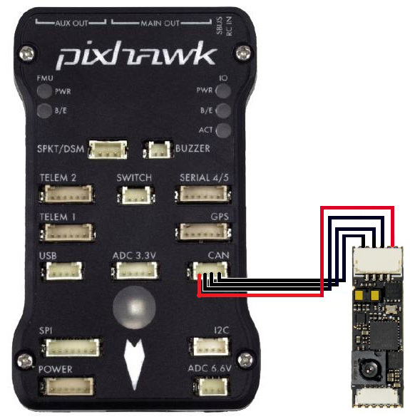

.. _common-hereflow:

================================
Hex HereFlow Optical Flow Sensor
================================

[copywiki destination="copter"]

The `HereFlow optical flow sensor <http://www.proficnc.com/all-products/185-pixhawk2-suite.html>`__ is a lightweight optical flow sensor including a short range lidar which uses the CAN protocol to communicate with the autopilot.  This can be used to improve horizontal position control especially in GPS denied environments.

..  youtube:: MKJB_7cA_0s
    :width: 100%

Support for this sensor is available in Copter-4.0.0 (and higher)

.. warning::

   The lidar included with the HereFlow is very short range especially outdoors.  We strongly recommend using a :ref:`longer range lidar instead <common-rangefinder-landingpage>`.

Where to Buy
------------

The sensor is available from `Hex resellers <http://www.proficnc.com/stores>`__

Connection to Autopilot
-----------------------

- The flow sensor should be mounted on the underside of the copter with the camera lens pointing downwards.  The side of the sensor with the lens should be towards the front of the vehicle.  The image above is incorrect because the autopilot's arrow is pointing down while the sensor's lens is close to the top.
- Connect the sensor to the autopilots' CAN port (if using a Cube note that pre-Apr 2019 boards have CAN1 and CAN2 swapped)
- Set :ref:`FLOW_TYPE <FLOW_TYPE>` = 6 (UAVCAN)
- Set :ref:`CAN_P1_DRIVER <CAN_P1_DRIVER>` = 1 to enable UAVCAN
- Set :ref:`CAN_D1_PROTOCOL <CAN_D1_PROTOCOL>` = 1 (UAVCAN)

To use the onboard lidar (not recommended):

- Set :ref:`RNGFND1_TYPE <RNGFND1_TYPE>` = 24 (UAVCAN)
- Set :ref:`RNGFND1_MAX_CM <RNGFND1_MAX_CM>` = 300 to set range finder's maximum range to 3m

Additional Notes
-----------------

- As with the :ref:`PX4Flow sensor <common-px4flow-overview>` a range finder is required to use the sensor for autonomous modes including :ref:`Loiter <loiter-mode>` and :ref:`RTL <rtl-mode>`
- :ref:`FlowHold <flowhold-mode>` does not require the use of a rangefinder
