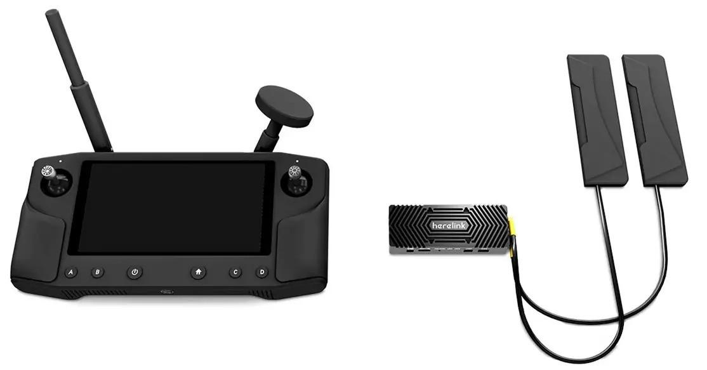

.. _common-herelink:
[copywiki destination="plane,copter,rover,blimp"]
========================================
Herelink RC/HD Video Transmission System
========================================

Herelink is an integrated remote controller, ground station and wireless digital transmission system which can be used with the Cube Autopilot and Ardupilot. Herelink allows RC control, HD video and telemetry data to be transmitted up to 20km between the ground station and air unit, the Herelink remote controller features custom Solex TX and QGC applications and both air unit and ground station feature an integrated 8 core SOC for custom application development. Herelink 1.1 also includes Ethernet connectivity from the air unit to gimbals,cameras, and autopilots in addition to HDMI, SBUS and UART based I/O.

Features
--------
* Android based smart device with 5.46 inch 1080P capacitive touch screen.
* Integrated digital transmission system simultaneously transmitting video, telemetry and control. 
* Custom Solex TX and QGC ground station software with MAVLink support for ArduPilot and PX4.
* Dual hall effect self centering gimbals with removable sticks. 
* 1080P HD video with dual digital video inputs. 
* Dual S.bus signal output for simultaneous control of autopilot and pan/tilt cameras.
* 6 customizable MAVLink buttons and Mavlink/Sbus hardware wheel. 
* RC gimbal control on dedicated service independent from Solex TX / QGC. 
* Tether and share video and telemetry via wifi ground station such as Mission Planner. 
* Onboard Arm Cortex A53 & Cortex A53 SOC in both air and ground units for custom applications. 

`Herelink System Overview <https://docs.cubepilot.org/user-guides/herelink/herelink-overview>`_

`Herelink User Manual <https://docs.cubepilot.org/user-guides/herelink/herelink-user-guides>`__

More Info on Herelink can be found on 

-   `Cubepilot <https://docs.cubepilot.org/user-guides/herelink/herelink-overview>`_
-   `Hex HereLink Website <http://www.proficnc.com/all-products/211-gps-module.html>`_
-   `Cubepilot Support Forum <https://discuss.cubepilot.org>`_