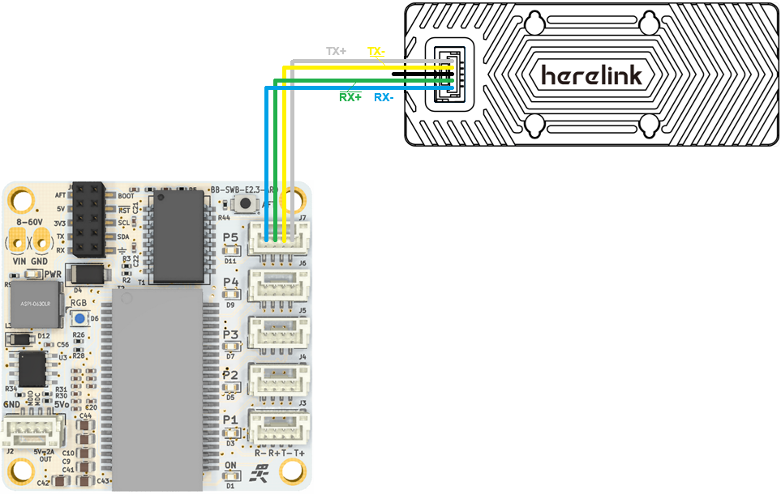

.. _common-herelink:
[copywiki destination="plane,copter,rover,blimp"]
========================================
Herelink RC/HD Video Transmission System
========================================

Herelink is an integrated remote controller, ground station and wireless digital transmission system which can be used with the Cube Autopilot and Ardupilot. Herelink allows RC control, HD video and telemetry data to be transmitted up to 20km between the ground station and air unit, the Herelink remote controller features custom Solex TX and QGC applications and both air unit and ground station feature an integrated 8 core SOC for custom application development. Herelink 1.1 also includes Ethernet connectivity from the air unit to gimbals,cameras, and autopilots in addition to HDMI, SBUS and UART based I/O.

.. image:: ../../../images/herelink.jpg
    :target: ../_images/herelink.jpg

Features
--------
* Android based smart device with 5.46 inch 1080P capacitive touch screen.
* Integrated digital transmission system simultaneously transmitting video, telemetry and control. 
* Custom Solex TX and QGC ground station software with MAVLink support for ArduPilot and PX4.
* Dual hall effect self centering gimbals with removable sticks. 
* 1080P HD video with dual digital video inputs. 
* Dual S.bus signal output for simultaneous control of autopilot and pan/tilt cameras.
* 6 customizable MAVLink buttons and Mavlink/Sbus hardware wheel. 
* RC gimbal control on dedicated service independent from Solex TX / QGC. 
* Tether and share video and telemetry via wifi ground station such as Mission Planner. 
* Onboard Arm Cortex A53 & Cortex A53 SOC in both air and ground units for custom applications. 

`Herelink System Overview <https://docs.cubepilot.org/user-guides/herelink/herelink-overview>`__

`Herelink User Manual <https://docs.cubepilot.org/user-guides/herelink/herelink-user-guides>`__

Ethernet Connectivity
---------------------

Instead of using a UART serial connection to connect the autopilot to the AirUnit, an Ethernet virtual serial connection may be used

An example of the setup of the Herelink in a networked ArduPilot vehicle system is detailed in :ref:`common-ethernet-vehicle` but a short form of the instructions is below

- Connect the AirUnit and autopilot using an :ref:`ethernet adapter <common-ethernet-adapters>`.  The wiring for the AirUnit when used with a BotBlox SwitchBox is shown above but CubePilot's CubeLAND 8-Port Switch can also be used
- Ensure the AirUnit and autopilot are on the same subnet (e.g the first 3 octets of the IP address match, 4th octet is different)

  - Herelink AirUnit's IP address is 192.168.144.10, GroundUnit's is 192.168.144.11
  - Set the autopilot's :ref:`NET_ENABLE<NET_ENABLE>` = 1 and reboot to enable networking
  - Set the autopilot's IP address using :ref:`NET_IPADDR0<NET_IPADDR0>`, :ref:`NET_IPADDR1<NET_IPADDR1>`, :ref:`NET_IPADDR2<NET_IPADDR2>`, :ref:`NET_IPADDR3<NET_IPADDR3>` (e.g. 192.168.144.14)

- Create a serial connection over ethernet for MAVLink telemetry

  - Set :ref:`NET_P1_TYPE<NET_P1_TYPE>` = 1 (UDP Client) and reboot the autopilot
  - Set :ref:`NET_P1_IP0<NET_P1_IP0>`, :ref:`NET_P1_IP1<NET_P1_IP1>`, :ref:`NET_P1_IP2<NET_P1_IP2>`, :ref:`NET_P1_IP3<NET_P1_IP3>` to the Herelink AirUnit's IP address (e.g. 192.168.144.11)
  - Set :ref:`NET_P1_PORT<NET_P1_PORT>` = 14550 (port that AirUnit listens on)
  - Set :ref:`NET_P1_PROTOCOL<NET_P1_PROTOCOL>` = 2 (MAVLink2)

For information on how to include a camera gimbal to the system, please see the individual wiki pages for the :ref:`Siyi <common-siyi-zr10-gimbal>`, :ref:`Topotek <common-topotek-gimbal>` and :ref:`ViewPro <common-viewpro-gimbal>` gimbals

Updating QGC
------------

As of June 2024 the Herelink comes pre-installed with QGC-4.0.8.  If you wish to upgrade to QGC-4.4 (or higher) which includes improved camera and gimbal support follow these instructions:

1. Open the `QGC releases page <https://github.com/mavlink/qgroundcontrol/releases>`__
2. Click on the "Herelink" link and download the QGroundControl-Herelink.apk file
3. On the Herelink

  - Open settings by pulling down from the top of the screen and select the gear icon
  - Select "About Phone", scroll down and click "Build Number" multiple times to enable developer mode
  - Return to settings by clicking the back arrow button
  - Scroll down to "Developer Options" and enable "USB debugging"
  - Connect the Herelink to a PC via USB cable
  - Pull down from the top and select "USB charging this device" and change to "Use USB to Transfer files"

4. On the PC

  - Open a windows file explorer
  - Open the Herelink's filesystem (check under "This PC")
  - Drag-and-drop the Herelink-QGroundControl.apk file (downloaded above) to the Herelink's internal file system

5. On the Herelink

  - Pull down from the top and select "USB for file transfer" and restore "Use USB to" "Charge this device"
  - Open settings by pulling down from the top of the screen and select the gear icon
  - Select "Storage", "Internal shared storage", scroll down and select "Explore"
  - Click on "Herelink-QGroundControl.apk" and select "INSTALL"
  - To ease starting Herelink open the Herelink Launcher application, select the grid icon on the bottom right, click on "Herelink-QGroundControl" and select, "Add to Favorites"
  - When QGC is first started it will ask for various permission (select "Allow" for all), preferred units and Vehicle firmware (select "ArduPilot"

`This video <https://www.youtube.com/watch?v=a-cLzYD7HBk>`__ demonstrates how to update the QGC version in a general sense

`CubePilot instructions for installing a custom app <https://docs.cubepilot.org/user-guides/herelink/herelink-user-guides/installing-a-custom-app>`__ may also be useful

More Info on Herelink can be found on 

-   `Cubepilot <https://docs.cubepilot.org/user-guides/herelink/herelink-overview>`_
-   `Hex HereLink Website <http://www.proficnc.com/all-products/211-gps-module.html>`_
-   `Cubepilot Support Forum <https://discuss.cubepilot.org>`_