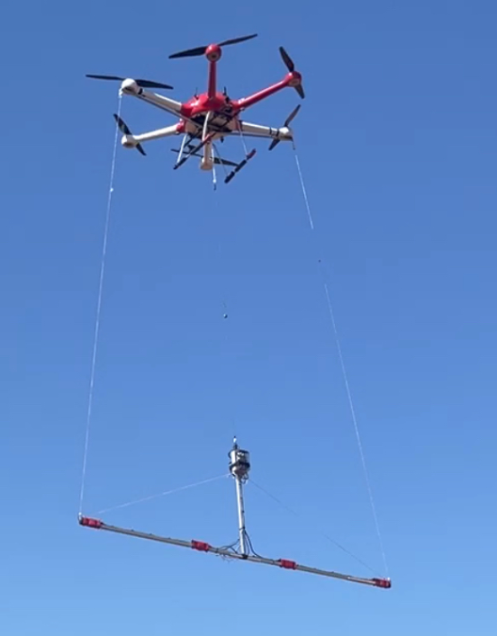

.. _common-hires-mag-array:

===========================
DroneCAN Magnetometer Array
===========================

ArduPilot can be used to create a multiple magnetomer array using DroneCAN compasses. This could be useful as a suspended device for geophysical surveys or other uses.

An ArduPilot autopilot (used only for the array logging, not for vehicle control) could support many DroneCAN compasses as shown below:

.. image:: ../../../images/mag-array.png

And could be suspended below a vehicle as shown below:

*image courtesy of* `AerialVision <https://www.aerial-vision.com.au>`__

Each compass would have its raw x/y/z field readings logged by the MAGH message.

This capability is not included by default and would have to be included in a custom build for the autopilot using the `Custom Firmware Build Server <https://custom.ardupilot.org>`__ and enabling the "DroneCAN HiRes compasses for survey logging" option under **Compass**.

The autopilot would need to have :ref:`LOG_DISARMED<LOG_DISARMED>` parameter set to log as soon as power is supplied.