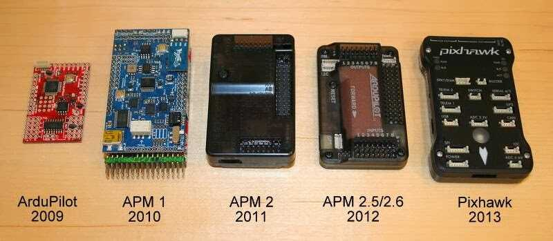
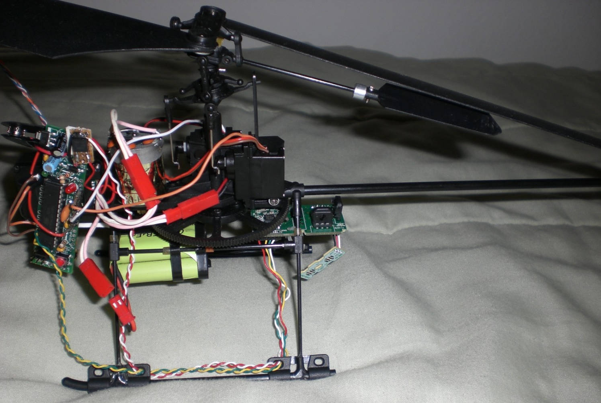

.. _history-of-ardupilot:

====================
History of Ardupilot
====================

May 2007 - Chris Anderson starts
`DIYDrones.com <http://diydrones.com/>`__ while building his `Lego mindstorm base UAV <https://www.youtube.com/watch?v=GC2qs0WpL7w>`__.

Sep 2008 - Jordi builds traditional helicopter UAV able to `fly autonomously <https://www.youtube.com/watch?v=20Z9VSvAAug&list=UU0sMZYj_oTmZmXMfBzqDyjg>`__
and `wins the first Sparkfun AVC competition <https://avc.sparkfun.com/2009>`__.

    
    Jordi's traditional helicopter

2009 - Chris Anderson & Jordi Munoz found 3D Robotics

May 2009 - `First ArduPilot board <http://diydrones.com/profiles/blogs/ardupilot-how-to-reflash>`__
(using
`thermopiles <http://diydrones.com/profiles/blogs/attopilot-ir-sensors-now>`__)
released by Jordi/3DRobotics

Nov 2009 - `ArduPilot code repository <https://code.google.com/p/ardupilot/>`__ created by Jordi

Nov 2009 - first version of ArduIMU written by Jordi, Doug Weibel, Jose
Julio using DCM from William Premerlani

Nov 2009 - Feb 2010 – ArduPilot rewritten from scratch (v2.5) by Jason
and includes interrupt driven RC input, RC throttle failsafe, RTL,
Loiter, Circle, Crosstrack correction, decent stabilization,
Fly-By-Wire, system events, 4 channel RC output, and 2-way telemetry.
(`Post <http://diydrones.com/profiles/blogs/ardupilot-25-final>`__)

Dec 2009 - `first IMU based autonomous plane mission <http://diydrones.com/profiles/blogs/arduimupilot-flys-first>`__
flown by Doug with modified ArduPilot v2.4.

2010 - APM1 released by 3d Robotics

Early 2010 - ArduPilot 2.6 released by Doug and Jason with improved
throttle control, and ArduIMU support.

Summer 2010 - APM Code development:

-  Jason - Mission scripting, Flight modes, Navigation
-  Jose - Code Libraries, DCM, and HW sensor support
-  Doug - Advanced flight control, logging, DCM
-  MikeS - Parameters, CLI, Fast Serial, advanced hardware optimizations

May 2010 - `ArduPilot merges with AeroQuad (including Jani Hirvinen) and begins work on CopterNG <http://diydrones.com/profiles/blogs/announcing-arducopter-the>`__

June 2010 - APM 1 flies first autonomous and scripted mission in SW
(`post <http://diydrones.com/profiles/blogs/ardupilot-megas-first-complete>`__)

June 2010 - APM 1 takes first `autonomous Plane flights <http://diydrones.com/profiles/blogs/ardupilot-mega-moves-off-the>`__

July 2010 - Perl based Hardware-in-the-loop developed by Jason for
Xplane for testing new APM mission scripting commands in (later
integrated into
Mavlink)(\ `Post <http://diydrones.com/profiles/blogs/x-plane-integration>`__)

Aug 2010 - `Jani/jDrones ships first DIY quad frames <http://diydrones.com/profiles/blogs/arducopter-unboxing>`__
which were adopted as the original standard

Oct 2010 - CopterNG (AeroQuad/ArduCopter merged code) project abandoned
by ArduPilot team and handed over, with encouragement, to the
`ArduPirates <https://code.google.com/p/ardupirates/>`__ team for
further development. Jason restarts Copter with alternative control
logic based on Plane making Copter autonomous. Adds Loiter, Circle, RTL,
Mission scripting, failsafe, takeoff, landing, etc.

Aug 2010 - `the Mission Planner <http://diydrones.com/profiles/blogs/ardupilot-mega-mission-planner>`__
is released by Michael Oborne

Aug 2010 - `TradHeli support <https://vimeo.com/14135066>`__\ added by
Randy

Dec 2010 - first successful fork of ArduPilot code as `MegaPirates group extends original CopterNG code <http://diydrones.com/profiles/blogs/arducopter-ng-taken-over-by>`__

April 2011 – First fully autonomous Copter mission flown by Jason at
`Sparkfun AVC <http://diydrones.com/profiles/blogs/acm-at-the-avc>`__

April 2011 - Laser Navigation made the first piece of 32 bit hardware capable of running the Arducopter software

2011 - APM2 released by 3D Robotics

Nov 2011 - `AutoTester <http://autotest.ardupilot.org/>`__ is created by
Tridge

2012 - APM2.5/2.6 released by 3D Robotics

Feb 2012 - Jason asks Randy to take over and be lead developer of
Copter, Doug goes off to get his PhD and Tridge takes over Plane

Feb 2012 - `Marco Robustini <https://www.youtube.com/user/erarius>`__
joins as lead Copter tester

July 2012 - `PX4 released <http://diydrones.com/profiles/blogs/introducing-the-px4-autopilot-system>`__
by \ `ETH (Lorenz Meier,MikeS) <https://pixhawk.org/>`__ / 3D Robotics

Aug 2012 - Hardware Abstraction Layer (AP_HAL) by Pat Hickey simplifies
adding support for other boards

Oct 2012 - first `TradHeli autonomous mission <https://www.youtube.com/watch?v=Rugt1gYb-1M>`__ by Rob Lefebvre

Oct 2012 - Tridge and CanberraUAV `win Outback Challenge with APM2 & Pandaboard <http://diydrones.com/profiles/blogs/canberrauav-outback-challenge-2012-debrief>`__

Nov 2012 - first APM2.5 clone appears

Dec 2012 - Successfully prototype of 3rd order complementary filter by
Jonathan Challinger leads to Copter's inertial based altitude hold by
Randy and Leonard
(`AC2.9 <http://diydrones.com/forum/topics/arducopter-2-9-released>`__).

Jan 2013 - ArduPilot code moved from `google code <http://code.google.com/p/ardupilot/>`__ to
`github <https://github.com/ArduPilot/ardupilot>`__

Jan/Feb 2013 - Android GCSs appear (`DroidPlanner from
Arthur <http://diydrones.com/profiles/blogs/droidplanner-ground-control-station-for-android-devices>`__,
`AndroPilot from Kevin Hester <http://diydrones.com/profiles/blogs/android-ground-controller-beta-release>`__)

Apr 2013 - :ref:`Plane L1 waypoint <plane:navigation-tuning>`
following by Paul Riseborough, Brandon Jones, Tridge

May 2013 - Copter inertial navigation support for waypoint navigation by
Leonard and Randy
(`AC3.0 <http://diydrones.com/forum/topics/arducopter-3-0-1-released>`__)

Jul 2013 - Plane integrated speed and height control by Paul
Riseborough, Tridge

Sep 2013 - `Flymaple <http://www.open-drone.org/flymaple>`__ board
support by Mike McCauley, Tridge

Nov 2013 - `Pixhawk released <http://diydrones.com/profiles/blogs/px4-and-3d-robotics-present-pixhawk-an-advanced-user-friendly>`__
by `ETH (Lorenz Meier,MikeS) <https://pixhawk.org/>`__/ 3D Robotics

Dec 2013 - `BeaglePilot project <https://github.com/BeaglePilot/beaglepilot>`__ created by Víctor Mayoral Vilches and Siddharth Bharat Purohit to port APM codebase to Linux. The project was by Andrew Tridgell, Philip Rowse and others and funded by 3DR, Google (through the Google Summer of Code) and BeagleBoard.

Jan 2014 - Extended Kalman Filter added for more reliable attitude and
position information by Paul Riseborough, Tridge

Mar 2014 - `VRBrain <http://www.virtualrobotix.com/page/vr-brain-v4-0>`__ boards
support added by Emile Castelnuovo and Tridge

Mar 2014 - `Emlid presented Navio <http://diydrones.com/profiles/blogs/navio-raspberry-pi-autopilot>`__, first Raspberry Pi autopilot shield that allows to run ArduPilot directly on Raspberry Pi.

Aug 2014 - `First Plane flight on Linux <http://diydrones.com/profiles/blogs/first-flight-of-ardupilot-on-linux>`__
board (Pixhawk Fire cape)

Sep 2014 - `Tridge & Canberra UAV win the Outback Challenge <http://diydrones.com/profiles/blog/show?id=705844%3ABlogPost%3A1790005>`__
with an ArduPilot based UAV plane (`Tridge's
debrief <http://diydrones.com/profiles/blogs/canberrauav-outback-challenge-2014-debrief>`__).

Sep 2014 - `First Copter flight on Linux <http://diydrones.com/profiles/blogs/apm4-0-first-copter-flight>`__
 +board (Pixhawk Fire cape)

Oct 2014 - `DroneCode foundation <https://www.dronecode.org/>`__ is
formed
(`announcement <http://diydrones.com/profiles/blogs/introducing-the-dronecode-foundation>`__)

Oct 2014 - first report of Plane being successfully used in search &
rescue including finding a missing light plane in Florida.

Feb 2015 - `Erle Robotics <http://erlerobotics.com>`__ launches DIY kits for Linux drones based on APM.

May 2015 - first documented multi-vehicle flight using only a single
ground station (`first
three <http://diydrones.com/profiles/blogs/multi-vehicle-testing-with-apm-copter-tracker-and-mission-planner>`__,
`then fifty! <http://diydrones.com/profiles/blogs/from-zero-to-fifty-planes-in-twenty-seven-minutes>`__).

June 2015 - `3DR ships Solo <https://www.youtube.com/watch?v=SP3Dgr9S4pM>`__, the first RTF
copter with built in companion computer

June 2015 - `Parrot Bebop port's first successful flights <http://diydrones.com/profiles/blogs/parrot-bebop-running-apm>`__

Aug 2015 - Michael Clement & Michael Day fly 
`50 arduplanes in a multi-vehicle environment <http://diydrones.com/profiles/blogs/from-zero-to-fifty-planes-in-twenty-seven-minutes>`__

Sep 2015 - `First major news event involving a misbehaving pilot of an ArduPilot vehicle (a Solo) <http://edition.cnn.com/2015/09/04/us/us-open-tennis-drone-arrest/>`__

March 2016 - 3DR ceases direct funding of ArduPilot community as it `cuts jobs <http://www.marketwatch.com/story/drone-maker-3d-robotics-reboots-by-cutting-jobs-refocusing-on-corporate-market-2016-03-23>`__.

March 2016 - Formation of the `ardupilot.org non profit organisation <http://diydrones.com/profiles/blogs/a-new-chapter-in-ardupilot-development>`__ and new website.

May 2016 - `Flirtey delivery drone (using ArduPilot) is entered into Smithsonian Air and Space Museum <http://www.smithsonianmag.com/smart-news/first-delivery-drone-united-states-lands-spot-smithsonian-180958964/?no-ist>`__.

Sep 2016 - Flymaple board support removed ( not actively tested or used , also lacks a maintainer see PR #4191 ).

Sep 2016 - Relationship with 3DR, Chris Anderson and PX4 team lead sours as DroneCode Platinum board members outvote Silver board members to remove GPLv3 projects including ArduPilot from DroneCode.

Sep 2016 - ArduPilot begins :ref:`ArduPilot Partners <common-partners>` group.

Sep 2016 - `Canberra UAV places 1st in Medical Express 2016 <https://uavchallenge.org/2016/09/29/final-day-of-medical-express-2016>`__ competition (aka Outback Challenge) (`debrief <https://discuss.ardupilot.org/t/canberrauav-outback-challenge-2016-debrief/12162>`__)

Oct 2016 - Copter-3.4 release including object avoidance.

Feb 2017 - ArduSub officially joins ArduPilot and `merges back to master <https://discuss.ardupilot.org/t/best-contribution-for-feb-ardusub-rustom-jehangir-and-jacob-walser/16031>`__

Feb 2017 - ArduPilot developer unconference in Canberra Australia (`Tridge <https://discuss.ardupilot.org/t/developer-unconference-feb-2017-andrew-tridgell/15888>`__, `PaulR <https://discuss.ardupilot.org/t/developer-unconference-feb-2017-andrew-tridgell/15888>`__, `MichaelO <https://discuss.ardupilot.org/t/developer-unconference-michael-oborne/16015>`__)

May 2017 - `Google Summer of Code funds 4 developers <https://discuss.ardupilot.org/t/calling-student-programmers-google-and-ardupilot-2017-summer-of-code/15296>`__ for the summer (see `SafeRTL <https://discuss.ardupilot.org/t/safertl-mode-for-copter/20486>`__)

July 2017 - Copter-3.5 release including Visual Odometry and Pozyx support for non-GPS navigation, AutoTune gets position hold, `Solo support <https://discuss.ardupilot.org/t/the-solo-lives-on/19347>`__

Aug 2017 - SkyRocket announces release of ArduPilot based SkyViper GPS Streaming drone (`blog <https://discuss.ardupilot.org/t/skyrocket-and-ardupilot/20381>`__)

.. note::

   The above list includes many of the major milestones for the project.  Please see the
   `ArduCopter.cpp <https://github.com/ArduPilot/ardupilot/blob/master/ArduCopter/ArduCopter.cpp>`__
   or the `GitHub contributors graph <https://github.com/ArduPilot/ardupilot/graphs/contributors>`__
   for a more complete list of contributors to the project.

[copywiki destination="copter,plane,rover,planner,planner2,antennatracker,dev,ardupilot"]
