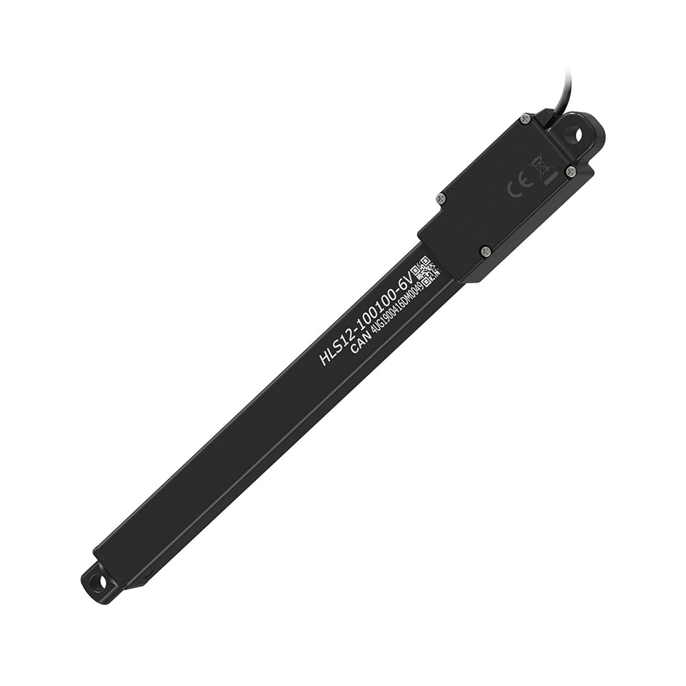
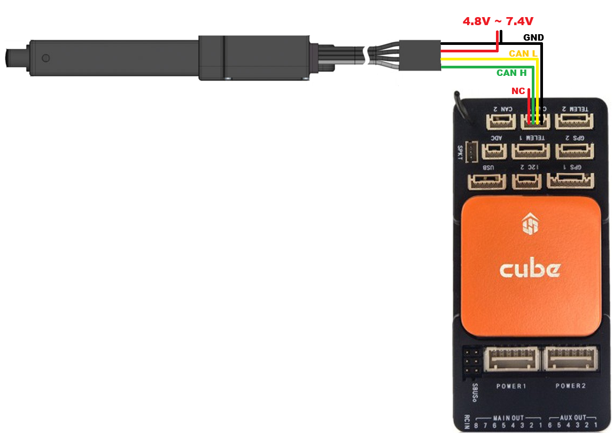
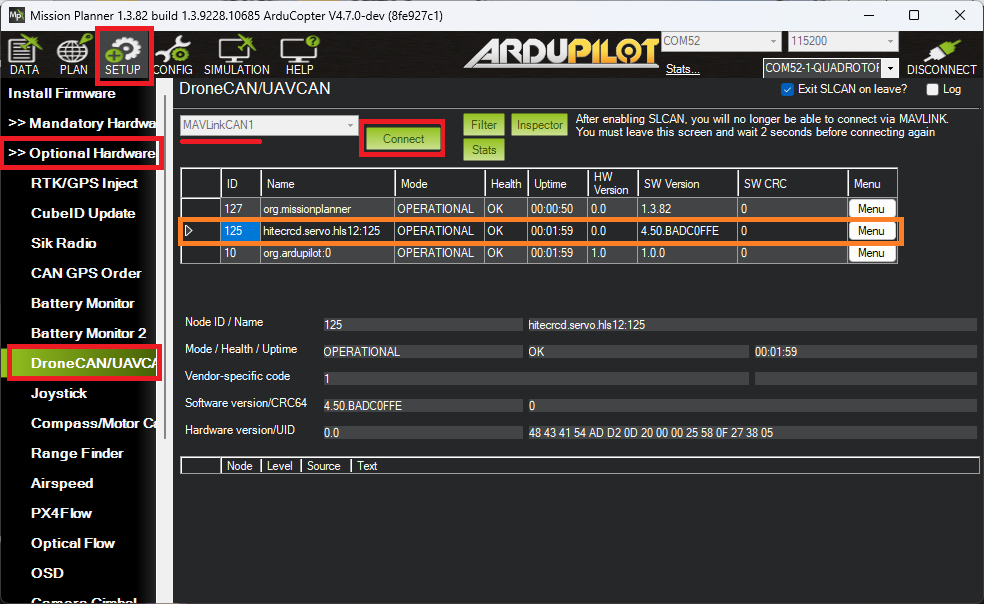
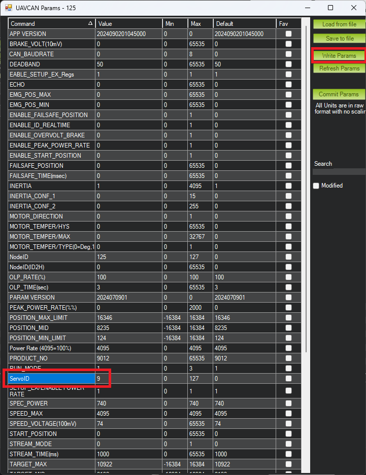
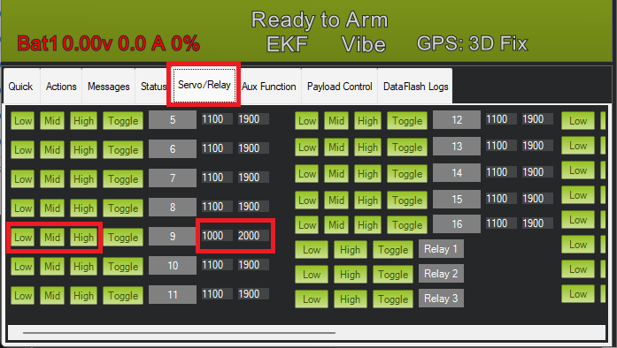

.. _common-hitec-dronecan-linear-actuator:

===============================
Hitec DroneCAN Linear Actuators
===============================

Hitec supplies several `linear actuators <https://www.hiteccs.com/actuators/products/search/servo/2/spec/0-0/accessory/0/sort/0>`__ that support the DroneCAN protocol using the same commands and feedback as are used for servos.  Before purchasing, ensure the product description includes the word "DroneCAN".

Where to Buy
============

Hitec linear actuators can be purchased `directly from Hitec <https://www.hiteccs.com/actuators/products/search/servo/2/spec/0-0/accessory/0/sort/0>`__ or from their `distributors <https://hitecrcd.com/distributors/>`__

Setup and Configuration
=======================

Connect the linear actuator to the autopilot and power supply as shown above and set the following parameters:

-  :ref:`CAN_P1_DRIVER<CAN_P1_DRIVER>` = 1 (First Driver)
-  :ref:`CAN_D1_PROTOCOL<CAN_D1_PROTOCOL>` = 1 (DroneCAN)
-  :ref:`CAN_D1_UC_SRV_BM<CAN_D1_UC_SRV_BM>`: bitmask of servo output channels that should be sent via DroneCAN.  E.g. "256" for Servo9
-  (Optionally) :ref:`CAN_D1_UC_SRV_RT<CAN_D1_UC_SRV_RT>`: rate that servo outputs are sent from the autopilot to the actuator

Use the :ref:`DroneCAN GUI Tool <common-uavcan-gui>` or Mission Planner's DroneCAN/UAVCAN screen to confirm communication with the autopilot is working correctly and to set the actuator's ServoId parameter

If using Misison Planner

   - Open Setup, Optional Hardware, DroneCAN/UAVCAN
   - Select MAVLinkCAN1 from the drop-down an press "Connect"
   - "hitecrcd.servo.hls" should appear in the list.  From the right side select Menu, Parameters
   - Set "ServoID" to the servo output channel that the linear actuator should take its position from (e.g. "9" to mirror SERVO9's output)
   - Reboot the autopilot and linear actuator

Testing
=======

Open Mission Planner's Data, Servo/Relay tab and use the Low, Mid and High buttons to test the actuator moves as expected

