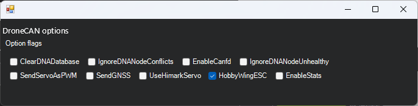

.. _common-hobbywing-dronecan-esc:

======================
Hobbywing DroneCAN ESC
======================

Hobbywing ESCs with CAN interfaces (`including these <https://www.hobbywing.com/en/products?id=46>`__) support DroneCAN which allows the autopilot to control the ESC/motor via CAN and also retrieve the individual rpm, voltage, current and temperature.

.. note:: be sure that the CAN version of the ESC is being ordered. Contact Hobbywing if there is doubt. Some ESCs may require special ordering to get CAN interface.

The contents of this page were verified using a `Hobbywing X6 Plus (6218-150KV CW motor) <https://www.hobbywingdirect.com/collections/xrotor-x8-series/products/xrotor-pro-x6-series>`__.

Some images courtesy of hobbywing.com

Connection and Configuration
============================

Connect the ESCs (perhaps using a 4-pin I2C splitter) to the autopilot's CAN1 (or CAN2) port.

Connect to the autopilot with a ground station and set the following parameters and then reboot the autopilot

- Set :ref:`CAN_P1_DRIVER<CAN_P1_DRIVER>` to 1 (First Driver)
- Set :ref:`CAN_D1_PROTOCOL<CAN_D1_PROTOCOL>` to 1 (DroneCAN)
- Set :ref:`CAN_D1_UC_ESC_BM<CAN_D1_UC_ESC_BM>` to configure which servo outputs are transmitted over CAN.  For most quadcopters this should be set to 15 to send outputs 1-4 to DroneCAN.

-  Modify :ref:`CAN_D1_UC_OPTION<CAN_D1_UC_OPTION>` so that "Hobbywing ESC" is checked (or directly set to 128)

Configuring the ESCs
====================

By default the ESCs come from the factory with an incorrect baudrate (500,000 instead of 1,000,000) and all IDs are set to 1 (the first motor).  The instructions below show how to configure the ESCs to use the correct baudrate and individual ID for each ESC.

You may initially test that the ESCs can be spun in their factory configuration by doing the following:

- Disconnect any other DroneCAN devices from the autopilot's CAN1 port
- Connect to the autopilot and set :ref:`CAN_P1_BITRATE<CAN_P1_BITRATE>` to 500,000
- Reboot the autopilot
- Power on the ESCs, they should stop beeping
- Use Mission Planner's Setup, Optional Hardware, Motor Test page's "Test All Motors" and all motors should spin

Next correct the configuration of each ESC:

- Ensure the autopilot's :ref:`CAN_P1_BITRATE<CAN_P1_BITRATE>` param is set to 500,000 (reboot the autopilot if modified)
- Download and install a the :ref:`DroneCAN Gui<common-uavcan-gui>` (version 1.2.25 or higher)
- Determine the autopilot's MAVLink or SLCAN COM port.  More details can be found on the :ref:`DroneCAN GUI page<common-uavcan-gui>`.
- Open the DroneCAN GUI

  - Connect to the MAVLink or SLCAN COM port
  - Push the check button beside the "Set local node ID" field
  - Select Panels, Hobbywing ESC Panel
  - From the top table select an ESC
  - Set the Baudrate to 1,000,000
  - Set ThrottleID and NodeID to the ESC number.  This ESC number corresponds to the autopilot's servo/PWM output port number
  - The values in the top table should update within a few seconds
  - Optionally you may wish to set Msg1Rate (rate at which RPM is sent to autopilot) and/or Msg2Rate (voltage, current temp).  Note Msg1Rate must be greater than Msg2Rate.
  - Repeat for each ESC

- Connect to the autopilot and set :ref:`CAN_P1_BITRATE<CAN_P1_BITRATE>` back to 1,000,000

Testing
=======

Once connected the ESC's RPM, voltage, current and temperature will be visible in the ground station and recorded in the onboard logs.  The image below shows where the data appears on Mission Planner's Status screen.

Test each motor spins properly using Mission Planner's Setup, Optional Hardware, Motor Test pages

Setup Video
===========

..  youtube:: 2fQBczEFnO8
    :width: 100%
