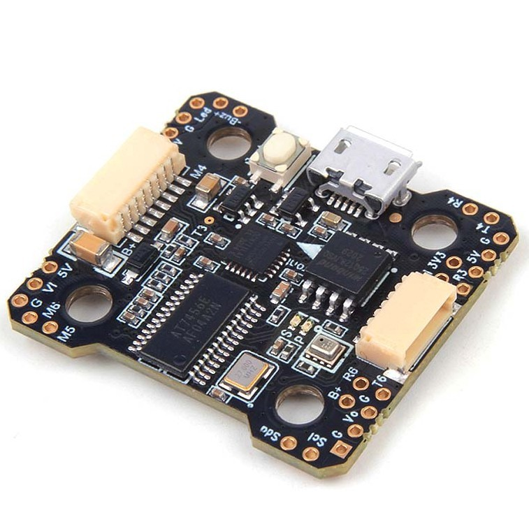
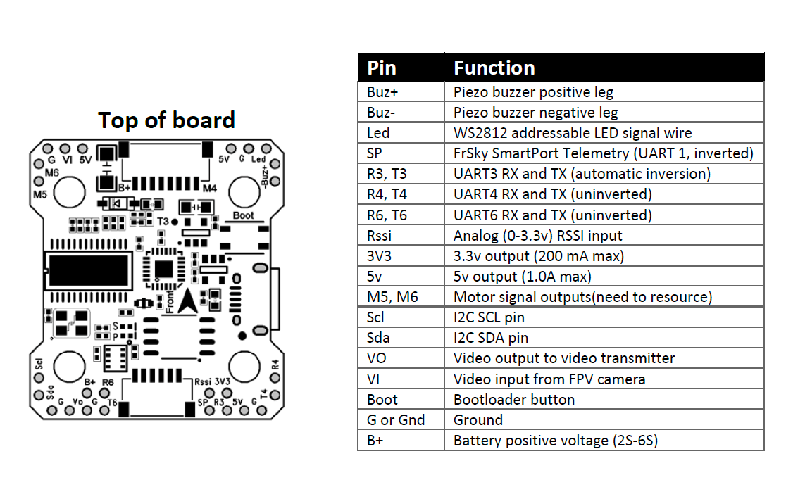

.. _common-holybro-kakutef4-mini:

======================
Holybro Kakute F4 Mini
======================

*above image and some content courtesy of* `Holybro <http://www.holybro.com/product/kakute-f4-v2-mini>`__

Specifications
==============

-  **Processor**

   -  STM32F405RGT6 32-bit processor 
   -  MAX7456 OSD chip

-  **Sensors**

   -  MPU6000 IMU (accel, gyro)
   -  BMP280 barometer

-  **Power**

   -  7V ~ 42V input power directly from battery

-  **Interfaces**

   -  5x PWM outputs
   -  1x RC input PWM/PPM
   -  5x UARTs/serial for GPS and other peripherals
   -  1x I2C port for external compass
   -  micro USB port
   -  Camera and Video TX

-  **Logging**

   - 128Mb flash for logging

Where to Buy
============

- Available from `Holybro <http://www.holybro.com/product/kakute-f4-v2-mini>`__

Pinout
======

UART Mapping
============

The UARTs are marked Rn and Tn in the above pinouts. The Rn pin is the
receive pin for UARTn. The Tn pin is the transmit pin for UARTn.

The pin labeled Rx on each corner of the board is a common pin for
ESC telemetry input.

 - SERIAL0 -> USB
 - SERIAL1 -> USART1 (TX only for Frsky Telem, no ext inverter needed)
 - SERIAL3 -> USART3 (RC Input protocols by default. PPM not supported.)
 - SERIAL4 -> UART4 (GPS/Telem1)
 - SERIAL5 -> UART5 (RX only, ESC Telemetry protocol by default)
 - SERIAL6 -> USART6 (GPS2/Telem2)

RC Input
========
 
RC input is configured on the R3 (UART3_RX) pin. It supports all RC protocols except PPM. See :ref:`common-rc-systems` for details for a specific RC system. :ref:`SERIAL3_PROTOCOL<SERIAL3_PROTOCOL>` is set to "23", by default, to enable this.

- SBUS/DSM/SRXL connects to the R6 pin.

- SBUS FPort requires connection to T3 and an external bi-directional inverter, see :ref:`common-FPort-receivers`.

- CRSF also requires a T3 connection, in addition to R6, and automatically provides telemetry. 

- SRXL2 requires a connection to R3 and T3 and automatically provides telemetry.  Set :ref:`SERIAL3_OPTIONS<SERIAL3_OPTIONS>` to "4".

Any UART can be used for RC system connections in ArduPilot also, and is compatible with all protocols except PPM. See :ref:`common-rc-systems` for details.

ESC Telemetry
=============

The SERIAL5 port (UART5) is for ESC telemetry. It is connected through the motor connector and works out of the box with the `Tekko32 F3 Mini <https://shop.holybro.com/tekko32-f3-4in1-45a-mini-esc_p1132.html>`__ which is commonly paired with this autopilot.
 
FrSky Telemetry
===============

FrSky Telemetry is supported using the SmartPort pad (UART1). You need
to set the following parameters to enable support for FrSky S.PORT. It
has built-in inverters and a diode to allow for operation from a single
pin with no special adapters.

  - :ref:`SERIAL1_PROTOCOL<SERIAL1_PROTOCOL>` 4 or 10
  - :ref:`SERIAL1_OPTIONS<SERIAL1_OPTIONS>` 0

OSD Support
===========

The KakuteF4 supports OSD using :ref:`OSD_TYPE<OSD_TYPE>` 1 (MAX7456 driver).

PWM Output
==========

The KakuteF4 supports up to 5 PWM outputs. The pads for motor output
M1 to M6 on the above diagram are for the 5 outputs. M1-4 outputs
support DShot and :ref:`Bi-Directional DShot<bidir-dshot>`, as well as all PWM types. The M5 is defaulted to support serial LEDs instead of PWM but can be changed by changing its default function using :ref:`SERVO5_FUNCTION<SERVO5_FUNCTION>` and supports Dshot.

The PWM is in 2 groups:

 - PWM 1 and 2 in group 1
 - PWM 3 and 4 in group 2
 - PWM 5 in group 3 (defaulted as serial LED)

Channels within the same group need to use the same output rate, whether PWM or Dshot. If
any channel in a group uses DShot then all channels in the group need
to use DShot.

Battery Monitoring
==================

The board has a built-in voltage and current sensor. The voltage
sensor can handle up to 6S LiPo batteries.

The correct battery setting parameters are:

 - :ref:`BATT_MONITOR<BATT_MONITOR>` 4
 - :ref:`BATT_VOLT_PIN<BATT_VOLT_PIN>` 13
 - :ref:`BATT_CURR_PIN<BATT_CURR_PIN>` 12
 - :ref:`BATT_VOLT_MULT<BATT_VOLT_MULT>` 10.9
 - :ref:`BATT_AMP_PERVLT<BATT_AMP_PERVLT>` 28.5

Compass
=======

The KakuteF4 Mini does not have a built-in compass, but you can attach an external compass using I2C on the SDA and SCL pads.

Logging
=======

The KakuteF4 supports on-board data flash logging. Use :ref:`LOG_BACKEND_TYPE<LOG_BACKEND_TYPE>` = 2)

Firmware
========

Firmware for this board can be found `here <https://firmware.ardupilot.org>`_ in  sub-folders labeled
"KakuteF4Mini".

Loading ArduPilot onto the board
================================

Initial firmware load can be done with DFU by plugging in USB with the
bootloader button pressed. Then you should load the "with_bl.hex"
firmware, using your favourite DFU loading tool. See :ref:`common-loading-firmware-onto-chibios-only-boards`

Once the initial firmware is loaded you can update the firmware using
any ArduPilot ground station software. Updates should be done with the KakuteF4Mini firmware files. See :ref:`common-loading-firmware-onto-pixhawk`.

[copywiki destination="plane,copter,rover,blimp"]
