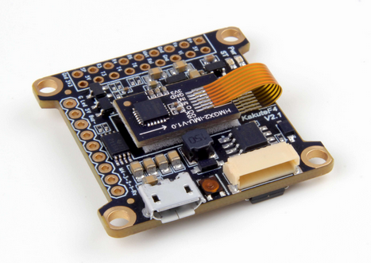
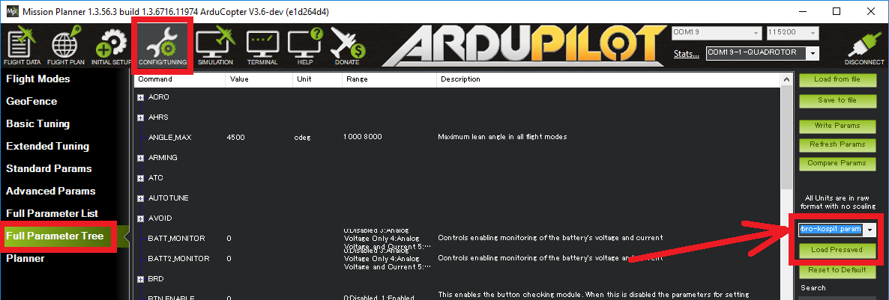

.. _common-holybro-kakutef4:

=================
Holybro Kakute F4
=================

*above image and some content courtesy of* `Holybro <http://www.holybro.com/product/47>`__

.. note::

   Support for the Kakute F4 will be released with Copter-3.6.

Specifications
==============

-  **Processor**

   -  STM32F405RGT6 32-bit processor 

-  **Sensors**

   -  InvenSense ICM20689 IMU (accel, gyro, compass) on vibration isolating foam
   -  BMP280 barometers

-  **Power**

   -  7V ~ 42V input power directly from battery

-  **Interfaces**

   -  4x PWM outputs
   -  1x RC input PWM/PPM
   -  5x UARTs/serial for GPS and other peripherals
   -  1x I2C port for external compass
   -  micro USB port

Where to Buy
============

- Available from many retailers including `Holybro <https://shop.holybro.com/kakute-f4-all-in-one-v2_p1072.html>`__ and `HobbyKing <https://hobbyking.com/en_us/holybro-kakute-f4-a10-v2-flight-controller-with-osd-and-bmp280-barometer.html>`__
- This flight controller is also included in the `Kopis1 drone <https://shop.holybro.com/kopis-1_p1041.html>`__ but note that for the moment, this vehicle will be delivered with a different open source flight code (see instructions below on loading ArduPilot)

Loading ArduPilot onto the board
================================

By default the board does not come pre-loaded with ArduPilot.  Instructions will be added soon describing how flash an ArduPilot compatable "bootloader" (a one time operation) and then how to upload ArduPilot using the Mission Planner or other ground station!

If you are using a Kospi1 you may wish to load the default parameter file found `here <https://github.com/ArduPilot/ardupilot/blob/master/Tools/Frame_params/Holybro-kospi1.param>`__ or if you are using the Mission Planner
it can be conveniently loaded from the Config/Tuning >> Full Parameter Tree screen.  Select "Holybro-kospi1.param" from the drop-down and then push the "Load Presaved" button.

Videos
======

..  youtube:: tg179GXu6LQ
    :width: 100%
