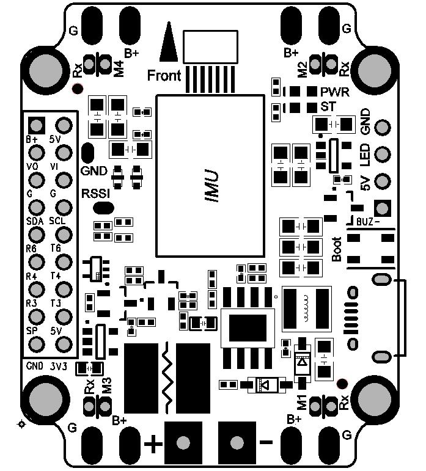

.. _common-holybro-kakutef4:

=================
Holybro Kakute F4
=================

.. image:: ../../../images/holybro-kakutef4.png
    :target: ../_images/holybro-kakutef4.png

*above image and some content courtesy of* `Holybro <http://www.holybro.com/product/47>`__

.. note::

   Support for this board is available with Copter-3.6.0 (and higher)

Specifications
==============

-  **Processor**

   -  STM32F405RGT6 32-bit processor 

-  **Sensors**

   -  InvenSense ICM20689 IMU (accel, gyro) on vibration isolating foam
   -  BMP280 barometers

-  **Power**

   -  7V ~ 42V input power directly from battery

-  **Interfaces**

   -  4x PWM outputs
   -  1x RC input PWM/PPM
   -  5x UARTs/serial for GPS and other peripherals
   -  1x I2C port for external compass
   -  micro USB port

Where to Buy
============

- Available from many retailers including `Holybro <https://shop.holybro.com/kakute-f4-all-in-one-v2_p1072.html>`__ and `HobbyKing <https://hobbyking.com/en_us/holybro-kakute-f4-a10-v2-flight-controller-with-osd-and-bmp280-barometer.html?___store=en_us>`__
- This autopilot is also included in the `Kopis1 drone <https://shop.holybro.com/kopis-1_p1041.html>`__ but note that for the moment, this vehicle will be delivered with a different open source flight code (see instructions below on loading ArduPilot)

Pinout
======

UART Mapping
============

The UARTs are marked Rn and Tn in the above pinouts. The Rn pin is the
receive pin for UARTn. The Tn pin is the transmit pin for UARTn.

The pin labeled Rx on each corner of the board is a common pin for
ESC telemetry input.

 - SERIAL0 -> USB
 - SERIAL1 -> UART6 (Telem1)
 - SERIAL2 -> UART1 (FrSky S.Port)
 - SERIAL3 -> UART4 (GPS)
 - SERIAL4 -> UART5 (ESC Telemetry, RX only)
 - SERIAL5 -> UART3 (spare, TX only)

RC Input
========
 
RC input is configured on the R6 (UART3_RX) pin. It supports all RC protocols.
 
FrSky Telemetry
===============

FrSky Telemetry is supported using the SmartPort pad (UART1). You need
to set the following parameters to enable support for FrSky S.PORT. It
has built-in inverters and a diode to allow for operation from a single
pin with no special adapters.

  - :ref:`SERIAL2_PROTOCOL<SERIAL2_PROTOCOL>` 4 or 10
  - :ref:`SERIAL2_OPTIONS<SERIAL2_OPTIONS>` 0

OSD Support
===========

The KakuteF4 supports OSD using :ref:`OSD_TYPE<OSD_TYPE>` 1 (MAX7456 driver).

PWM Output
==========

The KakuteF4 supports up to 4 PWM outputs. The pads for motor output
M1 to M4 on the above diagram are for the 4 outputs. All 4 outputs
support DShot as well as all PWM types. The M5 and M6 outputs are not
currently available with ArduPilot.

The PWM is in 2 groups:

 - PWM 1 and 4 in group 1
 - PWM 2 and 3 in group 2

Channels within the same group need to use the same output rate, whether PWM or Dshot. If
any channel in a group uses DShot then all channels in the group need
to use DShot.

Battery Monitoring
==================

The board has a built-in voltage and current sensor. The voltage
sensor can handle up to 6S LiPo batteries.

The correct battery setting parameters are:

 - :ref:`BATT_MONITOR<BATT_MONITOR>` 4
 - :ref:`BATT_VOLT_PIN<BATT_VOLT_PIN>` 13
 - :ref:`BATT_CURR_PIN<BATT_CURR_PIN>` 12
 - :ref:`BATT_VOLT_MULT<BATT_VOLT_MULT>` 10.1
 - :ref:`BATT_AMP_PERVLT<BATT_AMP_PERVLT>` 17.0

Compass
=======

The KakuteF4 AIO does not have a built-in compass, but you can attach an external compass using I2C on the SDA and SCL pads.

Logging
=======

The KakuteF4 supports on-board data flash logging.

Loading ArduPilot onto the board
================================

Initial firmware load can be done with DFU by plugging in USB with the
bootloader button pressed. Then you should load the "with_bl.hex"
firmware, using your favourite DFU loading tool.

Once the initial firmware is loaded you can update the firmware using
any ArduPilot ground station software. Updates should be done with the xxxxxxxxxx.apj firmware files.

If you are using a Kospi1 you may wish to load the default parameter file found `here <https://github.com/ArduPilot/ardupilot/blob/master/Tools/Frame_params/Holybro-kospi1.param>`__ or if you are using the Mission Planner it can be conveniently loaded from the Config/Tuning >> Full Parameter Tree screen.  Select "Holybro-kospi1.param" from the drop-down and then push the "Load Presaved" button.

.. image:: ../../../images/holybro-kakutef4-load-default-params.png
    :target: ../_images/holybro-kakutef4-load-default-params.png

Videos
======

..  youtube:: tg179GXu6LQ
    :width: 100%
