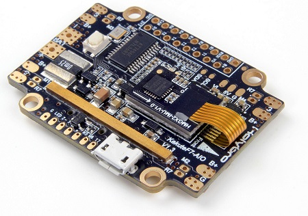

.. _common-holybro-kakutef7aio:

===================================
Holybro Kakute F7 and KAKUTE F7 AIO
===================================

*above image and some content courtesy of* `Holybro <http://www.holybro.com/product/59>`__

.. note::

   Support for these two boards are available with Copter-3.6.0 (and higher)

.. note::

	Due to flash memory limitations, this board does not include all ArduPilot features.
        See :ref:`Firmware Limitations <common-limited_firmware>` for details.

Specifications
==============

-  **Processor**

   -  STM32F745 32-bit processor 

-  **Sensors**

   -  InvenSense ICM20689 IMU (accel and gyro only, no compass) on vibration isolating foam
   -  BMP280 barometers

-  **Power**

   -  7V ~ 42V input power directly from battery
   -  Current Sensor up to 120A maximum continuous current on the All-in-One version

-  **Interfaces**

   -  6x PWM outputs
   -  1x RC input SBUS/PPM
   -  5x UARTs/serial for GPS and other peripherals
   -  1x I2C port for external compass
   -  micro USB port
   -  All UARTS support hardware inversion. SBUS, SmartPort, and other inverted protocols work on any UART without "uninvert hack"
   -  microSD Card Slot for logging
   -  AT7456E OSD
   -  2A 5v regulator
   
Pinout
======

The KakuteF7 comes in two varients with the primary difference being the AIO (All-In-One) board employs current sensor and provides power distribution in each of the four corners.
Both variants include a 5-volt regulator rated for 2 amps, OSD, vibration-isolated IMU, etc.

**Kakute F7 AIO**

**Kakute F7**

    

UART Mapping
============

The UARTs are marked Rn and Tn in the above pinouts. The Rn pin is the
receive pin for UARTn. The Tn pin is the transmit pin for UARTn.

   -  SERIAL0 -> USB
   -  SERIAL1 -> UART1 (Telem1)
   -  SERIAL2 -> UART2 (Telem2)
   -  SERIAL3 -> UART3 (GPS)
   -  SERIAL4 -> UART4
   -  SERIAL5 -> UART7
   -  SERIAL6 -> UART6 (TX only unless :ref:`BRD_ALT_CONFIG<BRD_ALT_CONFIG>` = 1, then RX available also)

The SERIAL5 port (UART7) is normally for ESC telemetry, and has an R7 pad on
each of the four corners of the KakuteF7 AIO board.

Servo Output Mapping
====================

The PWM outputs are marked M1-M6 in the above pinouts. The corresponding servo outputs are:

    - M1 -> Servo Output 4
    - M2 -> Servo Output 1
    - M3 -> Servo Output 2
    - M4 -> Servo Output 3
    - M5 -> Servo Output 5
    - M6 -> Servo Output 6

RC Input
========
 
RC input is configured on the R6 (UART6_RX) pin. It supports all RC protocols, however for FPort the receiver should be connected to T6 and SERIAL6 configured as described in :ref:`FPort<common-FPort-receivers>` section.
 
FrSky Telemetry
===============
 
FrSky Telemetry is supported using the T6 pin (UART6 transmit). You need to set the following parameters to enable support for FrSky S.PORT
 
  - :ref:`SERIAL6_PROTOCOL<SERIAL6_PROTOCOL>` 10
  - :ref:`SERIAL6_OPTIONS<SERIAL6_OPTIONS>` 7
  
OSD Support
===========

The KakuteF7 AIO supports OSD using :ref:`OSD_TYPE<OSD_TYPE>` 1 (MAX7456 driver).

PWM Output
==========

The KakuteF7 supports up to 6 PWM outputs. The pads for motor output M1 to M6 on the above diagram are for the 6 outputs. All 6 outputs support DShot as well as all PWM types.

The PWM is in 3 groups:

 - PWM 1, 2 and 3 in group1
 - PWM 4 and 5 in group2
 - PWM 6 in group3

Channels within the same group need to use the same output rate, whether PWM or Dshot. If
any channel in a group uses DShot then all channels in the group need
to use DShot.

Battery Monitoring
==================

The AIO board has a built-in current sensor. The current
sensor can read up to 130 Amps. The voltage sensor can handle up to 6S
LiPo batteries.

The correct battery setting parameters are:

 - :ref:`BATT_MONITOR<BATT_MONITOR>` 4
 - :ref:`BATT_VOLT_PIN<BATT_VOLT_PIN>` 13
 - :ref:`BATT_CURR_PIN<BATT_CURR_PIN>` 12
 - :ref:`BATT_VOLT_MULT<BATT_VOLT_MULT>` 10.1
 - :ref:`BATT_AMP_PERVLT<BATT_AMP_PERVLT>` 17.0

Compass
=======

The Kakute F7 and Kakute F7 AIO do not have a built-in compass, however you can attach an external compass using I2C on the SDA and SCL pads.

Loading Firmware
================

Initial firmware load can be done with DFU by plugging in USB with the
bootloader button pressed. Then you should load the "with_bl.hex"
firmware, using your favourite DFU loading tool.

Once the initial firmware is loaded you can update the firmware using
any ArduPilot ground station software. Updates should be done with the
\*.apj firmware files.

Where to Buy
============

- Available from many retailers including `Holybro Kakute F7 AIO <https://shop.holybro.com/kakute-f7-aio_p1105.html>`__ and `Holybro Kakute F7 <https://shop.holybro.com/kakute-f7_p1104.html>`__

