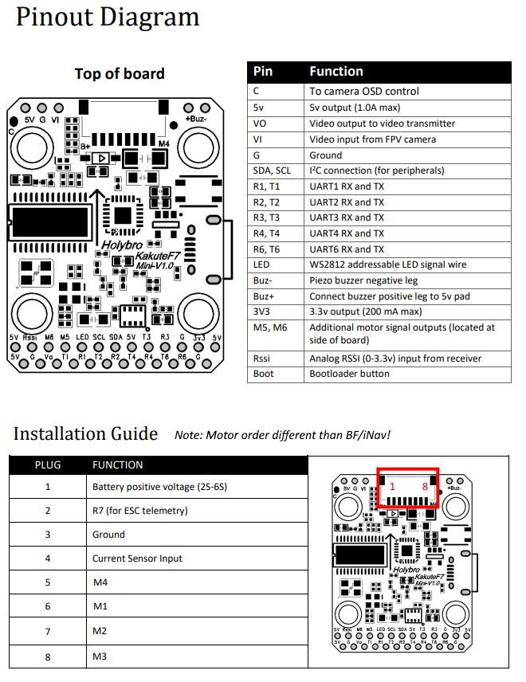

.. _common-holybro-kakutef7mini:

======================
Holybro Kakute F7 Mini
======================

.. image:: ../../../images/holybro-kakutef7mini.jpg
    

*above image and some content courtesy of* `Holybro <http://www.holybro.com>`__

.. note::

   Support for this board is available with ArduPilot-4.0 (and higher). Only the V1 and V2 boards are supported. The V3 board changed microporcessor type and is no longer capable of running ArduPilot.

.. note::

	Due to flash memory limitations, this board does not include all ArduPilot features.
        See :ref:`Firmware Limitations <common-limited_firmware>` for details.

Specifications
==============

-  **Processor**

   -  STM32F745VGH6 32-bit processor 

-  **Sensors**

   -  InvenSense ICM20689 IMU (accel, gyro, compass) on vibration isolating foam
   -  BMP280 barometers

-  **Power**

   -  7V ~ 42V input power directly from battery

-  **Interfaces**

   -  6x PWM outputs
   -  1x RC input 
   -  7x UARTs/serial for GPS and other peripherals
   -  1x I2C port for external compass
   -  micro USB port

Where to Buy
============

- Available from many retailers including `Holybro <https://shop.holybro.com/kakute-f7-mini_p1133.html>`__ and `HobbyKing <banggood.com/20x20mm-Holybro-KAKUTE-F7-Mini-Flight-Controller-with-Barometer-2-6S-for-RC-Drone-FPV-Racing-p-1449223.html>`__

Pinout
======

UART Mapping
============

The UARTs are marked Rn and Tn in the above pinouts. The Rn pin is the receive pin for UARTn. The Tn pin is the transmit pin for UARTn.

- SERIAL0 -> USB
- SERIAL1 -> UART1 (Telem1)
- SERIAL2 -> UART2 (Telem2)
- SERIAL3 -> UART3 (GPS)
- SERIAL4 -> UART4
- SERIAL6 -> UART6 (RC input)
- SERIAL7 -> UART7 (Receive only, ESC Telemetry)

RC Input
========
 
RC input is configured on the R6 (UART6_RX) pin. It supports all RC protocols except PPM. See :ref:`common-rc-systems` for details for a specific RC system. :ref:`SERIAL6_PROTOCOL<SERIAL6_PROTOCOL>` is set to "23", by default, to enable this.

- SBUS/DSM/SRXL connects to the R6 pin but SBUS requires that the :ref:`SERIAL6_OPTIONS<SERIAL6_OPTIONS>` be set to "3".

- FPort requires connection to T6 and :ref:`SERIAL6_OPTIONS<SERIAL6_OPTIONS>` be set to "7".

- CRSF also requires a T6 connection, in addition to R6, and automatically provides telemetry. Set :ref:`SERIAL6_OPTIONS<SERIAL6_OPTIONS>` to "0".

- SRXL2 requires a connection to T6 and automatically provides telemetry.  Set :ref:`SERIAL6_OPTIONS<SERIAL6_OPTIONS>` to "4".

Any UART can be used for RC system connections in ArduPilot also, and is compatible with all protocols except PPM. See :ref:`common-rc-systems` for details.
 

FrSky Telemetry
===============

FrSky Telemetry is supported using the T6 pin (UART6 transmit). You need
to set the following parameters to enable support for FrSky S.PORT. 

  - :ref:`SERIAL6_PROTOCOL<SERIAL6_PROTOCOL>` 4 or 10
  - :ref:`SERIAL6_OPTIONS<SERIAL6_OPTIONS>` 7

.. note:: FrSky Telemetry is supported on all UARTs, UART6 TX is suggested as its RX input is already being used for RC input and avoids consuming another UART.

OSD Support
===========

The KakuteF7 Mini supports OSD using :ref:`OSD_TYPE<OSD_TYPE>` 1 (MAX7456 driver).

PWM Output
==========

TThe KakuteF7 Mini supports up to 6 outputs. M1 to M4 are accessed via the connector and are :ref:`bi-directional<bidir-dshot>` capable. M5 and M6 are the pads shown on the above diagram. M1-4 and M6 outputs support DShot as well as all PWM types.M5 only supports PWM.

The PWM is in 3 groups:

- PWM 1, 4 in group1
- PWM 2 and 3 in group2
- PWM 5 in group3
- PWM 6 in group4

Channels within the same group need to use the same output rate. If any channel in a group uses DShot then all channels in the group need to use DShot.

Battery Monitoring
==================

The board has a built-in voltage sensor. The voltage
sensor can handle up to 6S LiPo batteries. An external current
sensor can be attached to pin 4 on the ESC connector.

The correct battery setting parameters are:

 - :ref:`BATT_MONITOR<BATT_MONITOR>` 4, if external sensor used; 3 for voltage only
 - :ref:`BATT_VOLT_PIN<BATT_VOLT_PIN>` 13
 - :ref:`BATT_CURR_PIN<BATT_CURR_PIN>` 12 , if external sensor used.
 - :ref:`BATT_VOLT_MULT<BATT_VOLT_MULT>` 10.9
 - :ref:`BATT_AMP_PERVLT<BATT_AMP_PERVLT>` should be set to match external current sensor, if used.
 
Compass
=======

The KakuteF7 Mini does not have a built-in compass, but you can attach an external compass using I2C on the SDA and SCL pads.

Logging
=======

The KakuteF7 Mini supports on-board data flash logging.

Loading ArduPilot onto the board
================================

Initial firmware load can be done with DFU by plugging in USB with the
bootloader button pressed. Then you should load the "with_bl.hex"
firmware, using your favourite DFU loading tool.

Once the initial firmware is loaded you can update the firmware using
any ArduPilot ground station software. Updates should be done with the xxxxxxxxxx.apj firmware files.

Firmware
========

Firmware for this board can be found `here <https://firmware.ardupilot.org>`_ in  sub-folders labeled
"KakuteF7Mini".

[copywiki destination="plane,copter,rover,blimp"]
