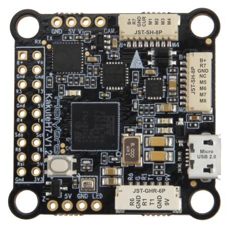
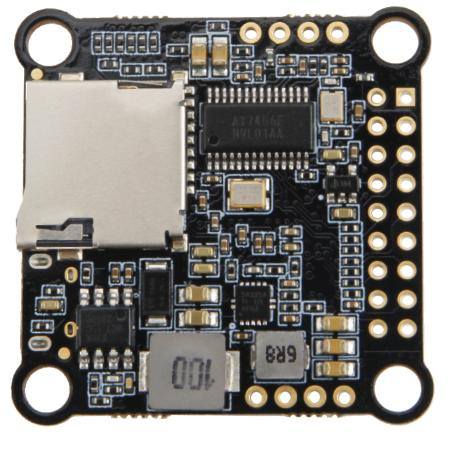
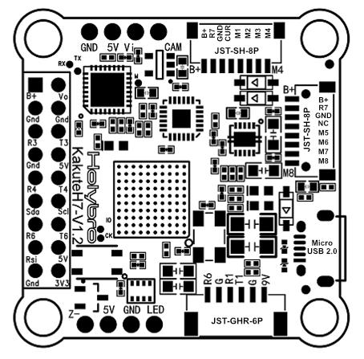

.. _common-holybro-kakuteh7:

====================
Holybro Kakute H7 V1
====================

*above image and some content courtesy of* `Holybro <http://www.holybro.com>`__

Where to Buy
============

- Available from many retailers including `Holybro <https://holybro.com/products/kakute-h7>`__

Specifications
==============

-  **Processor**

   -  STM32H743 32-bit processor 

-  **Sensors**

   -  InvenSense MPU6000 IMU (accel and gyro only, no compass)
   -  BMP280 barometer

-  **Power**

   -  2S  - 6S Lipo input voltage with voltage monitoring
   -  9V, 1.5A BEC for powering Video Transmitter

-  **Interfaces**

   -  9x PWM outputs (9th pwm output is for NeoPixel LED string via the LED pad)
   -  1x RC input
   -  6x UARTs/serial for GPS and other peripherals
   -  1x I2C port for external compass
   -  micro USB port
   -  All UARTS support hardware inversion. SBUS, SmartPort, and other inverted protocols work on any UART without "uninvert hack"
   -  microSD Card Slot for logging
   -  AT7456E OSD
   -  External current monitor input

Pinout
======

UART Mapping
============

The UARTs are marked Rn and Tn in the above pinouts. The Rn pin is the
receive pin for UARTn. The Tn pin is the transmit pin for UARTn.

   -  SERIAL0 -> USB
   -  SERIAL1 -> UART1 (Telem1)
   -  SERIAL2 -> not available externally
   -  SERIAL3 -> UART3 (GPS)
   -  SERIAL4 -> UART4
   -  SERIAL5 -> not available
   -  SERIAL6 -> UART6 (UART6 RX normally RCinput unless :ref:`BRD_ALT_CONFIG<BRD_ALT_CONFIG>` = 1)
   -  SERIAL7 -> UART7 (RX7 only available, normally used for ESC telemetry)

The SERIAL7 port (UART7) is normally for ESC telemetry, and has an R7 pin on
both of the ESC connectors.

Servo Output Mapping
====================

The PWM outputs are marked M1-M8 in the above pinouts. The corresponding servo outputs are:

    - M1 -> Servo Output 4
    - M2 -> Servo Output 1
    - M3 -> Servo Output 2
    - M4 -> Servo Output 3
    - M5 -> Servo Output 5
    - M6 -> Servo Output 6
    - M7 -> Servo Output 7
    - M8 -> Servo Output 8

RC Input
========

The R6 pin, which by default is mapped to a timer input, can be used for all ArduPilot supported receiver protocols, except CRSF/ELRS and SRXL2 which require a true UART connection. However, FPort, when connected in this manner, will only provide RC without telemetry. 

To allow CRSF and embedded telemetry available in Fport, CRSF, and SRXL2 receivers, the R6 pin can also be configured to be used as true UART RX pin for use with bi-directional systems by setting the :ref:`BRD_ALT_CONFIG<BRD_ALT_CONFIG>` to “1” so it becomes the SERIAL6 port's RX input pin.

With this option, :ref:`SERIAL6_PROTOCOL<SERIAL6_PROTOCOL>` must be set to "23", and:

- PPM is not supported.

- SBUS/DSM/SRXL connects to the R6 pin, but SBUS requires that the :ref:`SERIAL6_OPTIONS<SERIAL6_OPTIONS>` be set to "3".

- FPort requires connection to T6 and :ref:`SERIAL6_OPTIONS<SERIAL6_OPTIONS>` be set to "7".

- CRSF also requires a T6 connection, in addition to R6, and automatically provides telemetry. Set :ref:`SERIAL6_OPTIONS<SERIAL6_OPTIONS>` to "0".

- SRXL2 requires a connection to T6 and automatically provides telemetry.  Set :ref:`SERIAL6_OPTIONS<SERIAL6_OPTIONS>` to "4".

Any UART can be used for RC system connections in ArduPilot also, and is compatible with all protocols except PPM. See :ref:`common-rc-systems` for details.

FrSky Telemetry
===============

FrSky Telemetry is supported using the Tx pin of any UART including SERIAL6/UART6 . You need to set the following parameters to enable support for FrSky S.PORT (example shows SERIAL6). Note this assumes the RC input is using default (:ref:`BRD_ALT_CONFIG<BRD_ALT_CONFIG>` = 0). Obviously, if using :ref:`BRD_ALT_CONFIG<BRD_ALT_CONFIG>` = 1 for full duplex RC prtocols, you must a different UART for FrSky Telemetry.
 
  - :ref:`SERIAL6_PROTOCOL<SERIAL6_PROTOCOL>` 10
  - :ref:`SERIAL6_OPTIONS<SERIAL6_OPTIONS>` 7

OSD Support
===========

The KakuteH7  supports OSD using :ref:`OSD_TYPE<OSD_TYPE>` 1 (MAX7456 driver).

PWM Output
==========

The KakuteH7 supports up to 8 PWM outputs. Outputs are available via two JST-SH connectors. All 8 outputs support DShot as well as all PWM types.

The PWM is in 3 groups:

 - PWM 1, 2 in group1
 - PWM 3, 4 in group2
 - PWM 5, 6 in group3
 - PWM 7, 8 in group4

Channels within the same group need to use the same output rate, whether PWM or Dshot. If
any channel in a group uses DShot then all channels in the group need
to use DShot.

LED Output
==========

The LED output is configured by default to support :ref:`NeoPixel LED strings<common-serial-led-neopixel>`.

Battery Monitoring
==================

The board has a built-in voltage sensor via the B+ pin, but no internal current sensor. An external current sensor can be connected to the CUR pin. Default parameters for both internal voltage and external current monitoring are set by default to the below for use with any Holybro Tekko32 F4 4in1 ESC.

The correct battery setting parameters are:

 - :ref:`BATT_MONITOR<BATT_MONITOR>` 4
 - :ref:`BATT_VOLT_PIN<BATT_VOLT_PIN>` 10
 - :ref:`BATT_CURR_PIN<BATT_CURR_PIN>` 11
 - :ref:`BATT_VOLT_MULT<BATT_VOLT_MULT>` 11
 - :ref:`BATT_AMP_PERVLT<BATT_AMP_PERVLT>` 59.5

Compass
=======

The KakuteH7 does not have a built-in compass, however you can attach an external compass using I2C on the SDA and SCL pads.

Firmware
========

Firmware for this board can be found `here <https://firmware.ardupilot.org>`_ in  sub-folders labeled "KakuteH7".

Loading Firmware
================

Initial firmware load can be done with DFU by plugging in USB with the
bootloader button pressed. Then you should load the "with_bl.hex"
firmware, using your favourite DFU loading tool.

Once the initial firmware is loaded you can update the firmware using
any ArduPilot ground station software. Later updates should be done with the
\*.apj firmware files.

[copywiki destination="plane,copter,rover,blimp"]
