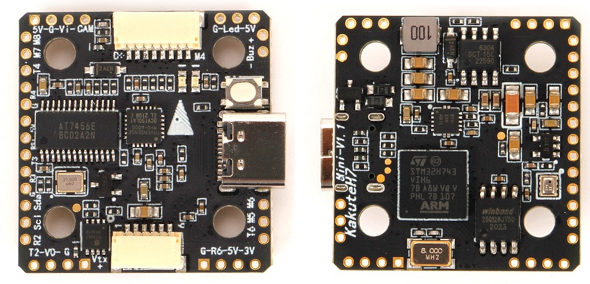
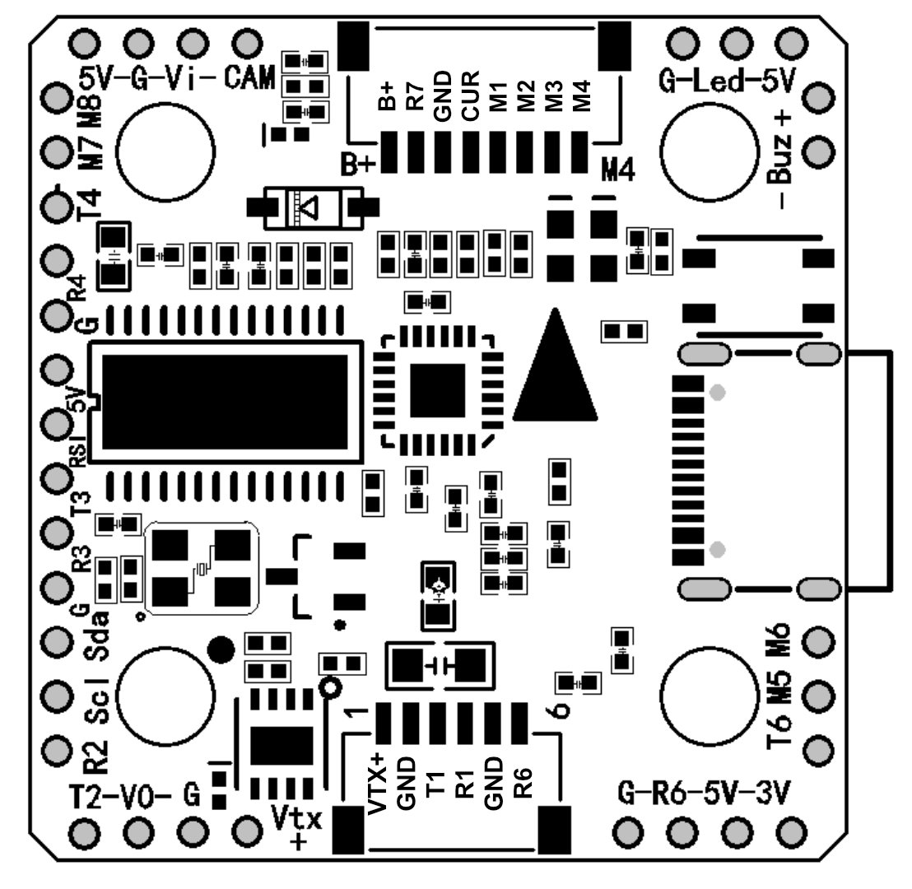

.. _common-holybro-kakuteh7mini:

===========================
Holybro Kakute H7 Mini V1.3
===========================

    

*above image and some content courtesy of* `Holybro <http://www.holybro.com>`__

Specifications
==============

-  **Processor**

   -  STM32H743 32-bit processor
   -  AT7456E Video processor for OSD
   -  16MB data flash for logging

-  **Sensors**

   -  MPU6000 (accel & gyro)
   -  BMP280 barometer

-  **Power**

   -  7V ~ 26V input power directly from battery
   -  5V 2A supply for peripherals

-  **Interfaces**

   -  9x PWM outputs (8 servo/motor + WS2812 LED)
   -  6x UARTs/serial for GPS and other peripherals
   -  1x I2C port for external compass
   -  Battery Voltage and Current Sensor inputs
   -  USB-C port
   -  Switchable VTX power
   -  Analog RSSI input (pin 8)
   -  Buzzer output

Where to Buy
============

- Available from many retailers including `Holybro <https://shop.holybro.com/kakute-h7-mini_p1308.html>`__

Pinout
======

UART Mapping
============

The UARTs are marked Rn and Tn in the above pinouts. The Rn pin is the receive pin for UARTn. The Tn pin is the transmit pin for UARTn.

- SERIAL0 -> USB
- SERIAL1 -> UART1 (Telem1)
- SERIAL2 -> UART2 (Telem2) No DMA
- SERIAL3 -> UART3 (GPS)
- SERIAL4 -> UART4
- SERIAL6 -> UART6 (used for RC input and RC telemetry, PPM is not supported)
- SERIAL7 -> UART7 (Receive only, ESC Telemetry) No DMA

RC Input
========
 
RC input is configured on the R6 (UART6_RX) pin. It supports all RC protocols except PPM. See :ref:`common-rc-systems` for details for a specific RC system. :ref:`SERIAL6_PROTOCOL<SERIAL6_PROTOCOL>` is set to "23", by default, to enable this.

- SBUS/DSM/SRXL connects to the R6 pin but SBUS requires that the :ref:`SERIAL6_OPTIONS<SERIAL6_OPTIONS>` be set to "3".

- FPort requires connection to T6 and :ref:`SERIAL6_OPTIONS<SERIAL6_OPTIONS>` be set to "7".

- CRSF also requires a T6 connection, in addition to R6, and automatically provides telemetry. Set :ref:`SERIAL6_OPTIONS<SERIAL6_OPTIONS>` to "0".

- SRXL2 requires a connection to T6 and automatically provides telemetry.  Set :ref:`SERIAL6_OPTIONS<SERIAL6_OPTIONS>` to "4".

Any UART can be used for RC system connections in ArduPilot also, and is compatible with all protocols except PPM. See :ref:`common-rc-systems` for details.

OSD Support
===========

The KakuteH7 Mini supports OSD using :ref:`OSD_TYPE<OSD_TYPE>` 1 (MAX7456 driver).

PWM Output
==========

The KakuteH7 Mini supports up to 9 outputs. M1 to M4 are accessed via the connector and are :ref:`bi-directional<bidir-dshot>` capable. M5-M8 and LED are the pads shown on the above diagram. M1-M8 and LED outputs support DShot as well as all PWM types.
The PWM is in 5 groups:

- PWM 1,4 in group1
- PWM 2,3 in group2
- PWM 5,6 in group3
- PWM 7,8 in group4
- PWM 9 in group5 (NeoPixel LED by default)

Channels within the same group need to use the same output rate. If any channel in a group uses DShot then all channels in the group need to use DShot.

Battery Monitoring
==================

The board has a built-in voltage sensor. The voltage
sensor can handle up to 6S LiPo batteries. An external current
sensor can be attached to pin 4 on the ESC connector.

The correct battery setting parameters are:

 - :ref:`BATT_MONITOR<BATT_MONITOR>` 4, if external sensor used; 3 for voltage only
 - :ref:`BATT_VOLT_PIN<BATT_VOLT_PIN>` 10
 - :ref:`BATT_CURR_PIN<BATT_CURR_PIN>` 11 , if external sensor used.
 - :ref:`BATT_VOLT_MULT<BATT_VOLT_MULT>` 11.1
 - :ref:`BATT_AMP_PERVLT<BATT_AMP_PERVLT>` should be set to match external current sensor, if used. For example, if the Holybro Teeko32 4in1 ESC is used, this value would be 59.5
 
 .. note:: these values are already set by default, but can be changed to trim the voltage and/or current as needed, or to suit other ESCs.
 
Compass
=======

The KakuteH7 Mini does not have a built-in compass, but you can attach an external compass using I2C on the SDA and SCL pads.

Logging
=======

The KakuteH7 Mini supports on-board data flash logging.

Loading ArduPilot onto the board
================================

Initial firmware load can be done with DFU by plugging in USB with the
bootloader button pressed. See :ref:`common-loading-firmware-onto-chibios-only-boards`

Firmware
========

Firmware for this board can be found `here <https://firmware.ardupilot.org>`_ in  sub-folders labeled
"KakuteH7Mini".

[copywiki destination="plane,copter,rover,blimp"]
