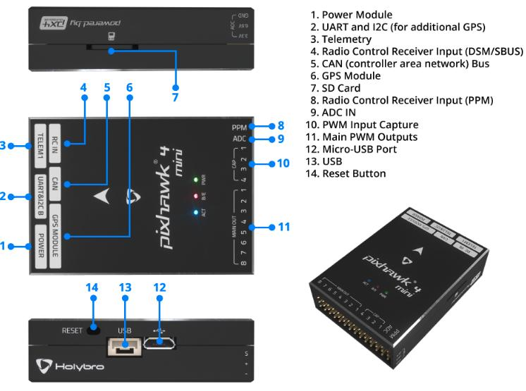

.. _common-holybro-ph4mini:

===============================
Pixhawk4-Mini Flight Controller
===============================

The Pixhawk4-Mini autopilot is sold by `Holybro <https://shop.holybro.com/pixhawk4-mini_p1120.html>`__

Features
========

 - STM32F765 microcontroller
 - Two IMUs: ICM20689 and BMI055
 - MS5611 SPI barometer
 - builtin I2C IST8310 magnetometer
 - microSD card slot
 - 5 UARTs plus USB
 - 11 PWM outputs
 - Two I2C and one CAN ports
 - External Buzzer
 - External safety Switch
 - Dedicated power input port for external power modules

Pinout
======

UART Mapping
============

 - SERIAL0 -> USB
 - SERIAL1 -> USART2 (Telem1)
 - SERIAL2 -> UART4 (Telem2)
 - SERIAL3 -> UART1 (GPS)
 - SERIAL4 -> UART6 (RCIN port)
 - SERIAL5 -> UART7 (debug)

The SERIAL1 port has RTS/CTS pins, the other UARTs do not have RTS/CTS.

The RCIN port can be used as RX or TX as a general UART using the
SERIAL4_OPTIONS bits to swap pins. It is not used for RC input (the
PPM pin is used for RC input)

The UART7 connector is inside the case and labelled as debug, but is
available as a general purpose UART with ArduPilot.

RC Input
========
The PPM pin, which by default is mapped to a timer input, can be used for all ArduPilot supported receiver protocols, except CRSF/ELRS and SRXL2 which require a true UART connection. However, FPort, when connected in this manner, will only provide RC without telemetry. 

To allow CRSF and embedded telemetry available in Fport, CRSF, and SRXL2 receivers, the RCIN port's RCIN pin can also be configured to be used as true UART RX or TX pin for use with bi-directional systems by setting the SERIAL4 parameters appropriately.

To use RCIN for bi-directional RC and Telemetry protocols, :ref:`SERIAL4_PROTOCOL<SERIAL4_PROTOCOL>` must be set to "23", and:

- PPM is not supported.

- SBUS/DSM/SRXL connects to the RCIN pin, but SBUS requires that the :ref:`SERIAL4_OPTIONS<SERIAL4_OPTIONS>` be set to "3" to invert the signal.

- FPort requires connection to RCIN and :ref:`SERIAL4_OPTIONS<SERIAL4_OPTIONS>` be set to "15".

- CRSF requires connection to both RX and TX of a UART, so the RCIN port and pin cannot be used. Instead either SERIAL1 (UART2), SERIAL2 (UART4), or SERIAL3 (UART1 must be used. Set its protocol to "23" and options to "0".

- SRXL2 requires a connection to RCIN and automatically provides telemetry.  Set :ref:`SERIAL4_OPTIONS<SERIAL4_OPTIONS>` to "4".

Any UART can be used for RC system connections in ArduPilot also, and is compatible with all protocols except PPM. See :ref:`common-rc-systems` for details.

PWM Output
==========

The Pixhawk4-Mini supports up to 11 PWM outputs. All 11 outputs
support all normal PWM output formats. All outputs except numbers 7
and 8 support DShot.

The first 8 outputs are labelled "MAIN OUT" on the case. The next 3
outputs are labelled CAP1 to CAP3 on the case. The CAP4 pin cannot be
used as a PWM output.

The 11 PWM outputs are in 4 groups:

 - PWM 1, 2, 3 and 4 in group1
 - PWM 5 and 6 in group2
 - PWM 7 and 8 in group3
 - PWM 9, 10 and 11 in group4

Channels within the same group need to use the same output rate. If
any channel in a group uses DShot then all channels in the group need
to use DShot.

Battery Monitoring
==================

The board has a dedicated power monitor port with a 6 pin
connector. The correct battery setting parameters are dependent on
the type of power module which is connected.

Compass
=======

The Pixhawk4-Mini has a builtin IST8310 compass. Due to potential
interference the board is usually used with an external I2C compass as
part of a GPS/Compass combination.

GPIOs
=====

The 11 PWM ports plus the CAP4 ports can be used as GPIOs (relays,
buttons, RPM etc). To use them you need to limit the number of these
pins that is used for PWM by setting the BRD_PWM_COUNT to a number
less than 11. See :ref:`common-gpios` page for more information.

For example if you set BRD_PWM_COUNT to 8 then CAP1,
CAP2 and CAP3 will be available for use as GPIOs, in addition to CAP4.

The numbering of the GPIOs for PIN variables in ArduPilot is:

 - PWM1 50
 - PWM2 51
 - PWM3 52
 - PWM4 53
 - PWM5 54
 - PWM6 55
 - PWM7 56
 - PWM8 57

In addition the 4 pins on the servo rail marked CAP1 to CAP4 can be
used as GPIOs. These are available as GPIOs in ArduPilot using the
following GPIO numbers:

 - CAP1 58
 - CAP2 59
 - CAP3 60
 - CAP4 61

Analog inputs
=============

The Pixhawk4-Mini has 4 analog inputs

 - ADC Pin0 -> Battery Voltage
 - ADC Pin1 -> Battery Current Sensor
 - ADC Pin10 -> ADC 5V Sense
 - ADC Pin11 -> ADC 3.3V Sense

Connectors
==========

Unless noted otherwise all connectors are JST GH

TELEM port
----------
.. raw:: html

   <table border="1" class="docutils">
   <tbody>
   <tr>
   <th>Pin </th>
   <th>Signal </th>
   <th>Volt </th>
   </tr>
   <tr>
   <td>1 (red)</td>
   <td>VCC</td>
   <td>+5V</td>
   </tr>
   <tr>
   <td>2 (blk)</td>
   <td>TX (OUT)</td>
   <td>+3.3V</td>
   </tr>
   <tr>
   <td>3 (blk)</td>
   <td>RX (IN)</td>
   <td>+3.3V</td>
   </tr>
   <tr>
   <td>4 (blk)</td>
   <td>CTS</td>
   <td>+3.3V</td>
   </tr>
   <tr>
   <td>5 (blk)</td>
   <td>RTS</td>
   <td>+3.3V</td>
   </tr>
   <tr>
   <td>6 (blk)</td>
   <td>GND</td>
   <td>GND</td>
   </tr>
   </tbody>
   </table>

GPS port
--------
.. raw:: html

   <table border="1" class="docutils">
   <tbody>
   <tr>
   <th>Pin </th>
   <th>Signal </th>
   <th>Volt </th>
   </tr>
   <tr>
   <td>1 (red)</td>
   <td>VCC</td>
   <td>+5V</td>
   </tr>
   <tr>
   <td>2 (blk)</td>
   <td>SERIAL3 TX (OUT)</td>
   <td>+3.3V</td>
   </tr>
   <tr>
   <td>3 (blk)</td>
   <td>SERIAL3 RX (IN)</td>
   <td>+3.3V</td>
   </tr>
   <tr>
   <td>4 (blk)</td>
   <td>SCL</td>
   <td>+3.3 (pullups)</td>
   </tr>
   <tr>
   <td>5 (blk)</td>
   <td>SDA</td>
   <td>+3.3 (pullups)</td>
   </tr>
   <tr>
   <td>6 (blk)</td>
   <td>SafetyButton</td>
   <td>+3.3V</td>
   </tr>
   <tr>
   <td>7 (blk)</td>
   <td>SafetyLED</td>
   <td>+3.3V</td>
   </tr>
   <tr>
   <td>8 (blk)</td>
   <td>VDD 3.3 (OUT)</td>
   <td>+3.3V</td>
   </tr>
   <tr>
   <td>9 (blk)</td>
   <td>Buzzer</td>
   <td>+3.3V</td>
   </tr>
   <tr>
   <td>10 (blk)</td>
   <td>GND</td>
   <td>GND</td>
   </tr>
   </tbody>
   </table>

TELEM2 & I2CB port
------------------
.. raw:: html

   <table border="1" class="docutils">
   <tbody>
   <tr>
   <th>Pin</th>
   <th>Signal</th>
   <th>Volt</th>
   </tr>
   <tr>
   <td>1 (red)</td>
   <td>VCC</td>
   <td>+5V</td>
   </tr>
   <tr>
   <td>2 (blk)</td>
   <td>TX (OUT)</td>
   <td>+3.3V</td>
   </tr>
   <tr>
   <td>3 (blk)</td>
   <td>RX (IN)</td>
   <td>+3.3V</td>
   </tr>
   <tr>
   <td>4 (blk)</td>
   <td>SCL I2C2</td>
   <td>+3.3V</td>
   </tr>
   <tr>
   <td>5 (blk)</td>
   <td>SDA I2C2</td>
   <td>+3.3V</td>
   </tr>
   <tr>
   <td>6 (blk)</td>
   <td>GND</td>
   <td>GND</td>
   </tr>
   </tbody>
   </table>

POWER1
--------
.. raw:: html

   <table border="1" class="docutils">
   <tbody>
   <tr>
   <th>Pin</th>
   <th>Signal</th>
   <th>Volt</th>
   </tr>
   <tr>
   <td>1 (red)</td>
   <td>VCC</td>
   <td>+5V</td>
   </tr>
   <tr>
   <td>2 (red)</td>
   <td>VCC</td>
   <td>+5V</td>
   </tr>
   <tr>
   <td>3 (blk)</td>
   <td>CURRENT</td>
   <td>up to +3.3V</td>
   </tr>
   <tr>
   <td>4 (blk)</td>
   <td>VOLTAGE</td>
   <td>up to +3.3V</td>
   </tr>
   <td>5 (blk)</td>
   <td>GND</td>
   <td>GND</td>
   </tr>
   <td>6 (blk)</td>
   <td>GND</td>
   <td>GND</td>
   </tr>
   </tbody>
   </table>

RCIN port
---------
.. raw:: html

   <table border="1" class="docutils">
   <tbody>
   <tr>
   <th>Pin </th>
   <th>Signal </th>
   <th>Volt </th>
   </tr>
   <tr>
   <td>1 (red)</td>
   <td>VCC</td>
   <td>+5V</td>
   </tr>
   <tr>
   <td>2 (blk)</td>
   <td>RCIN (IN)</td>
   <td>+3.3V</td>
   </tr>
   <tr>
   <td>3 (blk)</td>
   <td>RSSI (IN)</td>
   <td>+3.3V</td>
   </tr>
   <tr>
   <td>4 (blk)</td>
   <td>VDD3.3</td>
   <td>+3.3V</td>
   </tr>
   <tr>
   <td>5 (blk)</td>
   <td>GND</td>
   <td>GND</td>
   </tr>
   </tbody>
   </table>

Debug
-----
The Pixhawk4 supports SWD debugging on the debug port

.. raw:: html

   <table border="1" class="docutils">
   <tbody>
   <tr>
   <th>Pin </th>
   <th>Signal </th>
   <th>Volt </th>
   </tr>
   <tr>
   <td>1 (red)</td>
   <td>FMU VDD 3.3</td>
   <td>+3.3V</td>
   </tr>
   <tr>
   <td>2 (blk)</td>
   <td>UART TX Debug (OUT)</td>
   <td>+3.3V</td>
   </tr>
   <tr>
   <td>3 (blk)</td>
   <td>UART RX Debug (IN)</td>
   <td>+3.3V</td>
   </tr>
   <tr>
   <td>4 (blk)</td>
   <td>SWDIO</td>
   <td>+3.3V</td>
   </tr>
   <tr>
   <td>5 (blk)</td>
   <td>SWCLK</td>
   <td>+3.3V</td>
   </tr>
   <tr>
   <td>6 (blk)</td>
   <td>GND</td>
   <td>GND</td>
   </tr>
   </tbody>
   </table>

Loading Firmware
================

The board comes pre-installed with an ArduPilot compatible bootloader,
allowing the loading of xxxxxx.apj firmware files with any ArduPilot
compatible ground station.

Firmware for this board can be found `here <https://firmware.ardupilot.org>`_ in  sub-folders labeled
"PH4-mini".

Acknowledgements
================

Thanks to
[PX4](https://docs.px4.io/en/flight_controller/pixhawk4_mini.html) for
images used under the [CC-BY 4.0 license](https://creativecommons.org/licenses/by/4.0/)

[copywiki destination="plane,copter,rover,blimp"]
