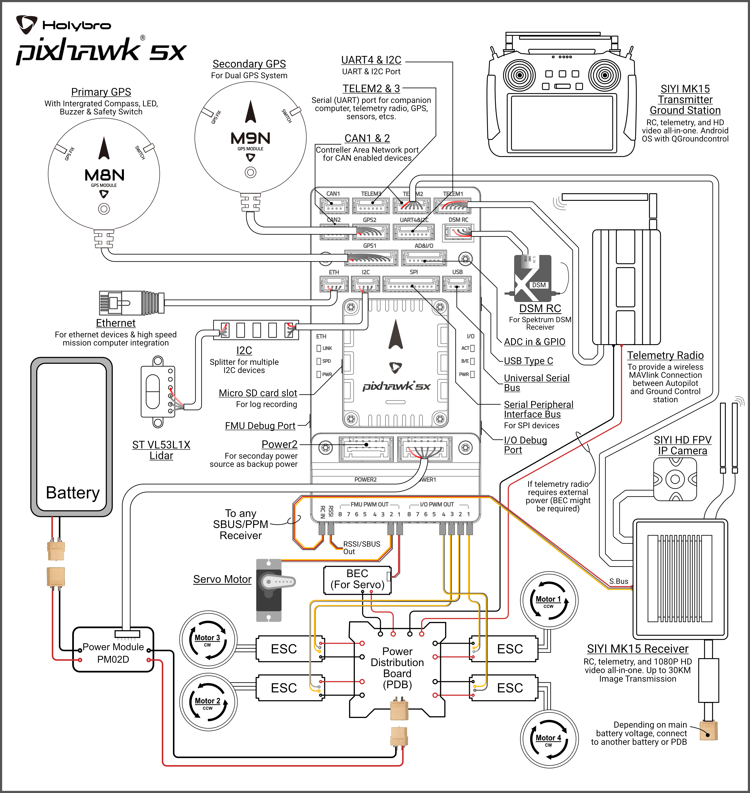
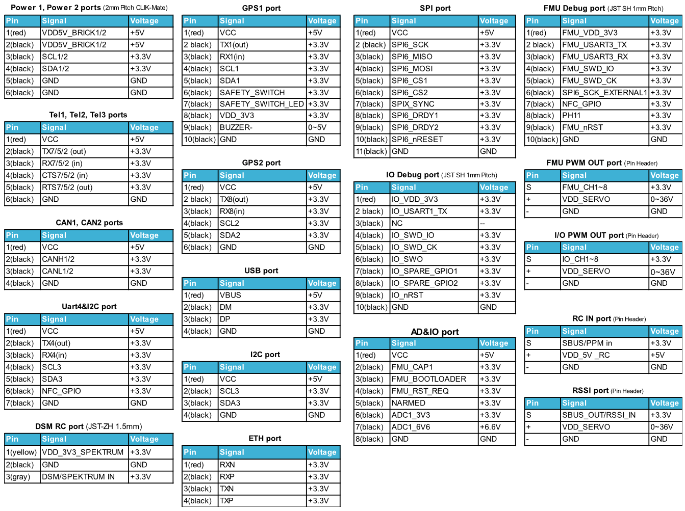

.. _common-holybro-ph5x:

============================
Pixhawk 5X Flight Controller
============================

Pixhawk 5X® is the latest update to the successful family of Pixhawk® autopilots made by Holybro, featuring vibration isolation of IMUs, triple redundant IMUs, double redundant barometers on separate buses, IMU heating, and integrated Ethernet for high speed connections to companion computers.

.. image:: ../../../images/holybro-pixhawk5x/pixhawk5x_exploded_diagram.jpg
    :target: ../_images/pixhawk5x_exploded_diagram.jpg
    :width: 450px

Where To Buy
============

The Pixhawk5X autopilot is sold by `Holybro <https://shop.holybro.com/pixhawk-5x_p1279.html>`__

Features
========

- **Processors**
    - STM32F765: 32 Bit Arm® Cortex®-M7, 216MHz, 2MB memory, 512KB RAM
    - IO Processor: STM32F100: 32 Bit Arm® Cortex®-M3, 24MHz, 8KB SRAM
- **On-board Sensors**
    - Accel/Gyro: ICM-20649
    - Accel/Gyro: ICM-42688P
    - Accel/Gyro: ICM-20602
    - Magnetometer: BMM150
    - Barometer: 2x BMP388
- **Interfaces**
    - 16- PWM servo outputs
    - R/C input for Spektrum / DSM
    - Dedicated R/C input for PPM and S.Bus input
    - Dedicated analog / PWM RSSI input and S.Bus output
    - 4 general purpose serial ports
        - 3 with full flow control
        - 1 with separate 1.5A current limit
        - 1 with I2C and additional GPIO line for external NFC reader
    - 2 GPS ports
        - 1 full GPS & Safety Switch Port
        - 1 basic GPS port
    - 1 I2C port
    - 1 Ethernet port,100Mbps
    - 1 SPI bus
        - 2 chip select lines
        - 2 data-ready lines
        - 1 SPI SYNC line
        - 1 SPI reset line
    - 2 CAN Buses for CAN peripheral
        - CAN Bus has individual silent controls or ESC RX-MUX control
    - 2 Power input ports with SMBus
    - 1 AD & IO port
        - 2 additional analog input, one 3.3V and one 6.6V max input
        - 1 PWM/Capture input
        - 2 Dedicated debug and GPIO lines
- **Voltage Ratings**
    - Max input voltage: 6V
    - USB Power Input: 4.75~5.25V
    - Servo Rail Input: 0~36V
- **Dimensions**
    - Flight Controller Module: 38.8 x 31.8 x 14.6mm
    - Standard Baseboard: 52.4 x 103.4 x 16.7mm
- **Weight**
    - Flight Controller Module: 23g
    - Standard Baseboard: 51g
- **Other Characteristics**
        Operating & storage temperature: -40 ~ 85°c

Typical Wiring Diagram
======================

.. note:: duplicated RC control and telemetry solutions are shown. Duplicate systems are not usually used.

UART Mapping
============

 - SERIAL0 -> USB 
 - SERIAL1 -> UART7 (Telem1) RTS/CTS pins (DMA enabled)
 - SERIAL2 -> UART5 (Telem2) RTS/CTS pins (DMA enabled)
 - SERIAL3 -> USART1 (GPS1)
 - SERIAL4 -> UART8 (GPS2)
 - SERIAL5 -> UART2 (Telem3) RTS/CTS pins (DMA enabled)
 - SERIAL6 -> UART4 (USER)
 - SERIAL7 -> USART3 (Debug)
 - SERIAL9 -> USB (SLCAN)

RC Input
========
The RCIN pin, which by default is mapped to a timer input, can be used for all ArduPilot supported receiver protocols, except CRSF/ELRS and SRXL2 which require a true UART connection. However, FPort, when connected in this manner, will only provide RC without telemetry. 

To allow CRSF and embedded telemetry available in Fport, CRSF, and SRXL2 receivers, a full UART, such as SERIAL5 (UART2) would need to be used for receiver connections. Below are setups using UART2. :ref:`SERIAL5_PROTOCOL<SERIAL5_PROTOCOL>` should be set to "23".

- FPort would require :ref:`SERIAL5_OPTIONS<SERIAL5_OPTIONS>` be set to "15".

- CRSF would require :ref:`SERIAL5_OPTIONS<SERIAL5_OPTIONS>` be set to "0".

- SRXL2 would require :ref:`SERIAL5_OPTIONS<SERIAL5_OPTIONS>` be set to "4" and connects only the UART2 TX pin.

Any UART can be used for RC system connections in ArduPilot also, and is compatible with all protocols except PPM. See :ref:`common-rc-systems` for details.

PWM Output
==========

The Pixhawk5x supports up to 16 PWM outputs. All 16 outputs
support all normal PWM output formats. All FMU outputs except 7 and 8 ,also support DShot.

The 8 FMU PWM outputs are in 4 groups:

 - PWM 1, 2, 3 and 4 in group1
 - PWM 5 and 6 in group2
 - PWM 7 and 8 in group3

FMU outputs within the same group need to use the same output rate and protocol. If
any output in a group uses DShot then all channels in that group need
to use DShot.

Battery Monitoring
==================

The board has 2 dedicated power monitor ports with a 6 pin
connector. They are intended for use with the I2C power monitor supplied with the autopilot.

.. note:: do not try to use the Mission Planner SETUP->Optional Hardware->Battery Monitor tab to setup the power monitors. The parameters needed for their operation are already setup by default:

- :ref:`BATT_MONITOR<BATT_MONITOR>` = 21
- :ref:`BATT_I2C_BUS<BATT_I2C_BUS__AP_BattMonitor_INA2xx>` = 1
- :ref:`BATT_I2C_ADDR<BATT_I2C_ADDR__AP_BattMonitor_INA2xx>` = 65

Compass
=======

The Pixhawk5x has a built-in BMM150 compass. Due to potential
interference the autopilot is usually used with an external I2C compass as
part of a GPS/Compass combination.

GPIOs
=====

The 8 FMU PWM outputs can be used as GPIOs (relays, buttons, RPM etc). To use them you need to set the output's ``SERVOx_FUNCTION`` to -1. See :ref:`common-gpios` page for more information.

The numbering of the GPIOs for PIN variables in ArduPilot is:

 - PWM1 50
 - PWM2 51
 - PWM3 52
 - PWM4 53
 - PWM5 54
 - PWM6 55
 - PWM7 56
 - PWM8 57
 - FMU_CAP1 58
 - FMU_CAP2 59
 - NFC_GPIO 60

Analog inputs
=============

The Pixhawk5X has 3 analog inputs, one 6V tolerant and two 3.3V tolerant

 - ADC Pin10 -> ADC 6.6V Sense
 - ADC Pin13 -> ADC 3.3V Sense
 - Analog 3.3V RSSI input pin = 103

Connectors
==========

Unless noted otherwise all connectors are JST GH

Loading Firmware
================

The board comes pre-installed with an ArduPilot compatible bootloader,
allowing the loading of xxxxxx.apj firmware files with any ArduPilot
compatible ground station.

Firmware for this board can be found `here <https://firmware.ardupilot.org>`_ in  sub-folders labeled "Pixhawk5X".

Layout and Dimensions
=====================

.. image:: ../../../images/holybro-pixhawk5x/pixhawk5x_dimensions_all.jpg
    :target: ../_images/pixhawk5x_dimensions_all.jpg

[copywiki destination="plane,copter,rover,blimp"]