.. _common-holybro-pix32v5:

.. role:: raw-html(raw)
   :format: html

=================
Pix32 v5
=================

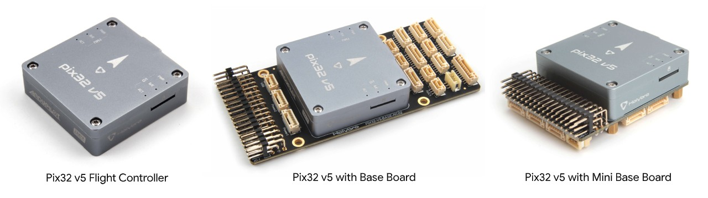

System Features
===============

HolyBro Pix32 v5 is a new flight controller developed on the base of FMUv5
scheme, which can be regarded as a variant version of 'Pixhawk4'.

The Pix32 v5 is comprised of a separate flight controller and carrier board which are
connected by a 100pin connector. It is designed for those pilots who need a high power,
flexible and customizable flight control system.

Holybro offers two variations of the carrier board, including an ultra compact "Mini" version.

Manufacturers can design  carrier boards to suit their specific needs.

Specifications
==============

-  **Processors**
     - 32 Bit Arm Cortex-M7 :raw-html:`&reg;` , 216MHz, 2MB memory, 512KB RAM
     - 32 Bit Arm Cortex-M3 :raw-html:`&reg;` IO co-processor, 24MHz, 8KB SRAM

-  **Sensors**
     - Accel/Gyro: ICM-20689
     - Accel/Gyro: BMI055 
     - Mag: IST8310
     - Barometer: MS5611

-  **Interfaces**
     - 8-16 PWM servo outputs (8 from IO co-processor, 8 from main cpu)
     - 3 dedicated PWM/Capture inputs
     - Dedicated R/C input for CPPM
     - Dedicated R/C input for Spektrum/DSM and S.Bus
     - Analog/PWM RSSI input
     - Dedicated S.Bus servo output
     - 5 general purpose serial ports
         - Two USARTs with full flow control
         - UART1 port on carrier board 5V supply capable of 1.5A current limit
     - 3 I2C ports
     - 4 SPI buses
         - 1 internal high speed SPI sensor bus with 4 chip selects and 6 DRDYs
         - 1 internal low noise SPI bus dedicated for Barometer with 2 chip selects, no DRDYs
         - 1 internal SPI bus dedicated for FRAM
         - Supports dedicated SPI calibration EEPROM located on sensor module
         - 1 external bus
     - Up to 2 CANBuses for dual CAN with serial EEPROM
     - Each CANBus has individual silent controls for ESC RX-MUX control
     - Analog inputs for voltage/current from two battery monitors with two additional analog inputs

-  **Voltage Ratings**
     - Power module input to autopilot: 4.9~5.5V
     - Maximum input voltage: 6V
     - USB Voltage Input: 4.75~5.25V (supplies voltage to all carrier board 5V outputs, limited to USB current source's capability)
     - Servo Rail Input: 0~36V; servo rail isolated from other internal components and requires its own supply)

-  **Mechanical Data**
     - Dimensions: 45mm x 45mm x 13.5mm
     - Weight: 33.0g

Carrier board pin assignments
=============================
This section details the pin assignments of the standard and mini carrier board. OEMs can design their own carrier board, as needed for specific requirements. Design schematics, module conenctor and pinout, 3D printer files, etc. are located `here <https://github.com/ArduPilot/Schematics/tree/master/Holybro/Pix32-V5>`__.

.. note:: VDD_5V_RC is provided when either the USB or Power Module supply is attached. The power module will supply all 5V outputs except the VDD_SERVO which should be provided from a separate source, like an ESC or standalone BEC.

Standard
--------

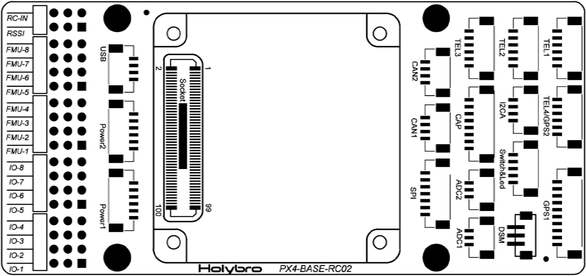

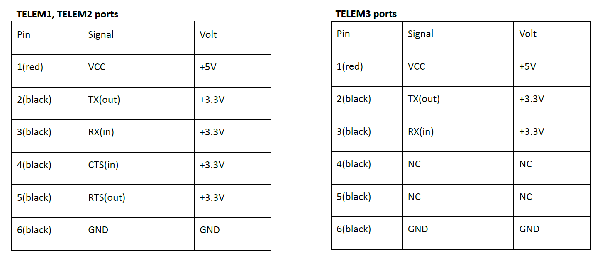

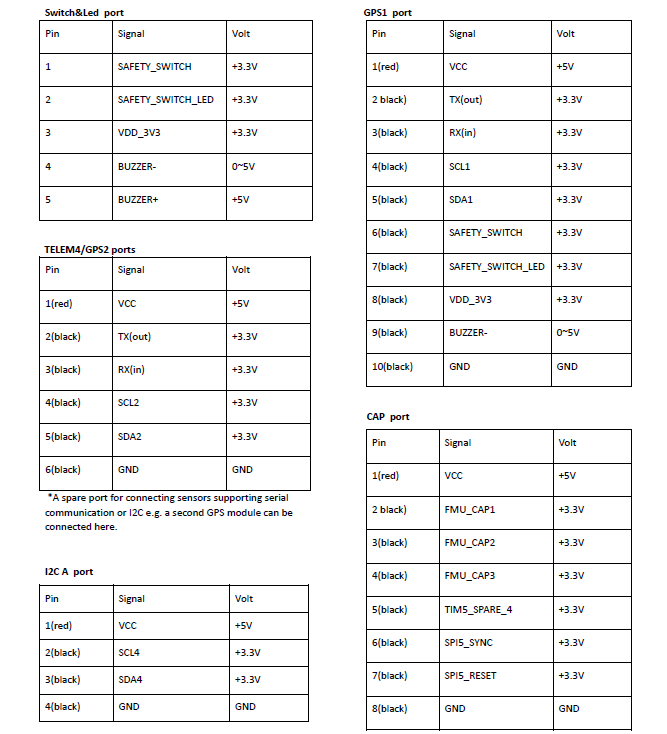

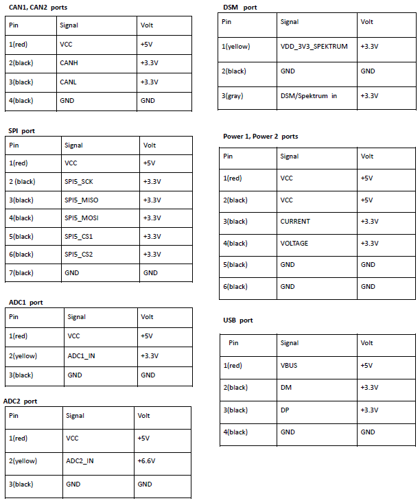

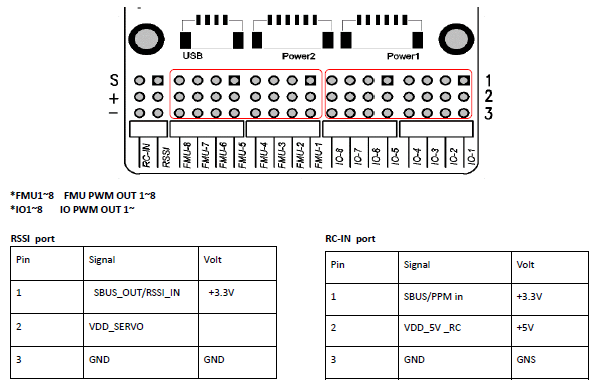

Mini
----

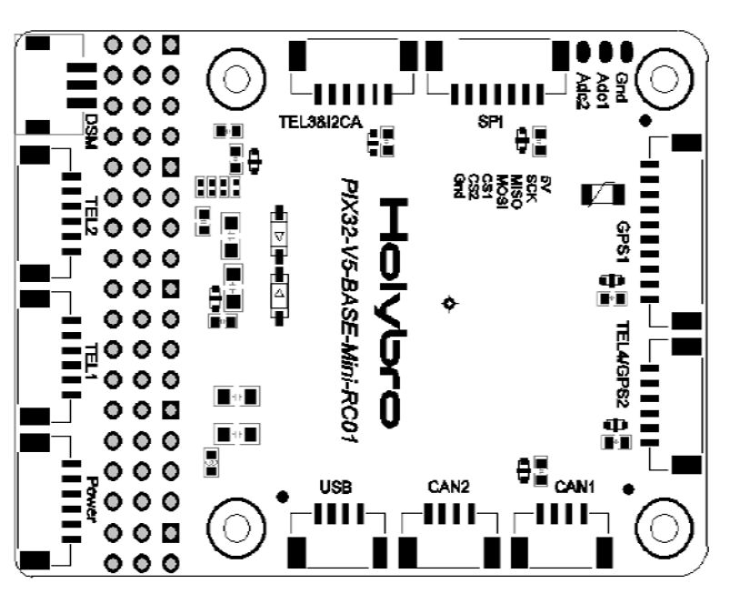

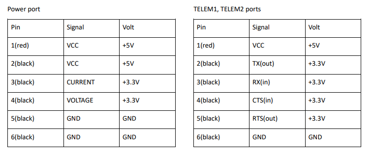

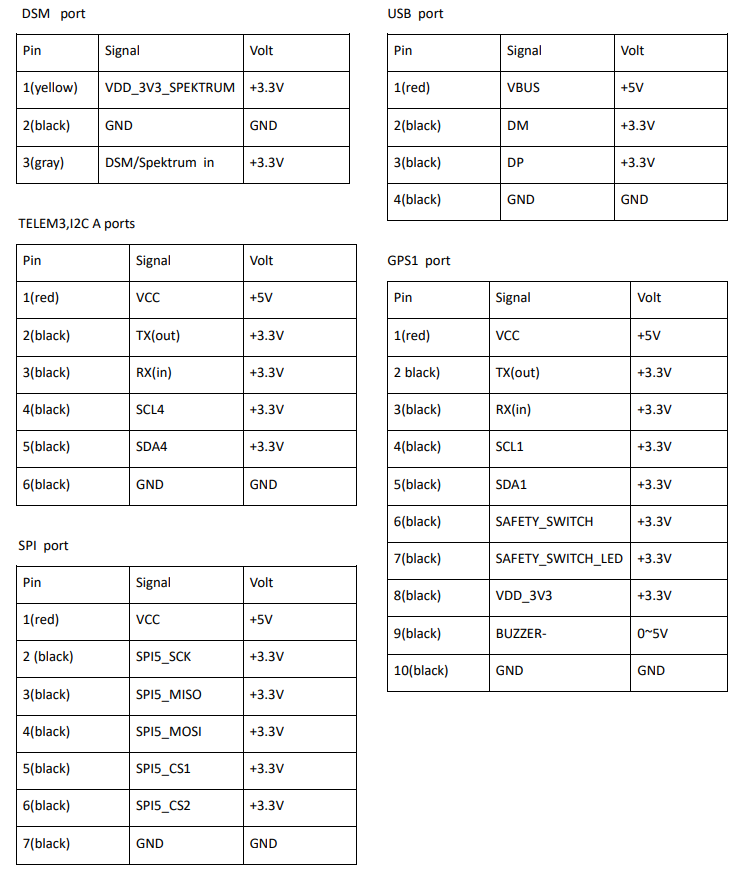

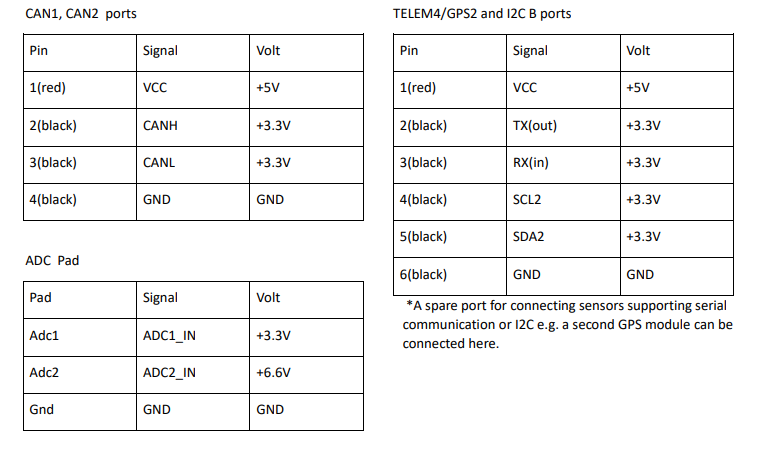

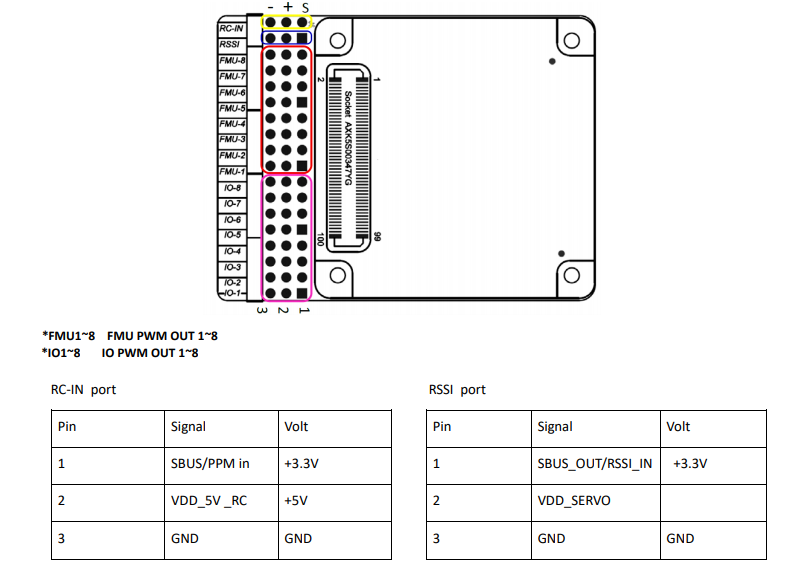

Where to Buy
============

 `Holybro <https://shop.holybro.com/pix32-v5_p1218.html>`__ .

