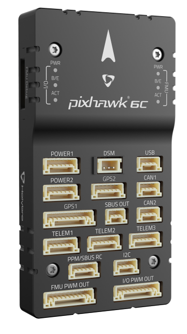

.. _common-holybro-pixhawk6C:

============================
Pixhawk 6C Flight Controller
============================

Pixhawk6C is the latest update to the successful family of Pixhawk® flight controllers made by Holybro, featuring STM32H7 cpus, vibration isolation of IMUs, redundant IMUs, and IMU heating.

Where To Buy
============

The Pixhawk6 flight controllers are sold by `Holybro <https://shop.holybro.com/c/flight-controllers_0456>`__

Features of Pixhawk6 Series
===========================

+---------------------+-----------------------------+-----------------+----------------------+
|                     |Pixhawk 6X                   |Pixhawk 6C       |Pix32 v6              |
+=====================+=============================+=================+======================+
|Key Design Point     |Additional Redundancy        |Low profile      |Cost effective        |
|                     +-----------------------------+-----------------+----------------------+
|                     |Modular design, allowing     |Cost effective   |Modular design,       |
|                     |customized baseboard         |                 |allowing customized   |
|                     |                             |                 |baseboard             |
+---------------------+-----------------------------+-----------------+----------------------+
|Processor            |STM32H753                    |               STM32H743                |
+---------------------+-----------------------------+-----------------+----------------------+
|Clock Speed          |                              480 MHz                                 |
+---------------------+-----------------------------+-----------------+----------------------+
|IO Processor         |                              STM32F103                               |
+---------------------+-----------------------------+-----------------+----------------------+
|IMU Redundancy       |Triple                       |Double           |Double                |
+---------------------+-----------------------------+-----------------+----------------------+
|IMU Temperature      |                             Yes                                      |
|Control              |                                                                      |
+---------------------+-----------------------------+-----------------+----------------------+
|Barometer            |                             |                 |                      |
|Redundancy           |Double                       |N/A              | N/A                  |
+---------------------+-----------------------------+-----------------+----------------------+
|Power Monitor        |I2C                          |Analog           |Analog                |
+---------------------+-----------------------------+-----------------+----------------------+
|UART                 |8                            |7                |7                     |
+---------------------+-----------------------------+-----------------+----------------------+
|CAN Bus              |                              2                                       |
+---------------------+-----------------------------+-----------------+----------------------+
|GPS/Copass Ports     |                             2                                        |
+---------------------+-----------------------------+-----------------+----------------------+
|UART Flow Control    |3 Ports                      |2 Ports          |2 Ports               |
+---------------------+-----------------------------+-----------------+----------------------+
|Additional I2C	      |                             Yes                                      |
+---------------------+-----------------------------+-----------------+----------------------+
|Ethernet Support     |Yes                          |No               |No                    |
+---------------------+-----------------------------+-----------------+----------------------+
|SPI Port             |Yes                          |No               |No                    |
+---------------------+-----------------------------+-----------------+----------------------+
|A/D                  |6.6V,3.3V,RSSI               |RSSI             |RSSI                  |
+---------------------+-----------------------------+-----------------+----------------------+

UART Mapping
============

 - SERIAL0 -> USB 
 - SERIAL1 -> UART7 (Telem1) RTS/CTS pins
 - SERIAL2 -> UART5 (Telem2) RTS/CTS pins
 - SERIAL3 -> USART1 (GPS1)
 - SERIAL4 -> UART8 (GPS2)
 - SERIAL5 -> USART2 (Telem3) RTS/CTS pins
 - SERIAL6 -> USART3 (USER)
 - SERIAL7 -> USB (can be used for SLCAN with protocol change)

RC Input
========
The RCIN pin, which by default is mapped to a timer input, can be used for all ArduPilot supported receiver protocols, except CRSF which requires a true UART connection. However, bi-directional protocols which include telemetry, such as SRXL2 and FPort, when connected in this manner, will only provide RC without telemetry. 

To allow CRSF and embedded telemetry available in Fport, CRSF, and SRXL2 receivers, a full UART, such as SERIAL6 (UART3) would need to be used for receiver connections. Below are setups using Serial6.

- :ref:`SERIAL6_PROTOCOL<SERIAL6_PROTOCOL>` should be set to "23".

- FPort would require :ref:`SERIAL6_OPTIONS<SERIAL6_OPTIONS>` be set to "15".

- CRSF would require :ref:`SERIAL6_OPTIONS<SERIAL6_OPTIONS>` be set to "0".

- SRXL2 would require :ref:`SERIAL6_OPTIONS<SERIAL6_OPTIONS>` be set to "4" and connects only the TX pin.

Any UART can be used for RC system connections in ArduPilot also, and is compatible with all protocols except PPM. See :ref:`common-rc-systems` for details.

PWM Output
==========

The Pixhawk6X/C supports up to 16 PWM outputs. All 16 outputs
support all normal PWM output formats. All FMU outputs (marked AUX) except 7 and 8 ,also support DShot.

The 8 FMU PWM outputs are in 4 groups:

 - PWM 1, 2, 3 and 4 in group1
 - PWM 5 and 6 in group2
 - PWM 7 and 8 in group3

FMU outputs within the same group need to use the same output rate and protocol. If
any output in a group uses DShot then all channels in that group need
to use DShot.

Battery Monitoring
==================

The board has 2 dedicated power monitor ports with a 6 pin
connector. The Pixhawk6C uses analog power monitors on these ports.

- :ref:`BATT_MONITOR<BATT_MONITOR>` = 4
- :ref:`BATT_VOLT_PIN<BATT_VOLT_PIN>` = 8
- :ref:`BATT_CURR_PIN<BATT_CURR_PIN>` = 4
- :ref:`BATT_VOLT_MULT<BATT_VOLT_MULT>` = 18.182
- :ref:`BATT_AMP_PERVLT<BATT_AMP_PERVLT>` = 36.364

- :ref:`BATT2_VOLT_PIN<BATT2_VOLT_PIN>` = 5
- :ref:`BATT2_CURR_PIN<BATT2_CURR_PIN>` = 14
- :ref:`BATT2_VOLT_MULT<BATT2_VOLT_MULT>` = 18.182
- :ref:`BATT2_AMP_PERVLT<BATT2_AMP_PERVLT>` = 36.364

Compass
=======

The Pixhawk6C hs a built-in compass. Due to potential
interference, the autopilot is usually used with an external I2C compass as
part of a GPS/Compass combination.

GPIOs
=====

The 8 FMU PWM outputs can be used as GPIOs (relays, buttons, RPM etc). To use them you need to set the output's ``SERVOx_FUNCTION`` to -1. See :ref:`common-gpios` page for more information.

The numbering of the GPIOs for PIN variables in ArduPilot is:

FMU pins:

 - PWM1 50
 - PWM2 51
 - PWM3 52
 - PWM4 53
 - PWM5 54
 - PWM6 55
 - PWM7 56
 - PWM8 57

Analog inputs
=============

The Pixhawk6C has an analog RSSI input pin:

 - Analog 3.3V RSSI input pin = 103

Connectors
==========

Unless noted otherwise all connectors are JST GH

See `Pixhawk6C pinout <https://docs.holybro.com/autopilot/pixhawk-6c/pixhawk-6c-pinout>`__

Loading Firmware
================

The board comes pre-installed with an ArduPilot compatible bootloader,
allowing the loading of xxxxxx.apj firmware files with any ArduPilot
compatible ground station.

Firmware for these boards can be found `here <https://firmware.ardupilot.org>`_ in  sub-folders labeled "Pixhawk6C".

Layout and Dimensions
=====================

See `Pixhawk6C dimensions <https://docs.holybro.com/autopilot/pixhawk-6c/dimensions>`__
[copywiki destination="plane,copter,rover,blimp"]
